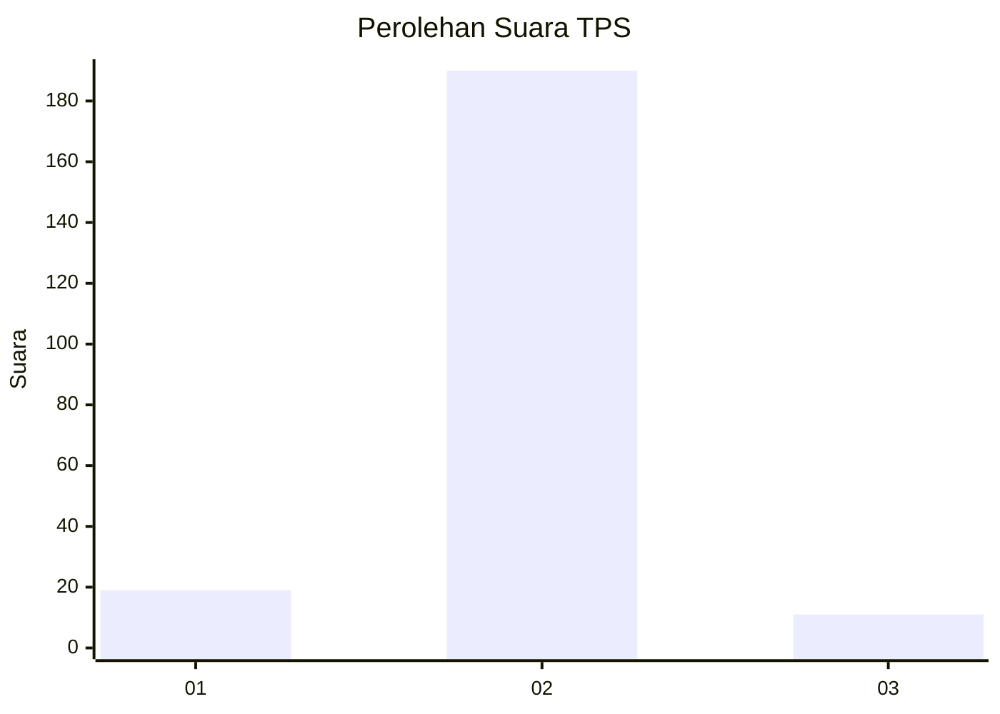
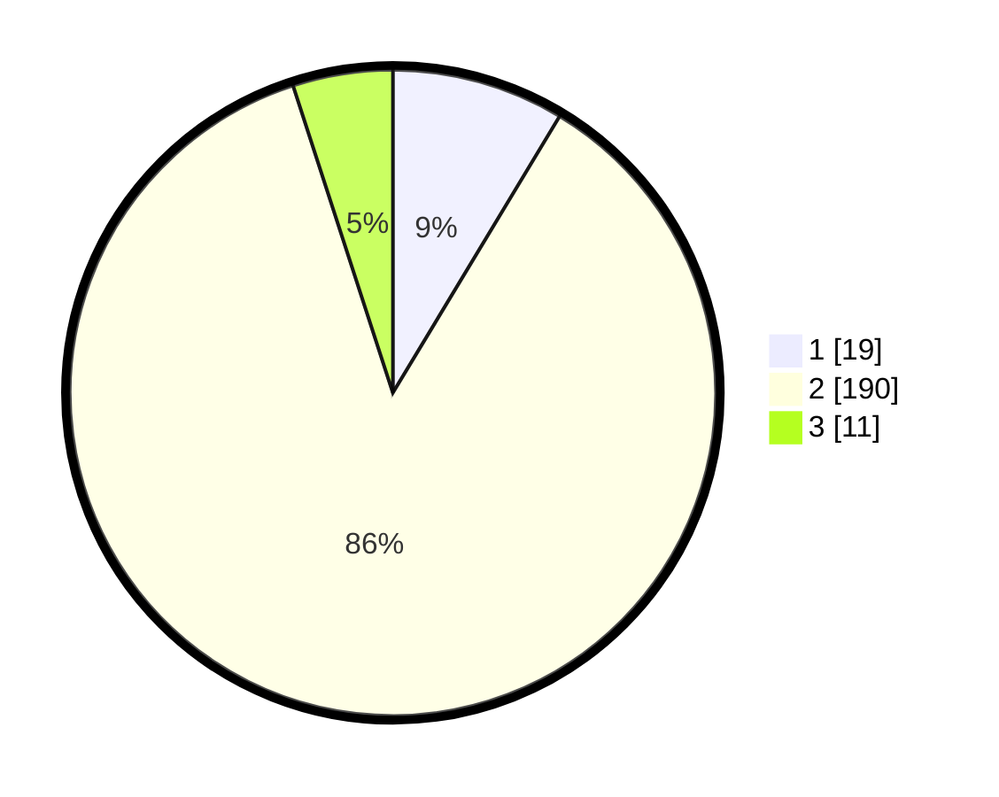

# Hasil

## Grafik

## Tabel

| No. | Nama Paslon    | Suara | Suara (raw) | Persentase |
|:--- |:-------------- | -----:| -----------:| ----------:|
| 1   | ANIES MUHAIMIN | 19    | [19][p-1]   | 8,64       |
| 2   | PRABOWO GIBRAN | 190   | [190][p-2]  | 86,36      |
| 3   | GANJAR MAHFUD  | 11    | [11][p-3]   | 5,00       |

[p-1]: https://github.com/gigit-pemilu/pemilu-2024-35-jawa-timur/blob/main/pilpres/hitung-suara/sub/35-jawa-timur/sub/14-pasuruan/sub/13-beji/sub/2002-ngembe/sub/003-tps/sub/paslon-1.txt
[p-2]: https://github.com/gigit-pemilu/pemilu-2024-35-jawa-timur/blob/main/pilpres/hitung-suara/sub/35-jawa-timur/sub/14-pasuruan/sub/13-beji/sub/2002-ngembe/sub/003-tps/sub/paslon-2.txt
[p-3]: https://github.com/gigit-pemilu/pemilu-2024-35-jawa-timur/blob/main/pilpres/hitung-suara/sub/35-jawa-timur/sub/14-pasuruan/sub/13-beji/sub/2002-ngembe/sub/003-tps/sub/paslon-3.txt

## Foto C Plano

https://sirekap-obj-formc.kpu.go.id/e3f5/pemilu/ppwp/35/14/13/20/02/3514132002003-20240215-222120--563bc3e3-1257-4c81-ab4e-a63ac7b56da7.jpg

https://sirekap-obj-formc.kpu.go.id/e3f5/pemilu/ppwp/35/14/13/20/02/3514132002003-20240215-202913--aa01da73-6141-409b-937a-ee4e033c9e42.jpg

https://sirekap-obj-formc.kpu.go.id/e3f5/pemilu/ppwp/35/14/13/20/02/3514132002003-20240215-183614--55f81204-e4a1-4584-84ac-d79ffec72a06.jpg

## Metadata

| Key        | Value               |
| ---------- | ------------------- |
| Time Stamp | 2024-02-16 00:00:26 |

