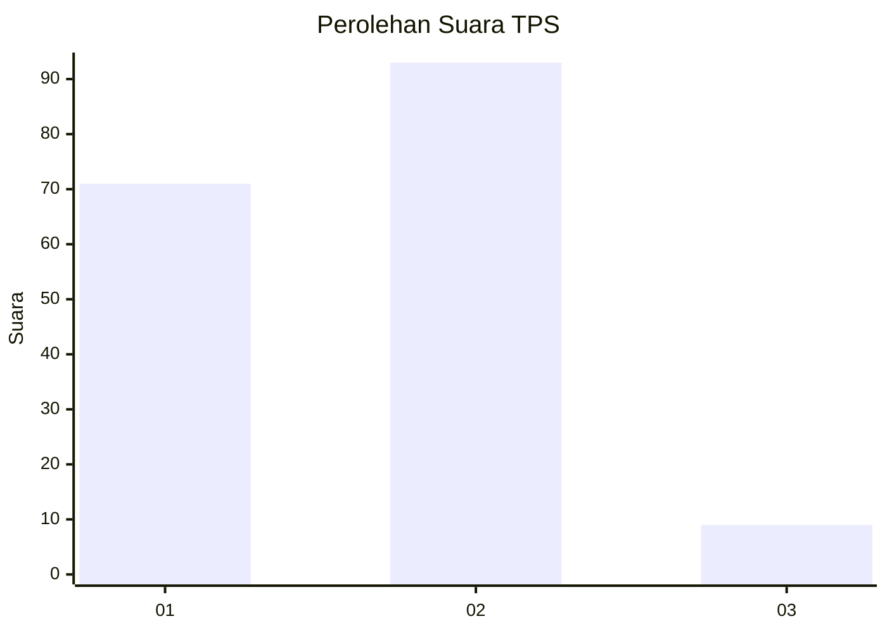
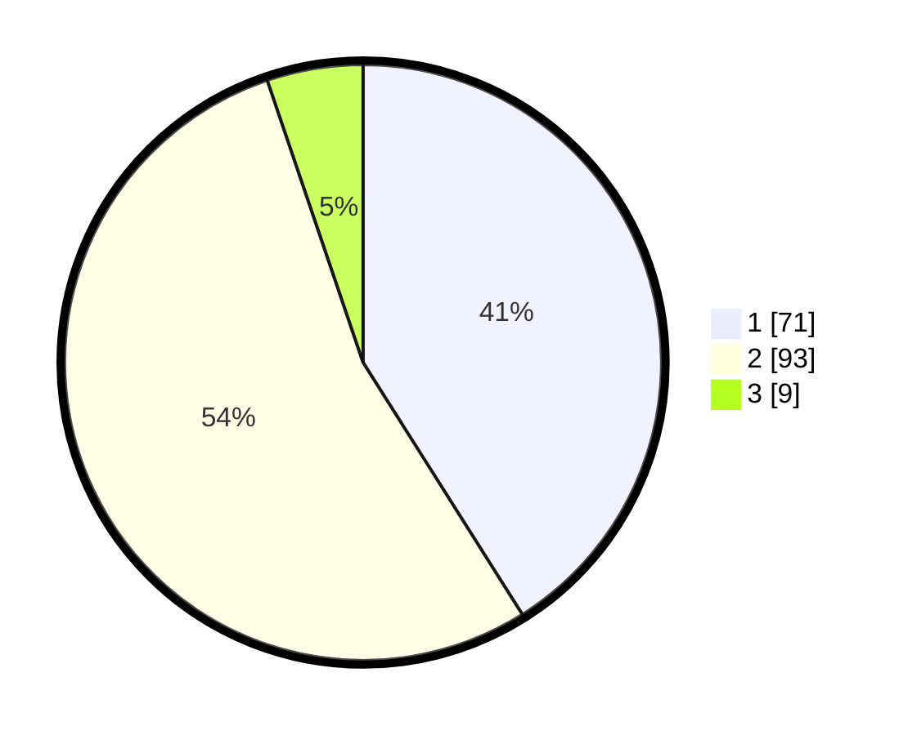

# Hasil

## Grafik

## Tabel

| No. | Nama Paslon    | Suara | Suara (raw) | Persentase |
|:--- |:-------------- | -----:| -----------:| ----------:|
| 1   | ANIES MUHAIMIN | 71    | [71][p-1]   | 41,04      |
| 2   | PRABOWO GIBRAN | 93    | [93][p-2]   | 53,76      |
| 3   | GANJAR MAHFUD  | 9     | [9][p-3]    | 5,20       |

[p-1]: https://github.com/gigit-pemilu/pemilu-2024/blob/main/pilpres/hitung-suara/sub/35-jawa-timur/sub/14-pasuruan/sub/14-bangil/sub/1005-bendomungal/sub/004-tps/sub/paslon-1.txt
[p-2]: https://github.com/gigit-pemilu/pemilu-2024/blob/main/pilpres/hitung-suara/sub/35-jawa-timur/sub/14-pasuruan/sub/14-bangil/sub/1005-bendomungal/sub/004-tps/sub/paslon-2.txt
[p-3]: https://github.com/gigit-pemilu/pemilu-2024/blob/main/pilpres/hitung-suara/sub/35-jawa-timur/sub/14-pasuruan/sub/14-bangil/sub/1005-bendomungal/sub/004-tps/sub/paslon-3.txt

## Foto C Plano

https://sirekap-obj-formc.kpu.go.id/ab32/pemilu/ppwp/35/14/14/10/05/3514141005004-20240214-141746--076dbda8-7ec9-4365-83b7-d6b21a354e2f.jpg

https://sirekap-obj-formc.kpu.go.id/ab32/pemilu/ppwp/35/14/14/10/05/3514141005004-20240218-085957--49c3a3e4-dc71-4be7-a93c-21748388e6f4.jpg

https://sirekap-obj-formc.kpu.go.id/ab32/pemilu/ppwp/35/14/14/10/05/3514141005004-20240214-141930--394709ed-1186-4f1a-8b2c-e04a03d1048c.jpg

## Metadata

| Key        | Value               |
| ---------- | ------------------- |
| Time Stamp | 2024-02-19 06:16:00 |

