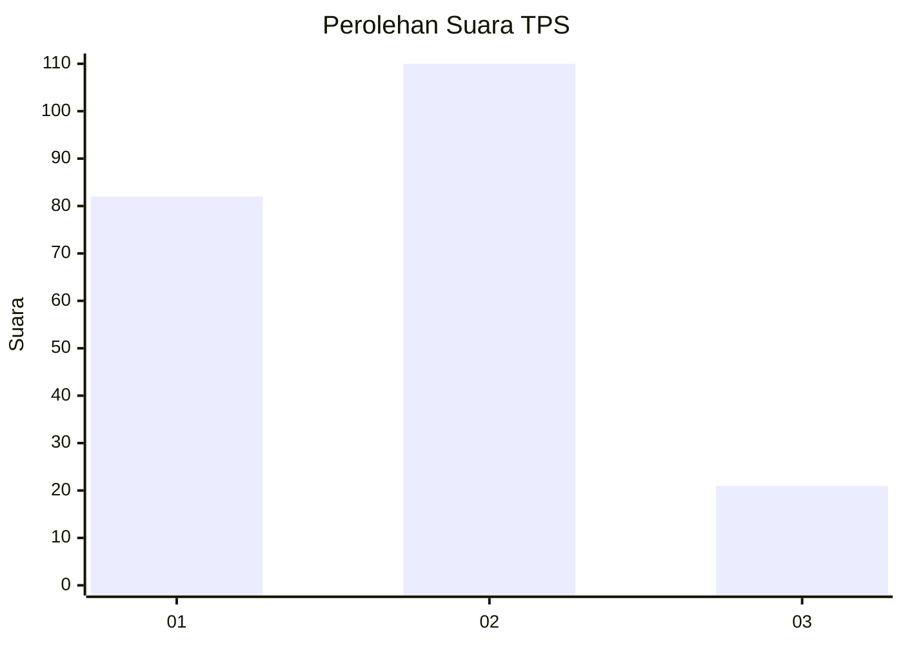
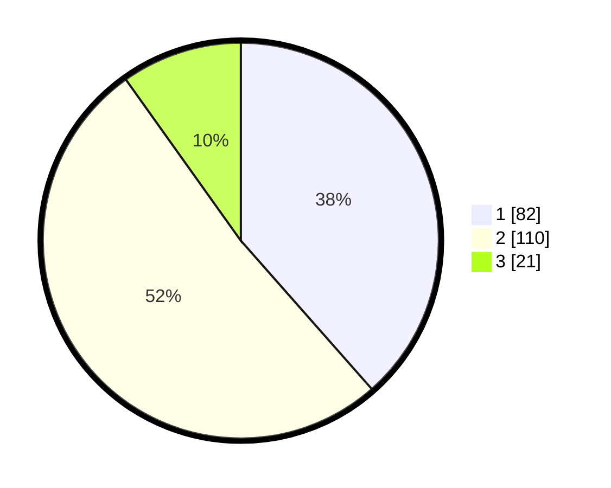

# Hasil

## Grafik

## Tabel

| No. | Nama Paslon    | Suara | Suara (raw) | Persentase |
|:--- |:-------------- | -----:| -----------:| ----------:|
| 1   | ANIES MUHAIMIN | 82    | [82][p-1]   | 38,50      |
| 2   | PRABOWO GIBRAN | 110   | [110][p-2]  | 51,64      |
| 3   | GANJAR MAHFUD  | 21    | [21][p-3]   | 9,86       |

[p-1]: https://github.com/gigit-pemilu/pemilu-2024-35-jawa-timur/blob/main/pilpres/hitung-suara/sub/35-jawa-timur/sub/14-pasuruan/sub/14-bangil/sub/1005-bendomungal/sub/012-tps/sub/paslon-1.txt
[p-2]: https://github.com/gigit-pemilu/pemilu-2024-35-jawa-timur/blob/main/pilpres/hitung-suara/sub/35-jawa-timur/sub/14-pasuruan/sub/14-bangil/sub/1005-bendomungal/sub/012-tps/sub/paslon-2.txt
[p-3]: https://github.com/gigit-pemilu/pemilu-2024-35-jawa-timur/blob/main/pilpres/hitung-suara/sub/35-jawa-timur/sub/14-pasuruan/sub/14-bangil/sub/1005-bendomungal/sub/012-tps/sub/paslon-3.txt

## Foto C Plano

https://sirekap-obj-formc.kpu.go.id/b1f4/pemilu/ppwp/35/14/14/10/05/3514141005012-20240218-110627--aa29358e-c429-4533-84b4-81f252e79994.jpg

https://sirekap-obj-formc.kpu.go.id/b1f4/pemilu/ppwp/35/14/14/10/05/3514141005012-20240218-124515--b147c69a-ebe7-4970-ac10-9cfe82397c46.jpg

https://sirekap-obj-formc.kpu.go.id/b1f4/pemilu/ppwp/35/14/14/10/05/3514141005012-20240218-143555--4de50153-f842-4555-9d04-d86d6f0bde16.jpg

## Metadata

| Key        | Value               |
| ---------- | ------------------- |
| Time Stamp | 2024-02-19 06:16:00 |

