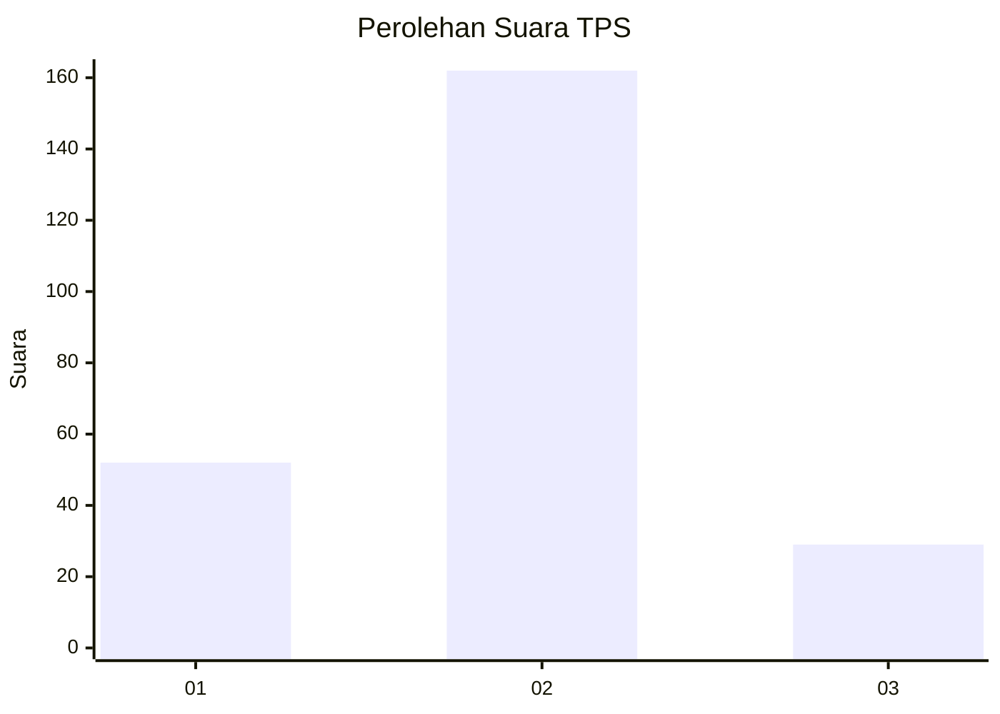
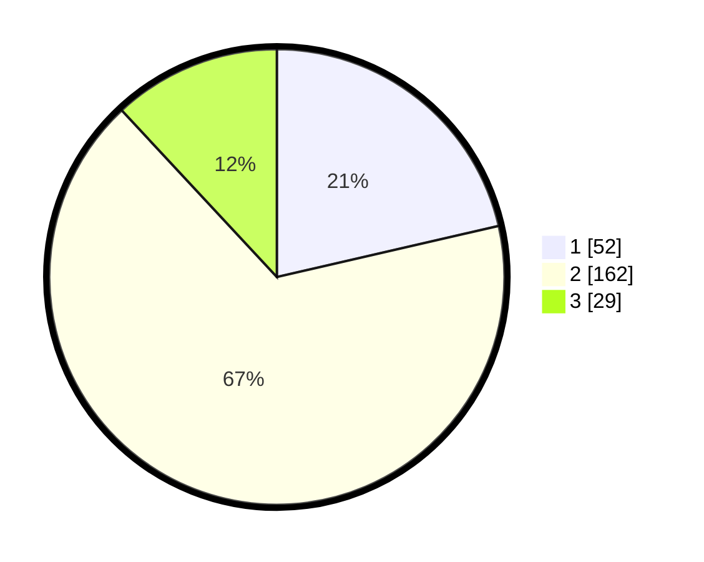

# Hasil

## Grafik

## Tabel

| No. | Nama Paslon    | Suara | Suara (raw) | Persentase |
|:--- |:-------------- | -----:| -----------:| ----------:|
| 1   | ANIES MUHAIMIN | 52    | [52][p-1]   | 21,40      |
| 2   | PRABOWO GIBRAN | 162   | [162][p-2]  | 66,67      |
| 3   | GANJAR MAHFUD  | 29    | [29][p-3]   | 11,93      |

[p-1]: https://github.com/gigit-pemilu/pemilu-2024/blob/main/pilpres/hitung-suara/sub/35-jawa-timur/sub/14-pasuruan/sub/14-bangil/sub/1009-latek/sub/005-tps/sub/paslon-1.txt
[p-2]: https://github.com/gigit-pemilu/pemilu-2024/blob/main/pilpres/hitung-suara/sub/35-jawa-timur/sub/14-pasuruan/sub/14-bangil/sub/1009-latek/sub/005-tps/sub/paslon-2.txt
[p-3]: https://github.com/gigit-pemilu/pemilu-2024/blob/main/pilpres/hitung-suara/sub/35-jawa-timur/sub/14-pasuruan/sub/14-bangil/sub/1009-latek/sub/005-tps/sub/paslon-3.txt

## Foto C Plano

https://sirekap-obj-formc.kpu.go.id/8e6c/pemilu/ppwp/35/14/14/10/09/3514141009005-20240214-193044--1ac386e7-ea8c-467e-bf79-58a8d4134563.jpg

https://sirekap-obj-formc.kpu.go.id/8e6c/pemilu/ppwp/35/14/14/10/09/3514141009005-20240214-193211--dda8739e-3bf3-4d9d-8f36-0d4ccaff0638.jpg

https://sirekap-obj-formc.kpu.go.id/8e6c/pemilu/ppwp/35/14/14/10/09/3514141009005-20240214-192527--ecaa52be-4c0b-40cb-b355-7ecdc70ddfb7.jpg

## Metadata

| Key        | Value               |
| ---------- | ------------------- |
| Time Stamp | 2024-02-19 06:16:00 |

