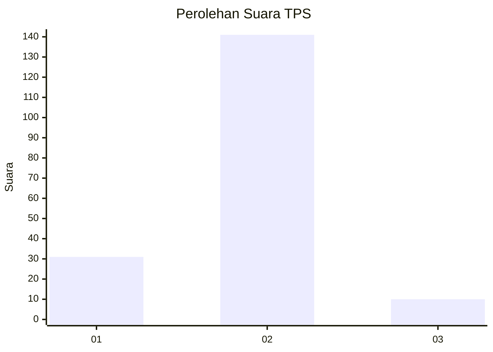
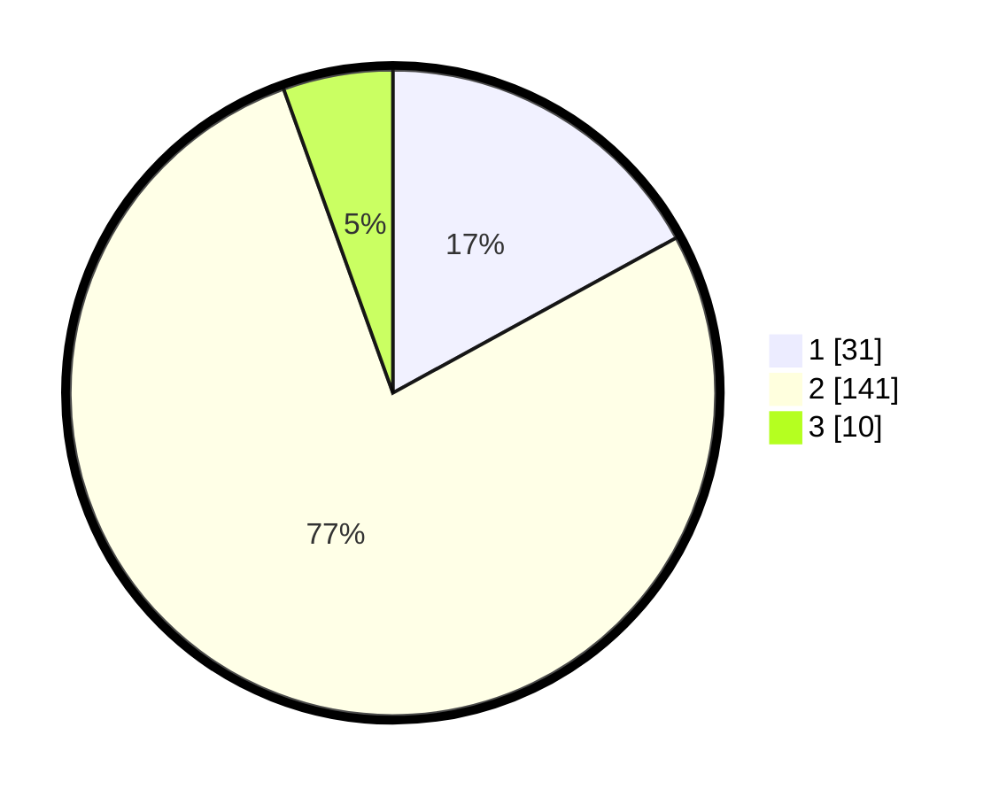

# Hasil

## Grafik

## Tabel

| No. | Nama Paslon    | Suara | Suara (raw) | Persentase |
|:--- |:-------------- | -----:| -----------:| ----------:|
| 1   | ANIES MUHAIMIN | 31    | [31][p-1]   | 17,03      |
| 2   | PRABOWO GIBRAN | 141   | [141][p-2]  | 77,47      |
| 3   | GANJAR MAHFUD  | 10    | [10][p-3]   | 5,49       |

[p-1]: https://github.com/gigit-pemilu/pemilu-2024/blob/main/pilpres/hitung-suara/sub/35-jawa-timur/sub/14-pasuruan/sub/14-bangil/sub/2015-tambakan/sub/008-tps/sub/paslon-1.txt
[p-2]: https://github.com/gigit-pemilu/pemilu-2024/blob/main/pilpres/hitung-suara/sub/35-jawa-timur/sub/14-pasuruan/sub/14-bangil/sub/2015-tambakan/sub/008-tps/sub/paslon-2.txt
[p-3]: https://github.com/gigit-pemilu/pemilu-2024/blob/main/pilpres/hitung-suara/sub/35-jawa-timur/sub/14-pasuruan/sub/14-bangil/sub/2015-tambakan/sub/008-tps/sub/paslon-3.txt

## Foto C Plano

https://sirekap-obj-formc.kpu.go.id/9f30/pemilu/ppwp/35/14/14/20/15/3514142015008-20240220-123326--3fc489cf-0a78-4ca0-83c2-8730c992a282.jpg

https://sirekap-obj-formc.kpu.go.id/9f30/pemilu/ppwp/35/14/14/20/15/3514142015008-20240220-123425--88fa69d9-b94f-49ca-b3ff-57c8b90340bd.jpg

https://sirekap-obj-formc.kpu.go.id/9f30/pemilu/ppwp/35/14/14/20/15/3514142015008-20240220-123512--e4616d12-dd6f-4fd4-8649-44e7bce0efb3.jpg

## Metadata

| Key        | Value               |
| ---------- | ------------------- |
| Time Stamp | 2024-02-20 13:00:00 |

