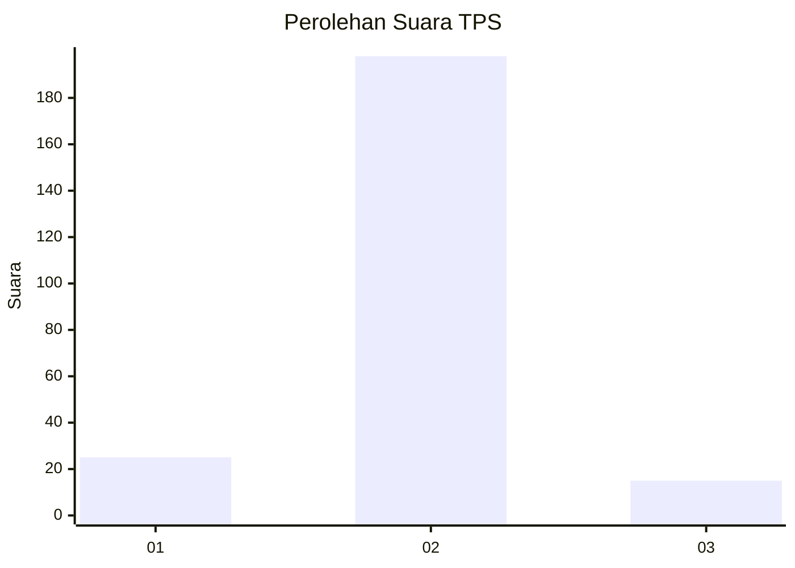
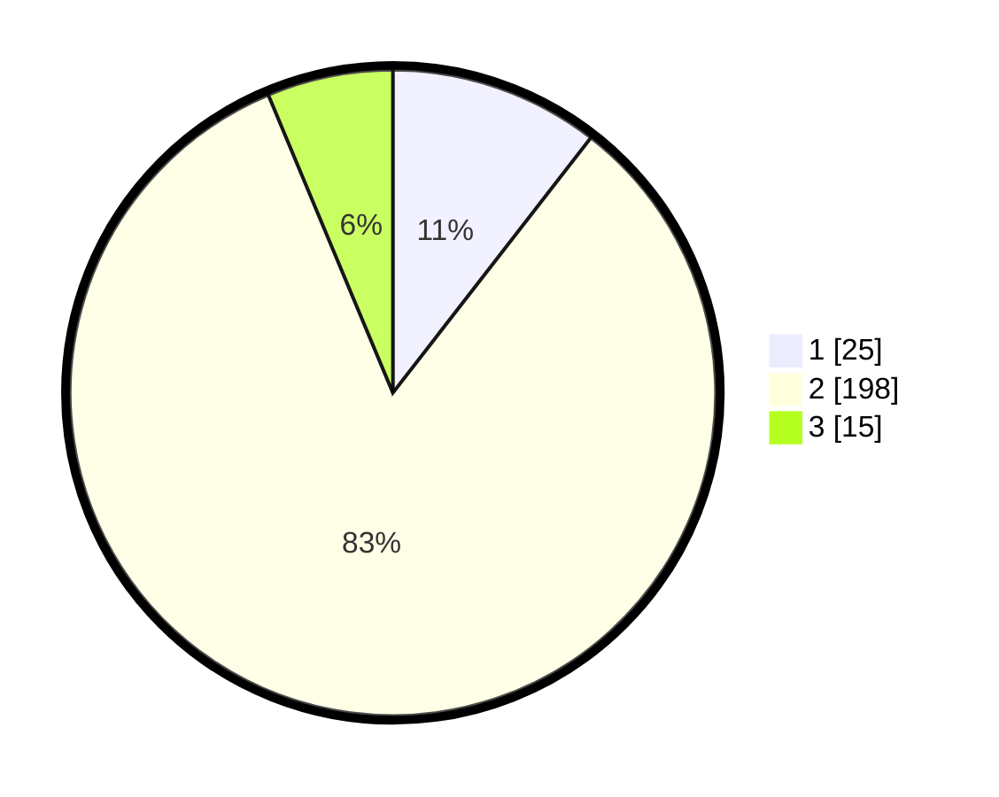

# Hasil

## Grafik

## Tabel

| No. | Nama Paslon    | Suara | Suara (raw) | Persentase |
|:--- |:-------------- | -----:| -----------:| ----------:|
| 1   | ANIES MUHAIMIN | 25    | [25][p-1]   | 10,50      |
| 2   | PRABOWO GIBRAN | 198   | [198][p-2]  | 83,19      |
| 3   | GANJAR MAHFUD  | 15    | [15][p-3]   | 6,30       |

[p-1]: https://github.com/gigit-pemilu/pemilu-2024-35-jawa-timur/blob/main/pilpres/hitung-suara/sub/35-jawa-timur/sub/14-pasuruan/sub/16-kraton/sub/2019-tambak-rejo/sub/005-tps/sub/paslon-1.txt
[p-2]: https://github.com/gigit-pemilu/pemilu-2024-35-jawa-timur/blob/main/pilpres/hitung-suara/sub/35-jawa-timur/sub/14-pasuruan/sub/16-kraton/sub/2019-tambak-rejo/sub/005-tps/sub/paslon-2.txt
[p-3]: https://github.com/gigit-pemilu/pemilu-2024-35-jawa-timur/blob/main/pilpres/hitung-suara/sub/35-jawa-timur/sub/14-pasuruan/sub/16-kraton/sub/2019-tambak-rejo/sub/005-tps/sub/paslon-3.txt

## Foto C Plano

https://sirekap-obj-formc.kpu.go.id/d870/pemilu/ppwp/35/14/16/20/19/3514162019005-20240217-164105--b99e253c-e3d1-4d25-9cf7-33ffa3e68a60.jpg

https://sirekap-obj-formc.kpu.go.id/d870/pemilu/ppwp/35/14/16/20/19/3514162019005-20240217-170104--ab16b20b-ea7f-4e42-8b7f-22a4445db2ad.jpg

https://sirekap-obj-formc.kpu.go.id/d870/pemilu/ppwp/35/14/16/20/19/3514162019005-20240217-165833--ac88b1b8-3a7f-438d-89aa-37fea9058f2f.jpg

## Metadata

| Key        | Value               |
| ---------- | ------------------- |
| Time Stamp | 2024-02-17 17:30:00 |

