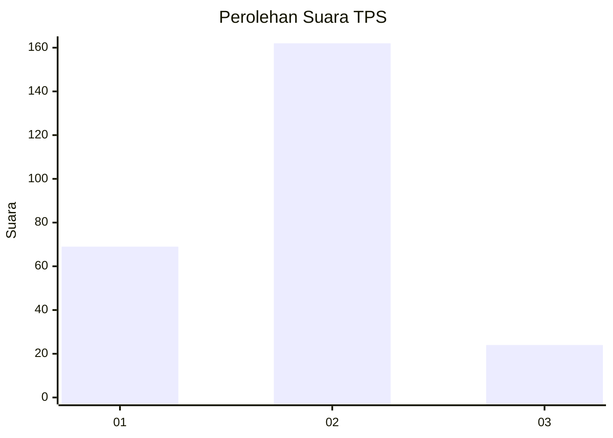
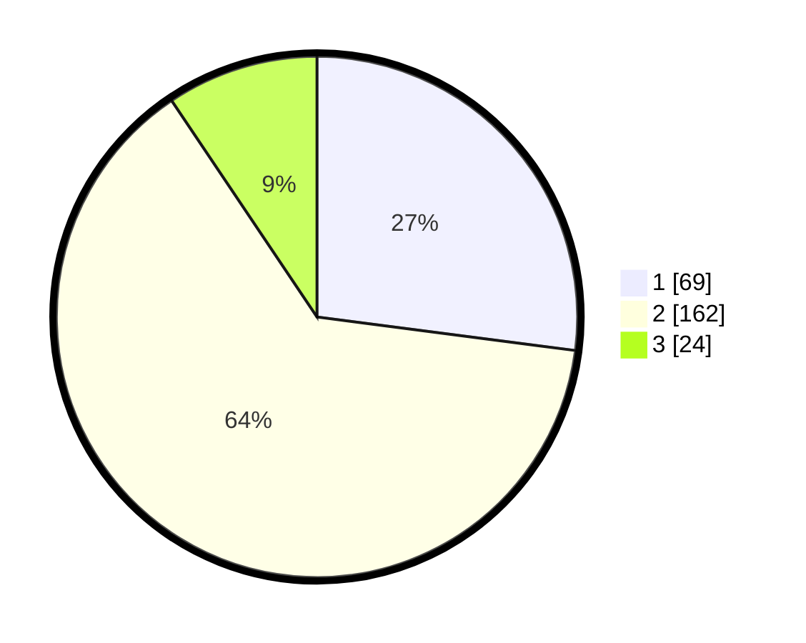

# Hasil

## Grafik

## Tabel

| No. | Nama Paslon    | Suara | Suara (raw) | Persentase |
|:--- |:-------------- | -----:| -----------:| ----------:|
| 1   | ANIES MUHAIMIN | 69    | [69][p-1]   | 27,06      |
| 2   | PRABOWO GIBRAN | 162   | [162][p-2]  | 63,53      |
| 3   | GANJAR MAHFUD  | 24    | [24][p-3]   | 9,41       |

[p-1]: https://github.com/gigit-pemilu/pemilu-2024/blob/main/pilpres/hitung-suara/sub/35-jawa-timur/sub/14-pasuruan/sub/18-gondangwetan/sub/2004-kebon-candi/sub/003-tps/sub/paslon-1.txt
[p-2]: https://github.com/gigit-pemilu/pemilu-2024/blob/main/pilpres/hitung-suara/sub/35-jawa-timur/sub/14-pasuruan/sub/18-gondangwetan/sub/2004-kebon-candi/sub/003-tps/sub/paslon-2.txt
[p-3]: https://github.com/gigit-pemilu/pemilu-2024/blob/main/pilpres/hitung-suara/sub/35-jawa-timur/sub/14-pasuruan/sub/18-gondangwetan/sub/2004-kebon-candi/sub/003-tps/sub/paslon-3.txt

## Foto C Plano

https://sirekap-obj-formc.kpu.go.id/3653/pemilu/ppwp/35/14/18/20/04/3514182004003-20240215-222249--e1aa0b39-f23c-4900-bad0-132201bbdab2.jpg

https://sirekap-obj-formc.kpu.go.id/3653/pemilu/ppwp/35/14/18/20/04/3514182004003-20240215-222334--8d2f751e-2012-44d5-93d8-8e3077e7b358.jpg

https://sirekap-obj-formc.kpu.go.id/3653/pemilu/ppwp/35/14/18/20/04/3514182004003-20240215-222427--e16a1ac7-fa7a-49c4-9948-eabcb186618d.jpg

## Metadata

| Key        | Value               |
| ---------- | ------------------- |
| Time Stamp | 2024-02-19 06:16:00 |

