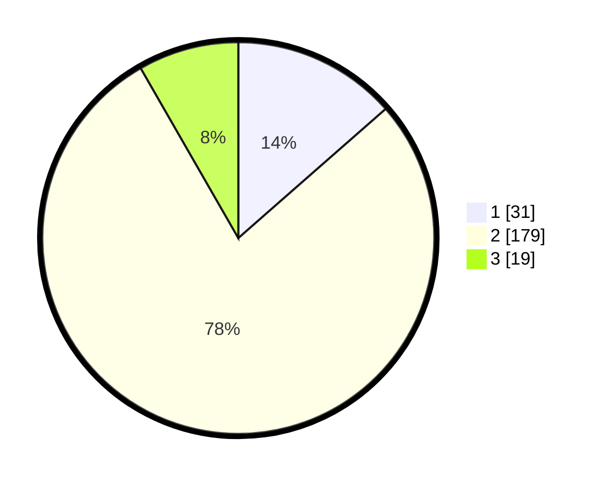

# Hasil

## Grafik

## Tabel

| No. | Nama Paslon    | Suara | Suara (raw) | Persentase |
|:--- |:-------------- | -----:| -----------:| ----------:|
| 1   | ANIES MUHAIMIN | 31    | [31][p-1]   | 13,54      |
| 2   | PRABOWO GIBRAN | 179   | [179][p-2]  | 78,17      |
| 3   | GANJAR MAHFUD  | 19    | [19][p-3]   | 8,30       |

[p-1]: https://github.com/gigit-pemilu/pemilu-2024-35-jawa-timur/blob/main/pilpres/hitung-suara/sub/35-jawa-timur/sub/14-pasuruan/sub/19-winongan/sub/2013-mendalan/sub/002-tps/sub/paslon-1.txt
[p-2]: https://github.com/gigit-pemilu/pemilu-2024-35-jawa-timur/blob/main/pilpres/hitung-suara/sub/35-jawa-timur/sub/14-pasuruan/sub/19-winongan/sub/2013-mendalan/sub/002-tps/sub/paslon-2.txt
[p-3]: https://github.com/gigit-pemilu/pemilu-2024-35-jawa-timur/blob/main/pilpres/hitung-suara/sub/35-jawa-timur/sub/14-pasuruan/sub/19-winongan/sub/2013-mendalan/sub/002-tps/sub/paslon-3.txt

## Foto C Plano

https://sirekap-obj-formc.kpu.go.id/da63/pemilu/ppwp/35/14/19/20/13/3514192013002-20240215-035311--1b4efc98-4e2f-47bf-88c3-3a5df1bde5ff.jpg

https://sirekap-obj-formc.kpu.go.id/da63/pemilu/ppwp/35/14/19/20/13/3514192013002-20240215-035136--6e7a639a-447a-4ac3-a1ba-75b55dc86a19.jpg

https://sirekap-obj-formc.kpu.go.id/da63/pemilu/ppwp/35/14/19/20/13/3514192013002-20240215-035029--c6db7ce9-c535-4c57-9fd2-3481dd09a73d.jpg

## Metadata

| Key        | Value               |
| ---------- | ------------------- |
| Time Stamp | 2024-02-19 06:16:00 |

