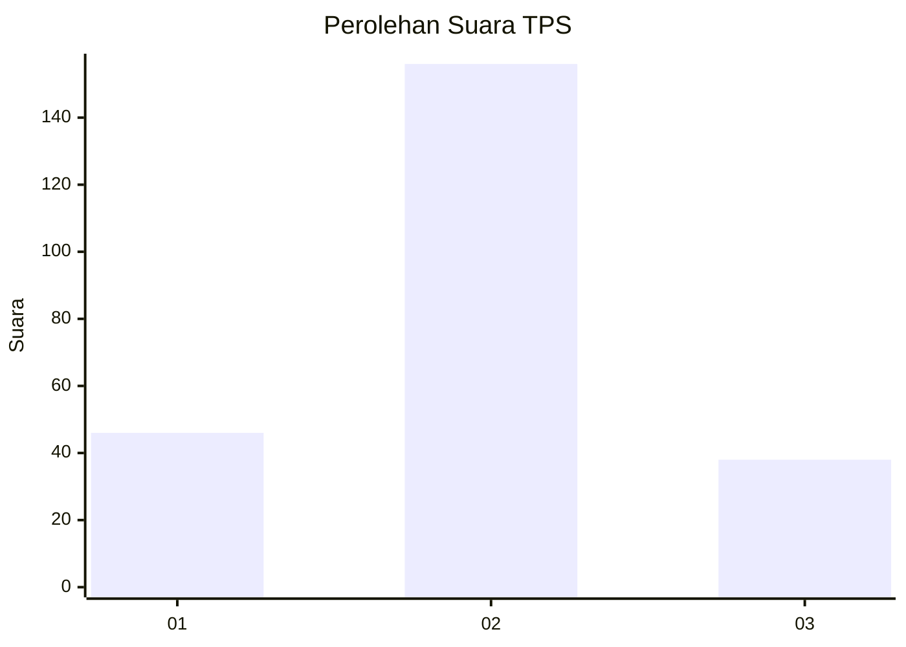
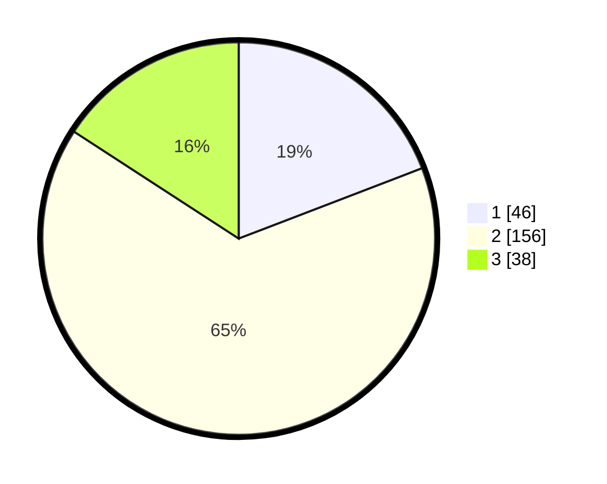

# Hasil

## Grafik

## Tabel

| No. | Nama Paslon    | Suara | Suara (raw) | Persentase |
|:--- |:-------------- | -----:| -----------:| ----------:|
| 1   | ANIES MUHAIMIN | 46    | [46][p-1]   | 19,17      |
| 2   | PRABOWO GIBRAN | 156   | [156][p-2]  | 65,00      |
| 3   | GANJAR MAHFUD  | 38    | [38][p-3]   | 15,83      |

[p-1]: https://github.com/gigit-pemilu/pemilu-2024/blob/main/pilpres/hitung-suara/sub/35-jawa-timur/sub/14-pasuruan/sub/20-grati/sub/2003-rebalas/sub/003-tps/sub/paslon-1.txt
[p-2]: https://github.com/gigit-pemilu/pemilu-2024/blob/main/pilpres/hitung-suara/sub/35-jawa-timur/sub/14-pasuruan/sub/20-grati/sub/2003-rebalas/sub/003-tps/sub/paslon-2.txt
[p-3]: https://github.com/gigit-pemilu/pemilu-2024/blob/main/pilpres/hitung-suara/sub/35-jawa-timur/sub/14-pasuruan/sub/20-grati/sub/2003-rebalas/sub/003-tps/sub/paslon-3.txt

## Foto C Plano

https://sirekap-obj-formc.kpu.go.id/757d/pemilu/ppwp/35/14/20/20/03/3514202003003-20240216-215713--59f1c4c5-ffda-4875-aca7-371009293136.jpg

https://sirekap-obj-formc.kpu.go.id/757d/pemilu/ppwp/35/14/20/20/03/3514202003003-20240215-203728--df7e5bb2-f9a0-4e64-b165-9524f5d56b03.jpg

https://sirekap-obj-formc.kpu.go.id/757d/pemilu/ppwp/35/14/20/20/03/3514202003003-20240216-221656--ef736a3b-5349-455f-a123-fe96a2993589.jpg

## Metadata

| Key        | Value               |
| ---------- | ------------------- |
| Time Stamp | 2024-02-19 06:16:00 |

