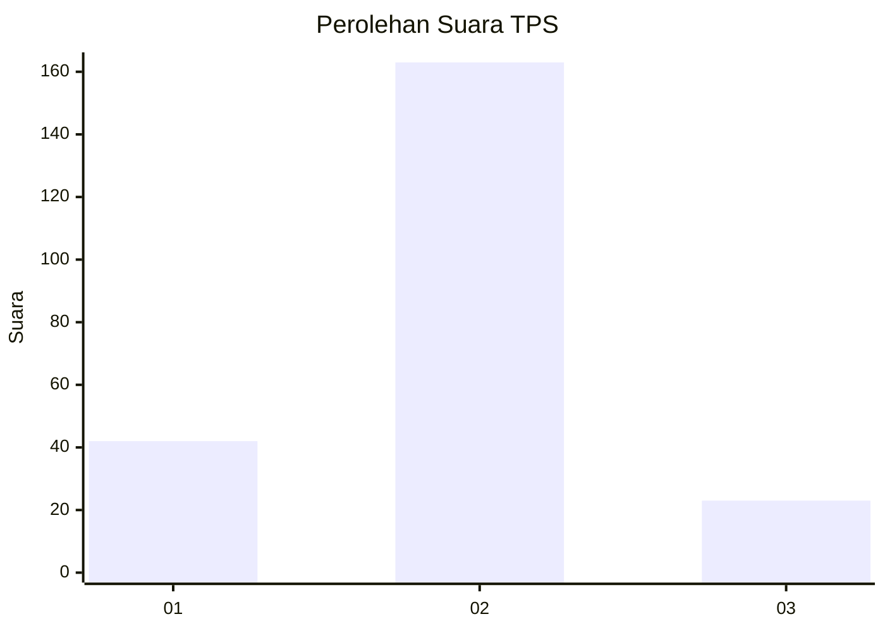
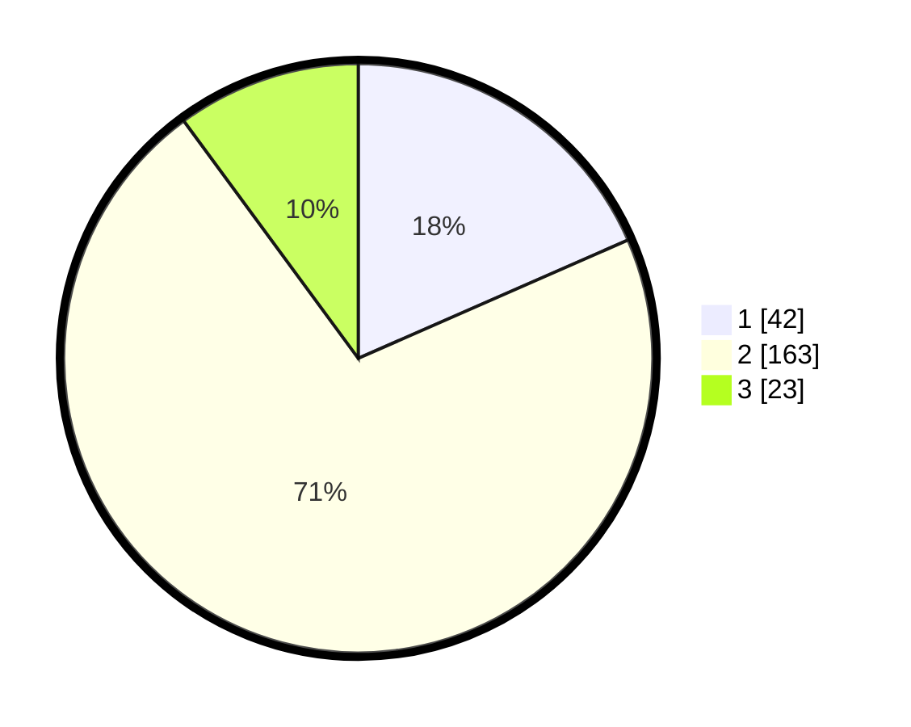

# Hasil

## Grafik

## Tabel

| No. | Nama Paslon    | Suara | Suara (raw) | Persentase |
|:--- |:-------------- | -----:| -----------:| ----------:|
| 1   | ANIES MUHAIMIN | 42    | [42][p-1]   | 18,42      |
| 2   | PRABOWO GIBRAN | 163   | [163][p-2]  | 71,49      |
| 3   | GANJAR MAHFUD  | 23    | [23][p-3]   | 10,09      |

[p-1]: https://github.com/gigit-pemilu/pemilu-2024-35-jawa-timur/blob/main/pilpres/hitung-suara/sub/35-jawa-timur/sub/14-pasuruan/sub/20-grati/sub/2003-rebalas/sub/008-tps/sub/paslon-1.txt
[p-2]: https://github.com/gigit-pemilu/pemilu-2024-35-jawa-timur/blob/main/pilpres/hitung-suara/sub/35-jawa-timur/sub/14-pasuruan/sub/20-grati/sub/2003-rebalas/sub/008-tps/sub/paslon-2.txt
[p-3]: https://github.com/gigit-pemilu/pemilu-2024-35-jawa-timur/blob/main/pilpres/hitung-suara/sub/35-jawa-timur/sub/14-pasuruan/sub/20-grati/sub/2003-rebalas/sub/008-tps/sub/paslon-3.txt

## Foto C Plano

https://sirekap-obj-formc.kpu.go.id/fc65/pemilu/ppwp/35/14/20/20/03/3514202003008-20240216-113932--7ac1f0fa-9119-4894-9c92-b435a8197dad.jpg

https://sirekap-obj-formc.kpu.go.id/fc65/pemilu/ppwp/35/14/20/20/03/3514202003008-20240215-154319--6248195a-0110-4821-b0dd-4a6e369ac5f0.jpg

https://sirekap-obj-formc.kpu.go.id/fc65/pemilu/ppwp/35/14/20/20/03/3514202003008-20240215-154409--b08197e9-e255-432f-922f-b0c817df6ca4.jpg

## Metadata

| Key        | Value               |
| ---------- | ------------------- |
| Time Stamp | 2024-02-19 06:16:00 |

## DATA PEMILIH TETAP

Jumlah pemilih dalam DPT: **202**.
 * L: **133**.
 * P: **149**.

## DATA PENGGUNA HAK PILIH

Jumlah pengguna hak pilih dalam DPT: **342**.
 * L: **501**.
 * P: **161**.

Jumlah pengguna hak pilih dalam DPTb: **2**.
 * L: **8**.
 * P: **20**.

Jumlah pengguna hak pilih dalam DPK: **700**.
 * L: **60**.
 * P: **600**.

Jumlah pengguna hak pilih: **250**.
 * L: **116**.
 * P: **339**.

## JUMLAH SUARA SAH DAN TIDAK SAH

JUMLAH SELURUH SUARA SAH: **228**.

JUMLAH SUARA TIDAK SAH: **22**.

JUMLAH SELURUH SUARA SAH DAN SUARA TIDAK SAH: **250**.

