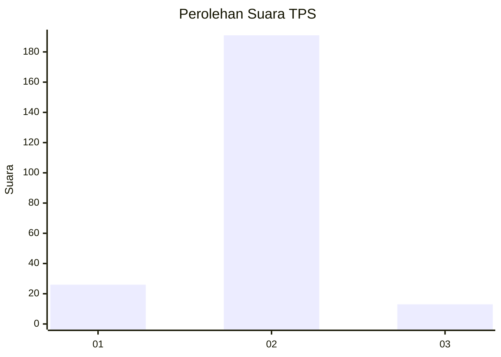
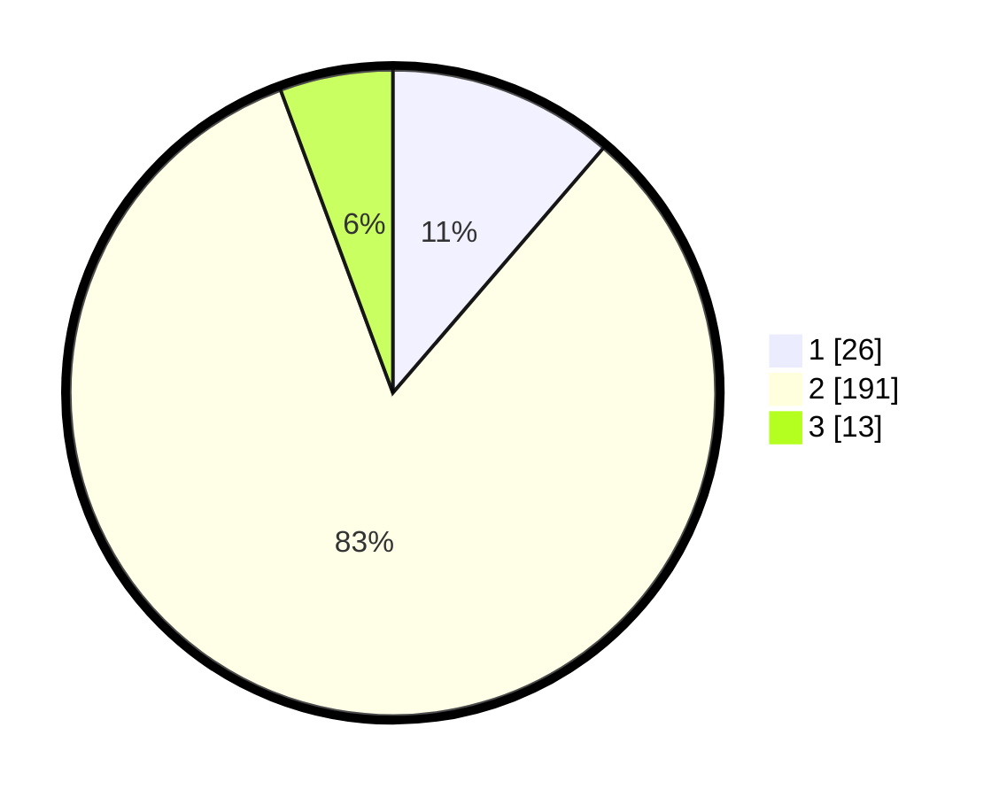

# Hasil

## Grafik

## Tabel

| No. | Nama Paslon    | Suara | Suara (raw) | Persentase |
|:--- |:-------------- | -----:| -----------:| ----------:|
| 1   | ANIES MUHAIMIN | 26    | [26][p-1]   | 11,30      |
| 2   | PRABOWO GIBRAN | 191   | [191][p-2]  | 83,04      |
| 3   | GANJAR MAHFUD  | 13    | [13][p-3]   | 5,65       |

[p-1]: https://github.com/gigit-pemilu/pemilu-2024-35-jawa-timur/blob/main/pilpres/hitung-suara/sub/35-jawa-timur/sub/14-pasuruan/sub/20-grati/sub/2004-plososari/sub/001-tps/sub/paslon-1.txt
[p-2]: https://github.com/gigit-pemilu/pemilu-2024-35-jawa-timur/blob/main/pilpres/hitung-suara/sub/35-jawa-timur/sub/14-pasuruan/sub/20-grati/sub/2004-plososari/sub/001-tps/sub/paslon-2.txt
[p-3]: https://github.com/gigit-pemilu/pemilu-2024-35-jawa-timur/blob/main/pilpres/hitung-suara/sub/35-jawa-timur/sub/14-pasuruan/sub/20-grati/sub/2004-plososari/sub/001-tps/sub/paslon-3.txt

## Foto C Plano

https://sirekap-obj-formc.kpu.go.id/e059/pemilu/ppwp/35/14/20/20/04/3514202004001-20240215-004251--24f4d314-353d-46b1-9d1a-459b853ad695.jpg

https://sirekap-obj-formc.kpu.go.id/e059/pemilu/ppwp/35/14/20/20/04/3514202004001-20240215-004402--083c67d1-f53a-4a92-82f5-182d0f6b887e.jpg

https://sirekap-obj-formc.kpu.go.id/e059/pemilu/ppwp/35/14/20/20/04/3514202004001-20240215-004335--82dafde9-f30c-461a-9382-5be5d5834433.jpg

## Metadata

| Key        | Value               |
| ---------- | ------------------- |
| Time Stamp | 2024-02-19 06:16:00 |

