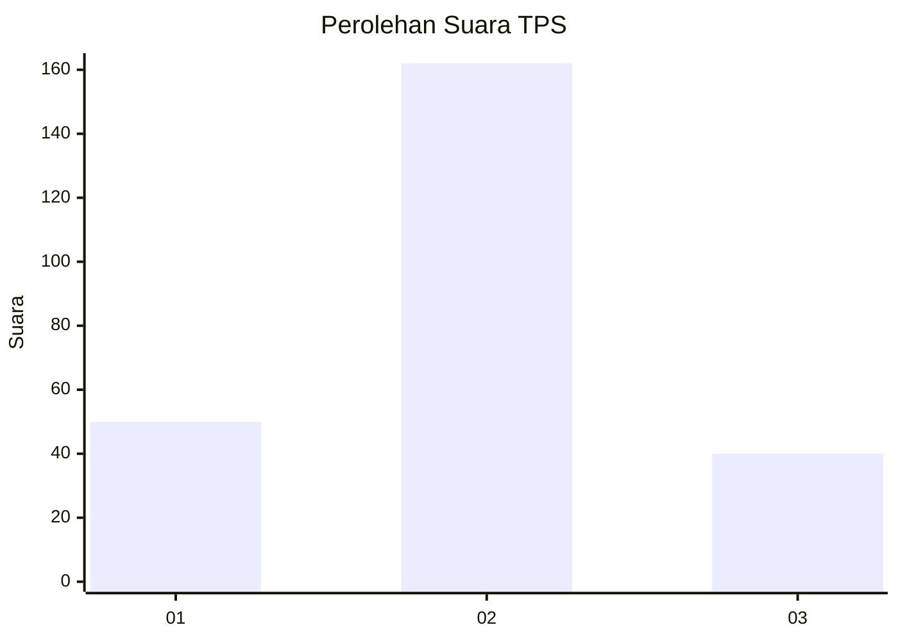
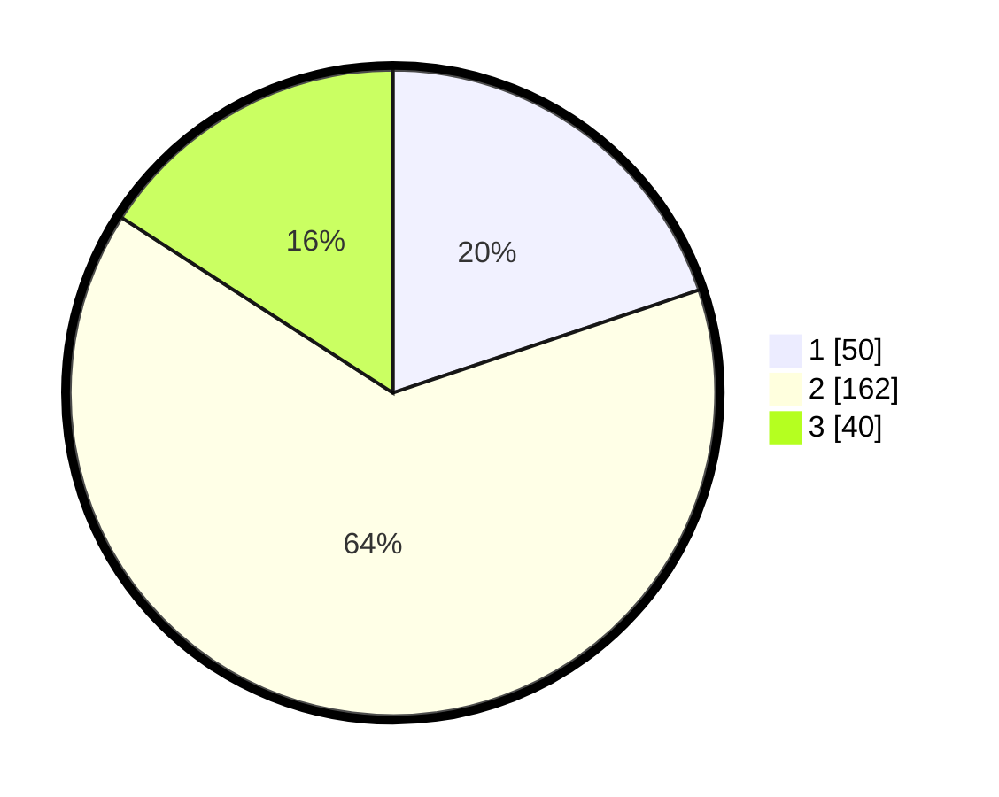

# Hasil

## Grafik

## Tabel

| No. | Nama Paslon    | Suara | Suara (raw) | Persentase |
|:--- |:-------------- | -----:| -----------:| ----------:|
| 1   | ANIES MUHAIMIN | 50    | [50][p-1]   | 19,84      |
| 2   | PRABOWO GIBRAN | 162   | [162][p-2]  | 64,29      |
| 3   | GANJAR MAHFUD  | 40    | [40][p-3]   | 15,87      |

[p-1]: https://github.com/gigit-pemilu/pemilu-2024/blob/main/pilpres/hitung-suara/sub/35-jawa-timur/sub/14-pasuruan/sub/20-grati/sub/2012-sumberagung/sub/002-tps/sub/paslon-1.txt
[p-2]: https://github.com/gigit-pemilu/pemilu-2024/blob/main/pilpres/hitung-suara/sub/35-jawa-timur/sub/14-pasuruan/sub/20-grati/sub/2012-sumberagung/sub/002-tps/sub/paslon-2.txt
[p-3]: https://github.com/gigit-pemilu/pemilu-2024/blob/main/pilpres/hitung-suara/sub/35-jawa-timur/sub/14-pasuruan/sub/20-grati/sub/2012-sumberagung/sub/002-tps/sub/paslon-3.txt

## Foto C Plano

https://sirekap-obj-formc.kpu.go.id/ee9a/pemilu/ppwp/35/14/20/20/12/3514202012002-20240218-195150--bbf2940d-8234-42ee-ad37-04c270815b62.jpg

https://sirekap-obj-formc.kpu.go.id/ee9a/pemilu/ppwp/35/14/20/20/12/3514202012002-20240218-193223--29ba2482-ba7d-4725-9816-2bdd1b3698b7.jpg

https://sirekap-obj-formc.kpu.go.id/ee9a/pemilu/ppwp/35/14/20/20/12/3514202012002-20240218-202658--14461c49-e6d1-418d-a8e3-bc5056493a56.jpg

## Metadata

| Key        | Value               |
| ---------- | ------------------- |
| Time Stamp | 2024-02-20 13:00:00 |

