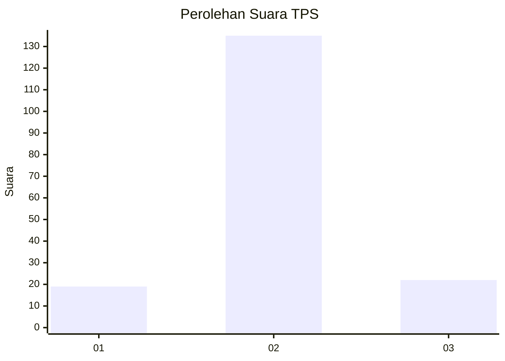
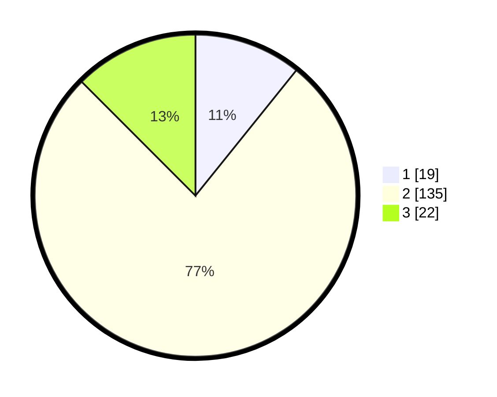

# Hasil

## Grafik

## Tabel

| No. | Nama Paslon    | Suara | Suara (raw) | Persentase |
|:--- |:-------------- | -----:| -----------:| ----------:|
| 1   | ANIES MUHAIMIN | 19    | [19][p-1]   | 10,80      |
| 2   | PRABOWO GIBRAN | 135   | [135][p-2]  | 76,70      |
| 3   | GANJAR MAHFUD  | 22    | [22][p-3]   | 12,50      |

[p-1]: https://github.com/gigit-pemilu/pemilu-2024-35-jawa-timur/blob/main/pilpres/hitung-suara/sub/35-jawa-timur/sub/14-pasuruan/sub/20-grati/sub/2013-ranuklindungan/sub/005-tps/sub/paslon-1.txt
[p-2]: https://github.com/gigit-pemilu/pemilu-2024-35-jawa-timur/blob/main/pilpres/hitung-suara/sub/35-jawa-timur/sub/14-pasuruan/sub/20-grati/sub/2013-ranuklindungan/sub/005-tps/sub/paslon-2.txt
[p-3]: https://github.com/gigit-pemilu/pemilu-2024-35-jawa-timur/blob/main/pilpres/hitung-suara/sub/35-jawa-timur/sub/14-pasuruan/sub/20-grati/sub/2013-ranuklindungan/sub/005-tps/sub/paslon-3.txt

## Foto C Plano

https://sirekap-obj-formc.kpu.go.id/07b0/pemilu/ppwp/35/14/20/20/13/3514202013005-20240217-160748--4efce016-6ad8-4431-ac29-ce1d4b031c75.jpg

https://sirekap-obj-formc.kpu.go.id/07b0/pemilu/ppwp/35/14/20/20/13/3514202013005-20240217-160626--8d1e07e8-0b42-44ec-90e9-0f1c15383d2b.jpg

https://sirekap-obj-formc.kpu.go.id/07b0/pemilu/ppwp/35/14/20/20/13/3514202013005-20240214-194432--b0c8e959-51f5-42c8-bee0-4d0ac1bd665d.jpg

## Metadata

| Key        | Value               |
| ---------- | ------------------- |
| Time Stamp | 2024-02-17 16:36:25 |

