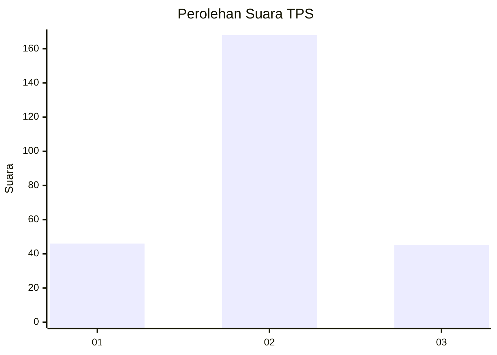
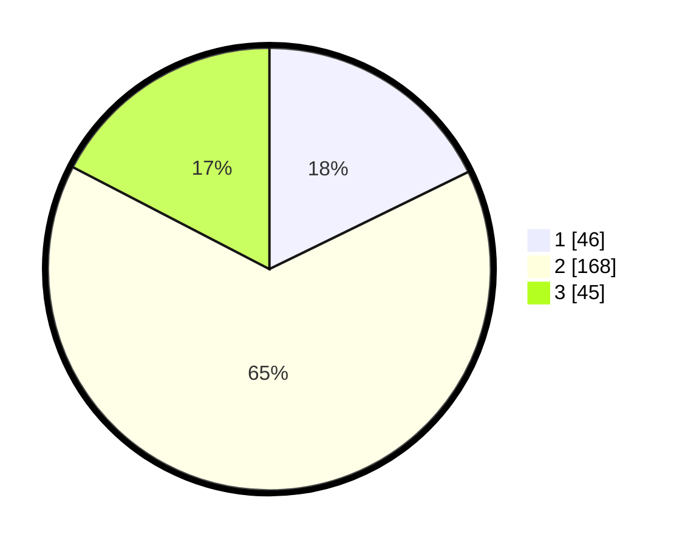

# Hasil

## Grafik

## Tabel

| No. | Nama Paslon    | Suara | Suara (raw) | Persentase |
|:--- |:-------------- | -----:| -----------:| ----------:|
| 1   | ANIES MUHAIMIN | 46    | [46][p-1]   | 17,76      |
| 2   | PRABOWO GIBRAN | 168   | [168][p-2]  | 64,86      |
| 3   | GANJAR MAHFUD  | 45    | [45][p-3]   | 17,37      |

[p-1]: https://github.com/gigit-pemilu/pemilu-2024/blob/main/pilpres/hitung-suara/sub/35-jawa-timur/sub/14-pasuruan/sub/20-grati/sub/2013-ranuklindungan/sub/009-tps/sub/paslon-1.txt
[p-2]: https://github.com/gigit-pemilu/pemilu-2024/blob/main/pilpres/hitung-suara/sub/35-jawa-timur/sub/14-pasuruan/sub/20-grati/sub/2013-ranuklindungan/sub/009-tps/sub/paslon-2.txt
[p-3]: https://github.com/gigit-pemilu/pemilu-2024/blob/main/pilpres/hitung-suara/sub/35-jawa-timur/sub/14-pasuruan/sub/20-grati/sub/2013-ranuklindungan/sub/009-tps/sub/paslon-3.txt

## Foto C Plano

https://sirekap-obj-formc.kpu.go.id/fdeb/pemilu/ppwp/35/14/20/20/13/3514202013009-20240217-194949--f5cd8a43-9b65-4a7e-8a91-92c789877fde.jpg

https://sirekap-obj-formc.kpu.go.id/fdeb/pemilu/ppwp/35/14/20/20/13/3514202013009-20240217-195713--f466e9f6-d618-4d24-94c3-967bf3a5d108.jpg

https://sirekap-obj-formc.kpu.go.id/fdeb/pemilu/ppwp/35/14/20/20/13/3514202013009-20240217-192504--b233df81-ab00-42ab-97ef-4d65dc14ec02.jpg

## Metadata

| Key        | Value               |
| ---------- | ------------------- |
| Time Stamp | 2024-02-19 06:16:00 |

