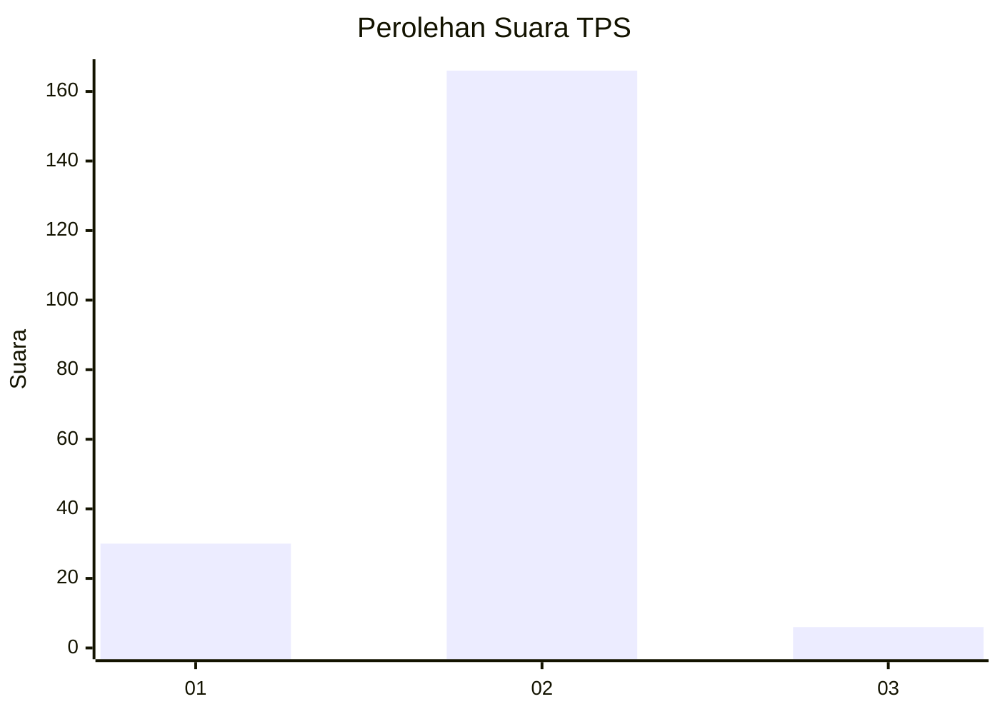
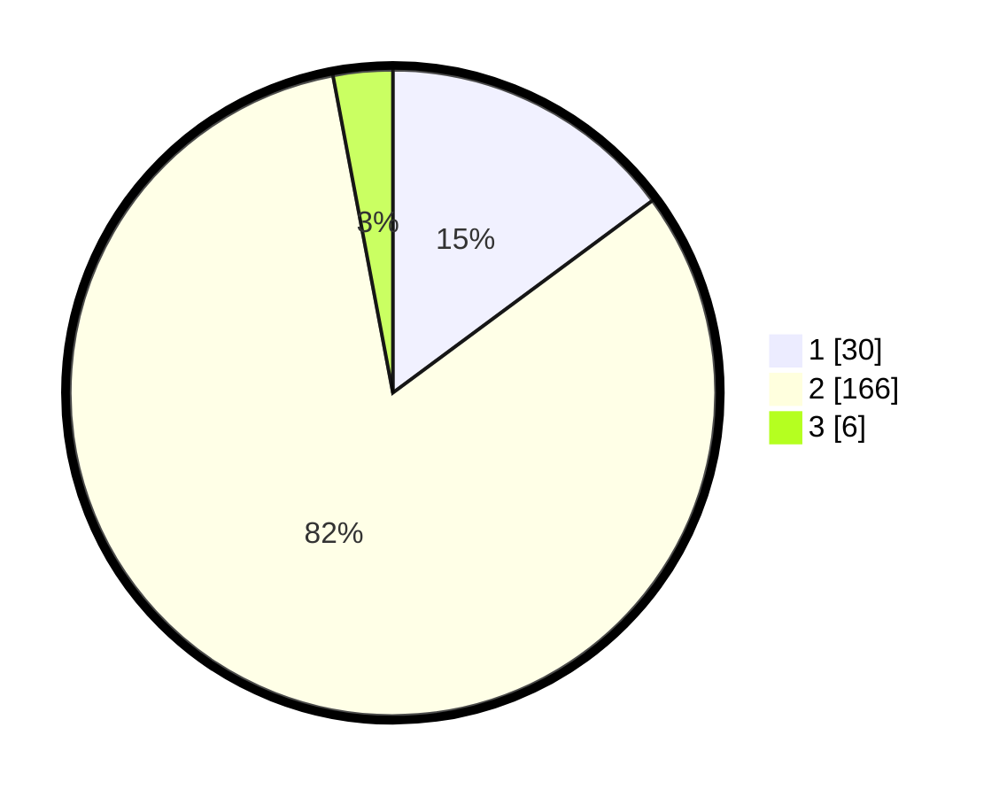

# Hasil

## Grafik

## Tabel

| No. | Nama Paslon    | Suara | Suara (raw) | Persentase |
|:--- |:-------------- | -----:| -----------:| ----------:|
| 1   | ANIES MUHAIMIN | 30    | [30][p-1]   | 14,85      |
| 2   | PRABOWO GIBRAN | 166   | [166][p-2]  | 82,18      |
| 3   | GANJAR MAHFUD  | 6     | [6][p-3]    | 2,97       |

[p-1]: https://github.com/gigit-pemilu/pemilu-2024-35-jawa-timur/blob/main/pilpres/hitung-suara/sub/35-jawa-timur/sub/14-pasuruan/sub/21-nguling/sub/2012-kedawang/sub/017-tps/sub/paslon-1.txt
[p-2]: https://github.com/gigit-pemilu/pemilu-2024-35-jawa-timur/blob/main/pilpres/hitung-suara/sub/35-jawa-timur/sub/14-pasuruan/sub/21-nguling/sub/2012-kedawang/sub/017-tps/sub/paslon-2.txt
[p-3]: https://github.com/gigit-pemilu/pemilu-2024-35-jawa-timur/blob/main/pilpres/hitung-suara/sub/35-jawa-timur/sub/14-pasuruan/sub/21-nguling/sub/2012-kedawang/sub/017-tps/sub/paslon-3.txt

## Foto C Plano

https://sirekap-obj-formc.kpu.go.id/7f0d/pemilu/ppwp/35/14/21/20/12/3514212012017-20240214-184907--ec1f4f68-14f9-49fd-82b2-841e05a85c6b.jpg

https://sirekap-obj-formc.kpu.go.id/7f0d/pemilu/ppwp/35/14/21/20/12/3514212012017-20240214-185351--559d34ce-d4ae-4995-b9d5-8e4ed589418e.jpg

https://sirekap-obj-formc.kpu.go.id/7f0d/pemilu/ppwp/35/14/21/20/12/3514212012017-20240216-202302--b266886e-0266-4c7b-bcd3-b6590ba371d4.jpg

## Metadata

| Key        | Value               |
| ---------- | ------------------- |
| Time Stamp | 2024-02-17 16:00:02 |

## DATA PEMILIH TETAP

Jumlah pemilih dalam DPT: **215**.
 * L: **435**.
 * P: **102**.

## DATA PENGGUNA HAK PILIH

Jumlah pengguna hak pilih dalam DPT: **215**.
 * L: **504**.
 * P: **412**.

Jumlah pengguna hak pilih dalam DPTb: **424**.
 * L: **488**.
 * P: **888**.

Jumlah pengguna hak pilih dalam DPK: **465**.
 * L: **882**.
 * P: **873**.

Jumlah pengguna hak pilih: **513**.
 * L: **102**.
 * P: **225**.

## JUMLAH SUARA SAH DAN TIDAK SAH

JUMLAH SELURUH SUARA SAH: **202**.

JUMLAH SUARA TIDAK SAH: **11**.

JUMLAH SELURUH SUARA SAH DAN SUARA TIDAK SAH: **213**.

