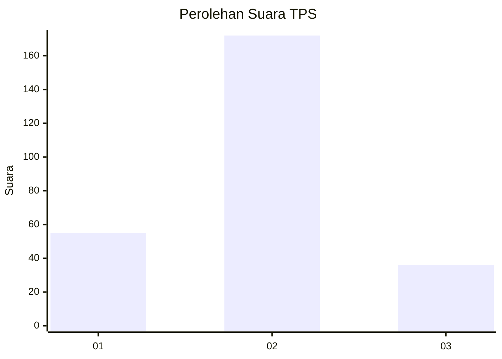
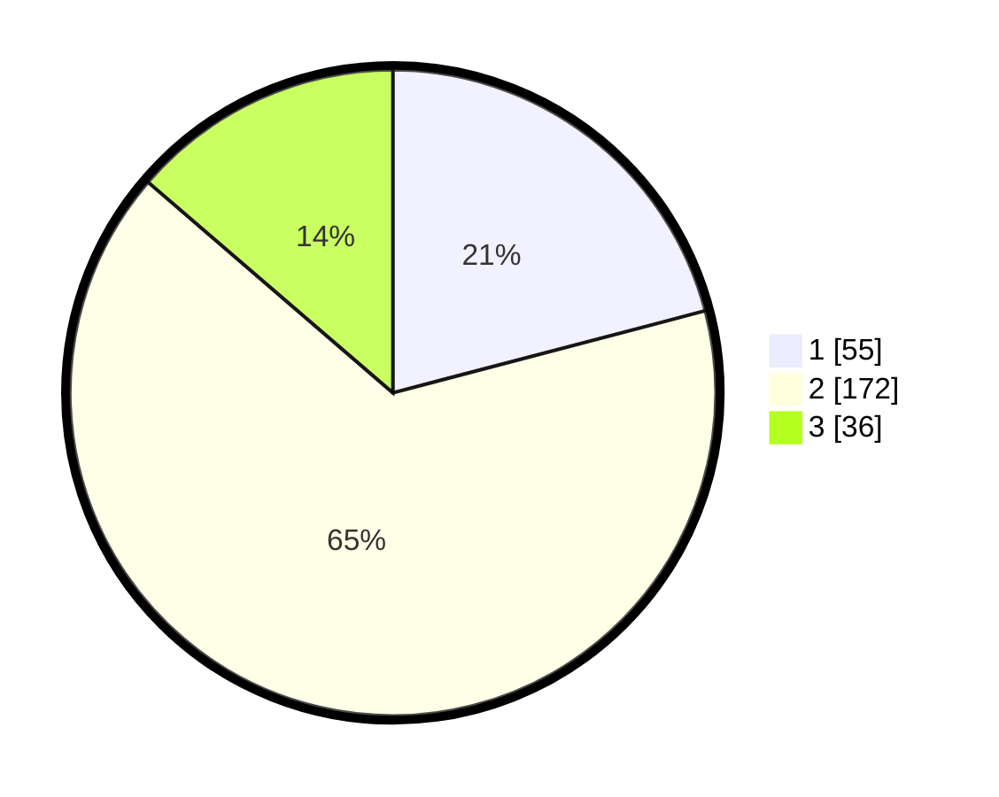

# Hasil

## Grafik

## Tabel

| No. | Nama Paslon    | Suara | Suara (raw) | Persentase |
|:--- |:-------------- | -----:| -----------:| ----------:|
| 1   | ANIES MUHAIMIN | 55    | [55][p-1]   | 20,91      |
| 2   | PRABOWO GIBRAN | 172   | [172][p-2]  | 65,40      |
| 3   | GANJAR MAHFUD  | 36    | [36][p-3]   | 13,69      |

[p-1]: https://github.com/gigit-pemilu/pemilu-2024/blob/main/pilpres/hitung-suara/sub/35-jawa-timur/sub/14-pasuruan/sub/22-lekok/sub/2001-rowogempol/sub/005-tps/sub/paslon-1.txt
[p-2]: https://github.com/gigit-pemilu/pemilu-2024/blob/main/pilpres/hitung-suara/sub/35-jawa-timur/sub/14-pasuruan/sub/22-lekok/sub/2001-rowogempol/sub/005-tps/sub/paslon-2.txt
[p-3]: https://github.com/gigit-pemilu/pemilu-2024/blob/main/pilpres/hitung-suara/sub/35-jawa-timur/sub/14-pasuruan/sub/22-lekok/sub/2001-rowogempol/sub/005-tps/sub/paslon-3.txt

## Foto C Plano

https://sirekap-obj-formc.kpu.go.id/846a/pemilu/ppwp/35/14/22/20/01/3514222001005-20240216-155452--77b32a43-a115-47a0-89af-25d10f83f9ef.jpg

https://sirekap-obj-formc.kpu.go.id/846a/pemilu/ppwp/35/14/22/20/01/3514222001005-20240217-161837--5c169f58-ba36-43bb-9649-2e0db2384660.jpg

https://sirekap-obj-formc.kpu.go.id/846a/pemilu/ppwp/35/14/22/20/01/3514222001005-20240216-155834--6999b1ed-eb0e-46ac-9ee4-b29e2bbef868.jpg

## Metadata

| Key        | Value               |
| ---------- | ------------------- |
| Time Stamp | 2024-02-17 17:30:00 |

## DATA PEMILIH TETAP

Jumlah pemilih dalam DPT: **291**.
 * L: **141**.
 * P: **150**.

## DATA PENGGUNA HAK PILIH

Jumlah pengguna hak pilih dalam DPT: **265**.
 * L: **124**.
 * P: **141**.

Jumlah pengguna hak pilih dalam DPTb: **4**.
 * L: **1**.
 * P: **3**.

Jumlah pengguna hak pilih dalam DPK: **4**.
 * L: **2**.
 * P: **2**.

Jumlah pengguna hak pilih: **273**.
 * L: **127**.
 * P: **146**.

## JUMLAH SUARA SAH DAN TIDAK SAH

JUMLAH SELURUH SUARA SAH: **263**.

JUMLAH SUARA TIDAK SAH: **10**.

JUMLAH SELURUH SUARA SAH DAN SUARA TIDAK SAH: **273**.

