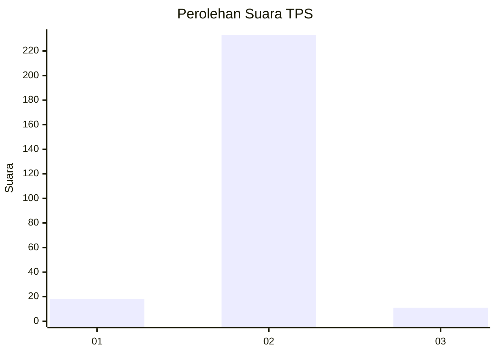
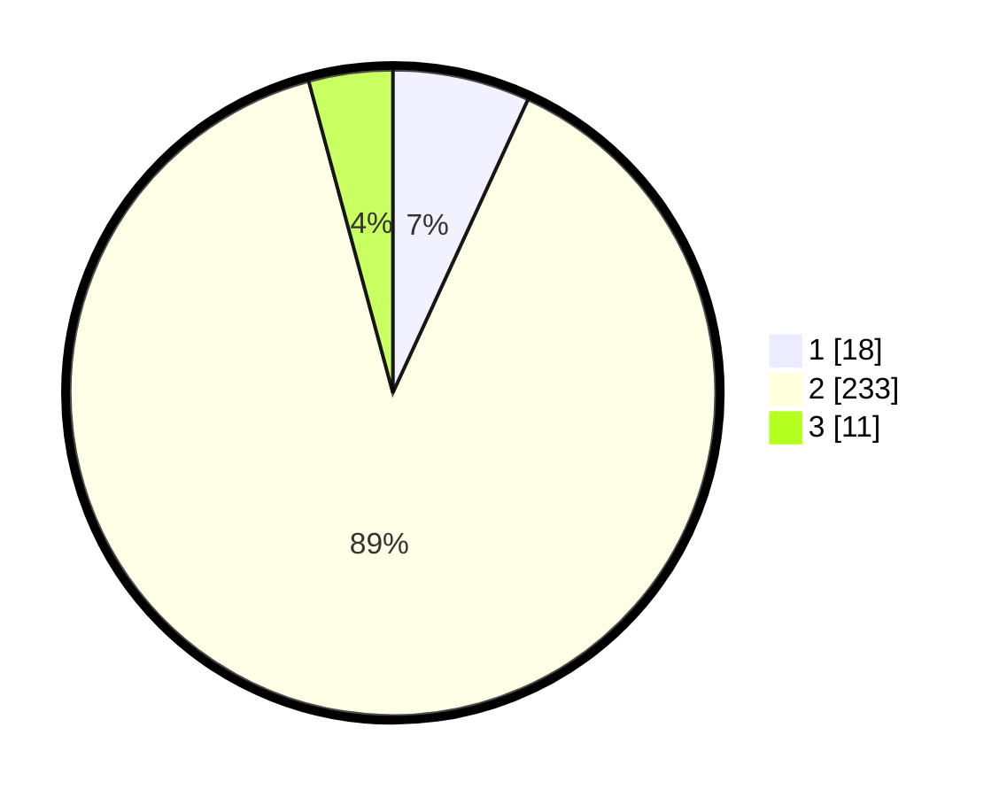

# Hasil

## Grafik

## Tabel

| No. | Nama Paslon    | Suara | Suara (raw) | Persentase |
|:--- |:-------------- | -----:| -----------:| ----------:|
| 1   | ANIES MUHAIMIN | 18    | [18][p-1]   | 6,87       |
| 2   | PRABOWO GIBRAN | 233   | [233][p-2]  | 88,93      |
| 3   | GANJAR MAHFUD  | 11    | [11][p-3]   | 4,20       |

[p-1]: https://github.com/gigit-pemilu/pemilu-2024/blob/main/pilpres/hitung-suara/sub/35-jawa-timur/sub/14-pasuruan/sub/22-lekok/sub/2001-rowogempol/sub/009-tps/sub/paslon-1.txt
[p-2]: https://github.com/gigit-pemilu/pemilu-2024/blob/main/pilpres/hitung-suara/sub/35-jawa-timur/sub/14-pasuruan/sub/22-lekok/sub/2001-rowogempol/sub/009-tps/sub/paslon-2.txt
[p-3]: https://github.com/gigit-pemilu/pemilu-2024/blob/main/pilpres/hitung-suara/sub/35-jawa-timur/sub/14-pasuruan/sub/22-lekok/sub/2001-rowogempol/sub/009-tps/sub/paslon-3.txt

## Foto C Plano

https://sirekap-obj-formc.kpu.go.id/bfdd/pemilu/ppwp/35/14/22/20/01/3514222001009-20240218-103711--1021103b-a618-4be6-8e85-ba36ef8b133d.jpg

https://sirekap-obj-formc.kpu.go.id/bfdd/pemilu/ppwp/35/14/22/20/01/3514222001009-20240214-192144--0711e3da-a9e4-432b-b767-79b0c5ef67fa.jpg

https://sirekap-obj-formc.kpu.go.id/bfdd/pemilu/ppwp/35/14/22/20/01/3514222001009-20240217-195827--350a17ef-770c-46ba-aa8e-9fa728f40378.jpg

## Metadata

| Key        | Value               |
| ---------- | ------------------- |
| Time Stamp | 2024-02-19 15:00:00 |

