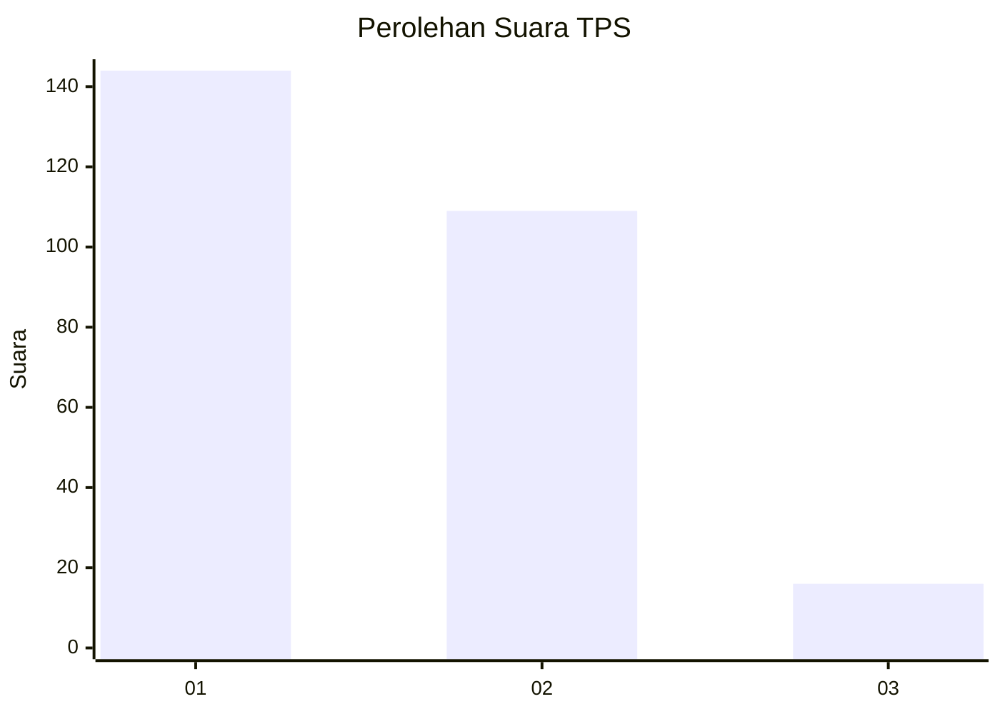
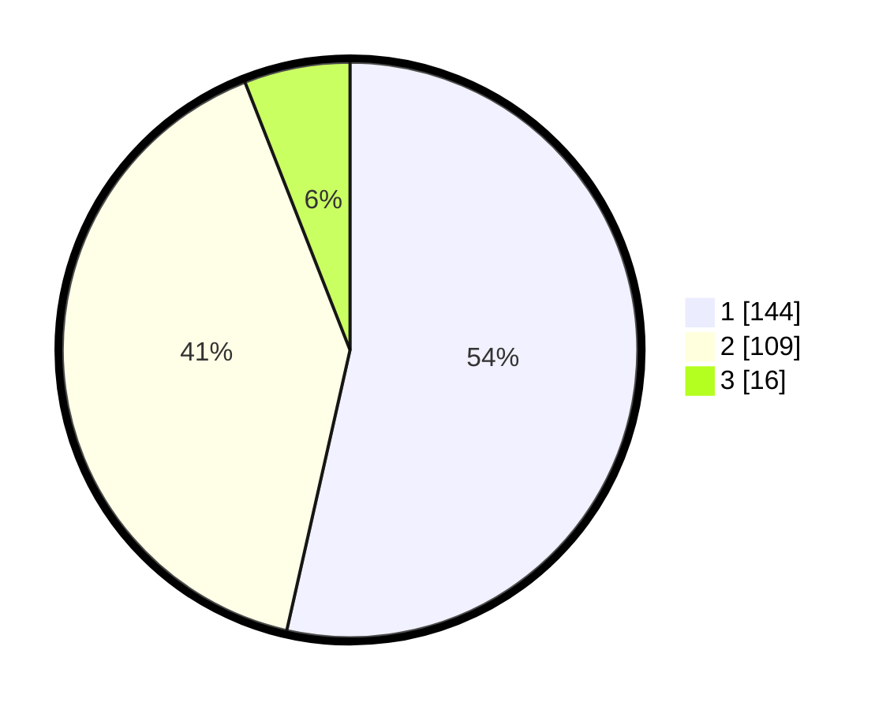

# Hasil

## Grafik

## Tabel

| No. | Nama Paslon    | Suara | Suara (raw) | Persentase |
|:--- |:-------------- | -----:| -----------:| ----------:|
| 1   | ANIES MUHAIMIN | 144   | [144][p-1]  | 53,53      |
| 2   | PRABOWO GIBRAN | 109   | [109][p-2]  | 40,52      |
| 3   | GANJAR MAHFUD  | 16    | [16][p-3]   | 5,95       |

[p-1]: https://github.com/gigit-pemilu/pemilu-2024/blob/main/pilpres/hitung-suara/sub/35-jawa-timur/sub/14-pasuruan/sub/22-lekok/sub/2006-tampung/sub/004-tps/sub/paslon-1.txt
[p-2]: https://github.com/gigit-pemilu/pemilu-2024/blob/main/pilpres/hitung-suara/sub/35-jawa-timur/sub/14-pasuruan/sub/22-lekok/sub/2006-tampung/sub/004-tps/sub/paslon-2.txt
[p-3]: https://github.com/gigit-pemilu/pemilu-2024/blob/main/pilpres/hitung-suara/sub/35-jawa-timur/sub/14-pasuruan/sub/22-lekok/sub/2006-tampung/sub/004-tps/sub/paslon-3.txt

## Foto C Plano

https://sirekap-obj-formc.kpu.go.id/dd5a/pemilu/ppwp/35/14/22/20/06/3514222006004-20240216-191930--a916c042-af7c-4334-b465-413e603c9ada.jpg

https://sirekap-obj-formc.kpu.go.id/dd5a/pemilu/ppwp/35/14/22/20/06/3514222006004-20240216-191705--feb6c401-bf89-4745-b3d9-27889fa6e9f2.jpg

https://sirekap-obj-formc.kpu.go.id/dd5a/pemilu/ppwp/35/14/22/20/06/3514222006004-20240216-192033--2e9c7f3f-5023-4fb8-b751-31ec5f1c2055.jpg

## Metadata

| Key        | Value               |
| ---------- | ------------------- |
| Time Stamp | 2024-02-16 22:01:00 |

## DATA PEMILIH TETAP

Jumlah pemilih dalam DPT: **297**.
 * L: **158**.
 * P: **139**.

## DATA PENGGUNA HAK PILIH

Jumlah pengguna hak pilih dalam DPT: **256**.
 * L: **138**.
 * P: **127**.

Jumlah pengguna hak pilih dalam DPTb: **0**.
 * L: **0**.
 * P: **0**.

Jumlah pengguna hak pilih dalam DPK: **18**.
 * L: **10**.
 * P: **8**.

Jumlah pengguna hak pilih: **283**.
 * L: **148**.
 * P: **135**.

## JUMLAH SUARA SAH DAN TIDAK SAH

JUMLAH SELURUH SUARA SAH: **269**.

JUMLAH SUARA TIDAK SAH: **14**.

JUMLAH SELURUH SUARA SAH DAN SUARA TIDAK SAH: **283**.

