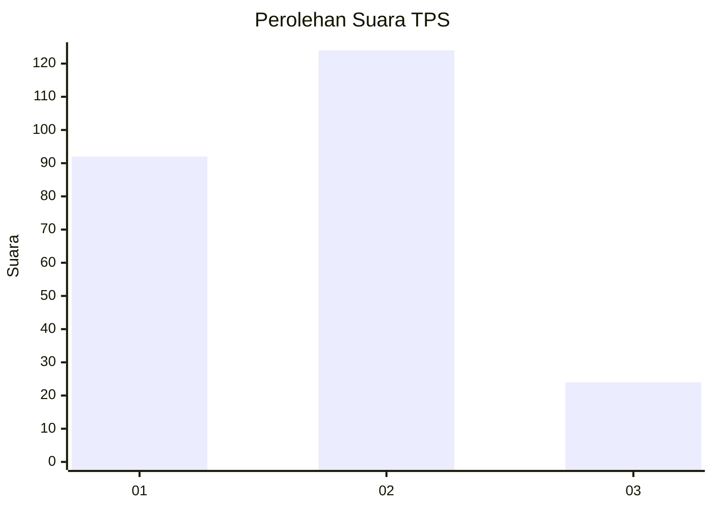
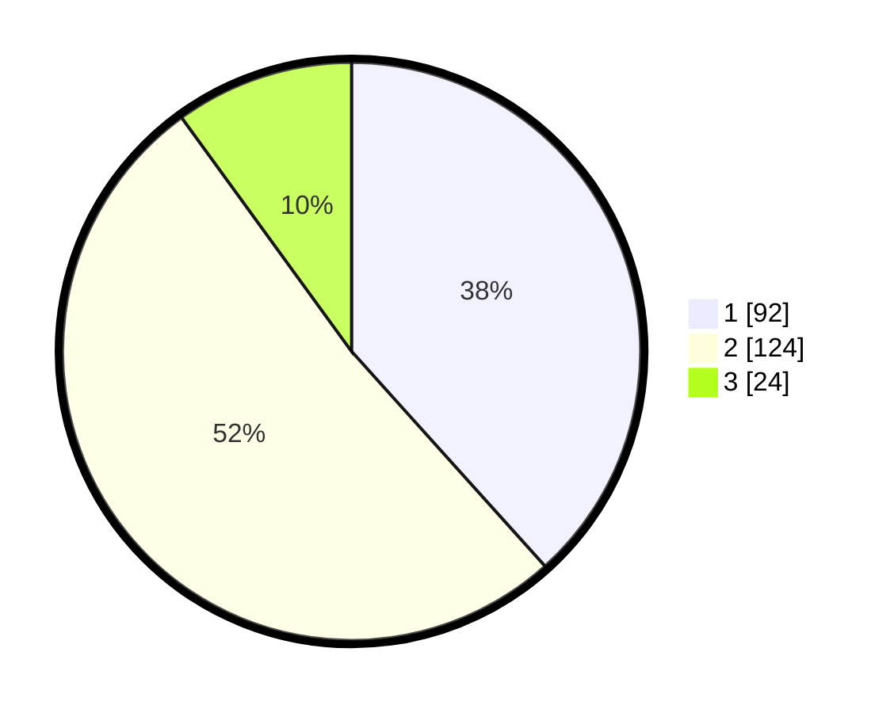

# Hasil

## Grafik

## Tabel

| No. | Nama Paslon    | Suara | Suara (raw) | Persentase |
|:--- |:-------------- | -----:| -----------:| ----------:|
| 1   | ANIES MUHAIMIN | 92    | [92][p-1]   | 38,33      |
| 2   | PRABOWO GIBRAN | 124   | [124][p-2]  | 51,67      |
| 3   | GANJAR MAHFUD  | 24    | [24][p-3]   | 10,00      |

[p-1]: https://github.com/gigit-pemilu/pemilu-2024/blob/main/pilpres/hitung-suara/sub/35-jawa-timur/sub/14-pasuruan/sub/22-lekok/sub/2010-wates/sub/002-tps/sub/paslon-1.txt
[p-2]: https://github.com/gigit-pemilu/pemilu-2024/blob/main/pilpres/hitung-suara/sub/35-jawa-timur/sub/14-pasuruan/sub/22-lekok/sub/2010-wates/sub/002-tps/sub/paslon-2.txt
[p-3]: https://github.com/gigit-pemilu/pemilu-2024/blob/main/pilpres/hitung-suara/sub/35-jawa-timur/sub/14-pasuruan/sub/22-lekok/sub/2010-wates/sub/002-tps/sub/paslon-3.txt

## Foto C Plano

https://sirekap-obj-formc.kpu.go.id/cef6/pemilu/ppwp/35/14/22/20/10/3514222010002-20240214-230949--5aa04e0e-4950-4f88-8436-310a105028e5.jpg

https://sirekap-obj-formc.kpu.go.id/cef6/pemilu/ppwp/35/14/22/20/10/3514222010002-20240216-185204--66b2b31c-b93b-4119-8953-97a79ad52a53.jpg

https://sirekap-obj-formc.kpu.go.id/cef6/pemilu/ppwp/35/14/22/20/10/3514222010002-20240216-185400--12b88817-2070-43c8-8186-b9ebfec81fc3.jpg

## Metadata

| Key        | Value               |
| ---------- | ------------------- |
| Time Stamp | 2024-02-17 12:00:00 |

## DATA PEMILIH TETAP

Jumlah pemilih dalam DPT: **237**.
 * L: **241**.
 * P: **156**.

## DATA PENGGUNA HAK PILIH

Jumlah pengguna hak pilih dalam DPT: **221**.
 * L: **123**.
 * P: **132**.

Jumlah pengguna hak pilih dalam DPTb: **887**.
 * L: **820**.
 * P: **8**.

Jumlah pengguna hak pilih dalam DPK: **4**.
 * L: **2**.
 * P: **3**.

Jumlah pengguna hak pilih: **265**.
 * L: **125**.
 * P: **540**.

## JUMLAH SUARA SAH DAN TIDAK SAH

JUMLAH SELURUH SUARA SAH: **240**.

JUMLAH SUARA TIDAK SAH: **25**.

JUMLAH SELURUH SUARA SAH DAN SUARA TIDAK SAH: **265**.

