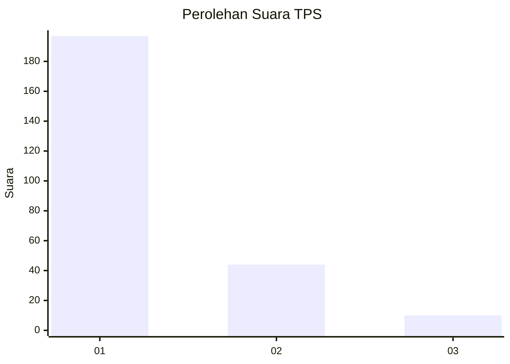
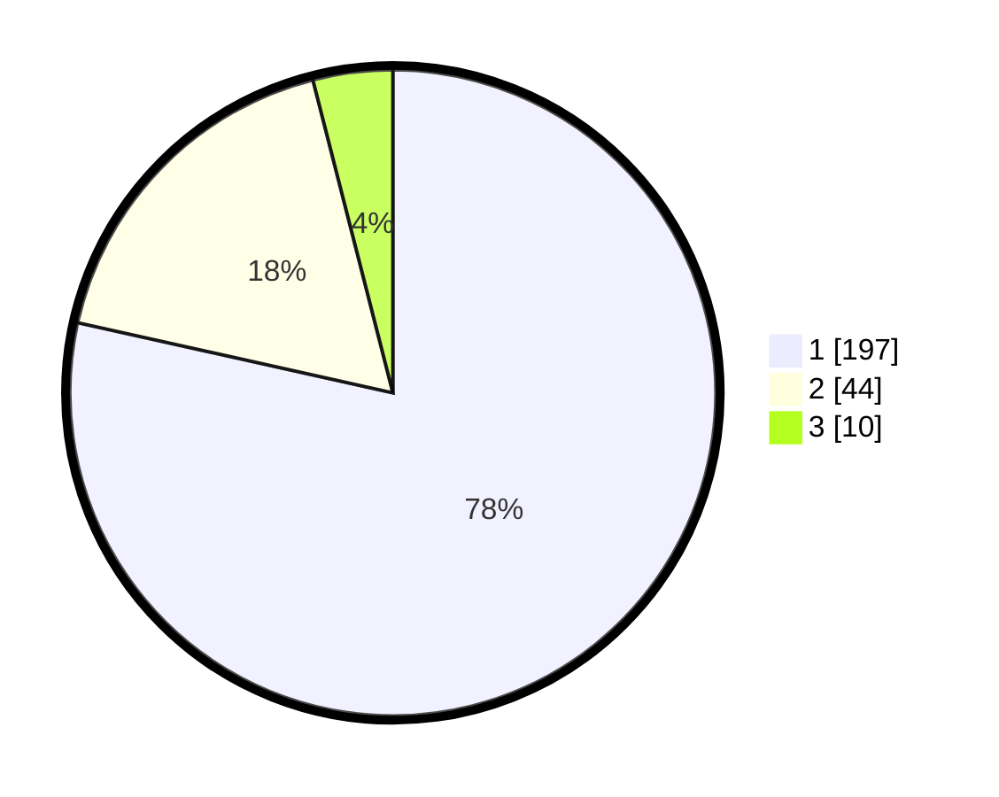

# Hasil

## Grafik

## Tabel

| No. | Nama Paslon    | Suara | Suara (raw) | Persentase |
|:--- |:-------------- | -----:| -----------:| ----------:|
| 1   | ANIES MUHAIMIN | 197   | [197][p-1]  | 78,49      |
| 2   | PRABOWO GIBRAN | 44    | [44][p-2]   | 17,53      |
| 3   | GANJAR MAHFUD  | 10    | [10][p-3]   | 3,98       |

[p-1]: https://github.com/gigit-pemilu/pemilu-2024/blob/main/pilpres/hitung-suara/sub/35-jawa-timur/sub/14-pasuruan/sub/22-lekok/sub/2010-wates/sub/018-tps/sub/paslon-1.txt
[p-2]: https://github.com/gigit-pemilu/pemilu-2024/blob/main/pilpres/hitung-suara/sub/35-jawa-timur/sub/14-pasuruan/sub/22-lekok/sub/2010-wates/sub/018-tps/sub/paslon-2.txt
[p-3]: https://github.com/gigit-pemilu/pemilu-2024/blob/main/pilpres/hitung-suara/sub/35-jawa-timur/sub/14-pasuruan/sub/22-lekok/sub/2010-wates/sub/018-tps/sub/paslon-3.txt

## Foto C Plano

https://sirekap-obj-formc.kpu.go.id/b5c2/pemilu/ppwp/35/14/22/20/10/3514222010018-20240217-124110--a1eaa63b-a7f8-4598-8c9d-fa7e2362d450.jpg

https://sirekap-obj-formc.kpu.go.id/b5c2/pemilu/ppwp/35/14/22/20/10/3514222010018-20240217-172611--e0d4e4e8-598e-4c25-a418-653ce6e214a3.jpg

https://sirekap-obj-formc.kpu.go.id/b5c2/pemilu/ppwp/35/14/22/20/10/3514222010018-20240217-123431--07fa6174-6d45-4d88-b960-3ae1e451d445.jpg

## Metadata

| Key        | Value               |
| ---------- | ------------------- |
| Time Stamp | 2024-02-19 06:16:00 |

