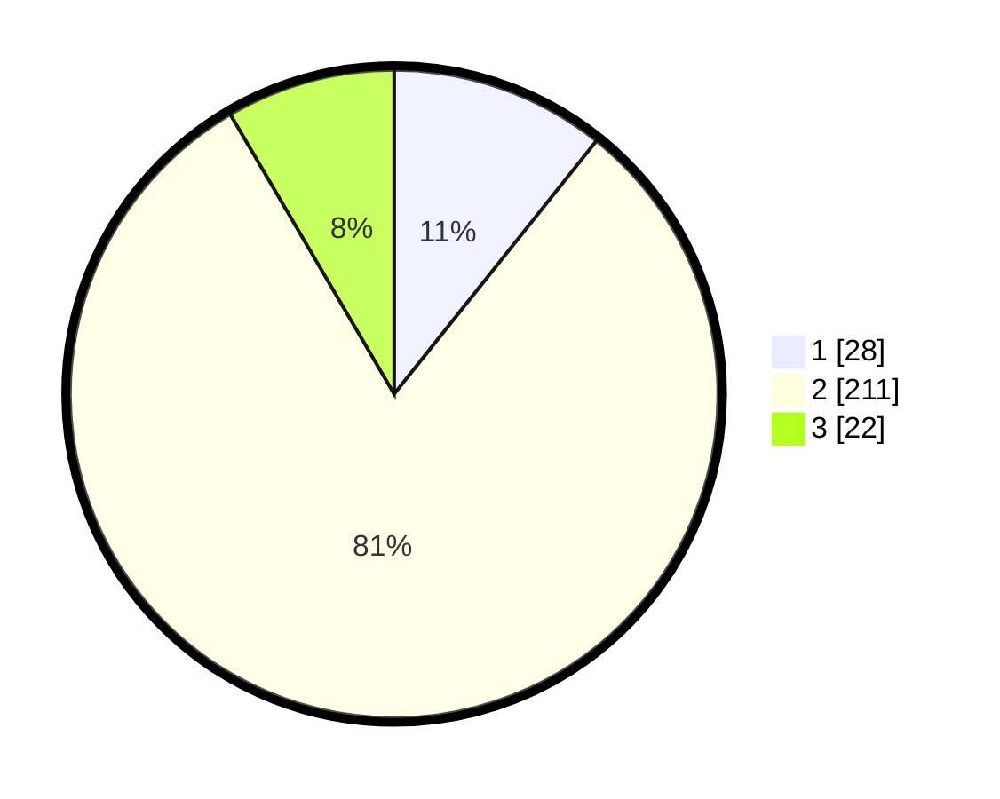

# Hasil

## Grafik

## Tabel

| No. | Nama Paslon    | Suara | Suara (raw) | Persentase |
|:--- |:-------------- | -----:| -----------:| ----------:|
| 1   | ANIES MUHAIMIN | 28    | [28][p-1]   | 10,73      |
| 2   | PRABOWO GIBRAN | 211   | [211][p-2]  | 80,84      |
| 3   | GANJAR MAHFUD  | 22    | [22][p-3]   | 8,43       |

[p-1]: https://github.com/gigit-pemilu/pemilu-2024-35-jawa-timur/blob/main/pilpres/hitung-suara/sub/35-jawa-timur/sub/14-pasuruan/sub/23-rejoso/sub/2005-arjosari/sub/007-tps/sub/paslon-1.txt
[p-2]: https://github.com/gigit-pemilu/pemilu-2024-35-jawa-timur/blob/main/pilpres/hitung-suara/sub/35-jawa-timur/sub/14-pasuruan/sub/23-rejoso/sub/2005-arjosari/sub/007-tps/sub/paslon-2.txt
[p-3]: https://github.com/gigit-pemilu/pemilu-2024-35-jawa-timur/blob/main/pilpres/hitung-suara/sub/35-jawa-timur/sub/14-pasuruan/sub/23-rejoso/sub/2005-arjosari/sub/007-tps/sub/paslon-3.txt

## Foto C Plano

https://sirekap-obj-formc.kpu.go.id/fa0f/pemilu/ppwp/35/14/23/20/05/3514232005007-20240215-204301--62f8bf12-5518-4a52-b043-07dd031a98c0.jpg

https://sirekap-obj-formc.kpu.go.id/fa0f/pemilu/ppwp/35/14/23/20/05/3514232005007-20240215-212130--7dc7732e-d44e-403a-a162-185b391ef9e3.jpg

https://sirekap-obj-formc.kpu.go.id/fa0f/pemilu/ppwp/35/14/23/20/05/3514232005007-20240215-204546--837e3c77-8d2a-449a-a8f7-1a2d0b41c309.jpg

## Metadata

| Key        | Value               |
| ---------- | ------------------- |
| Time Stamp | 2024-02-16 00:00:26 |

