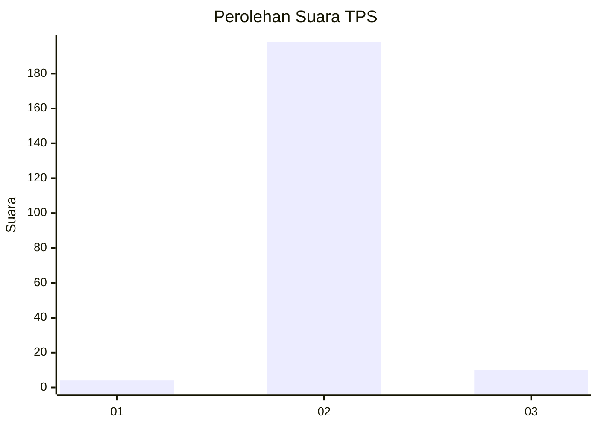
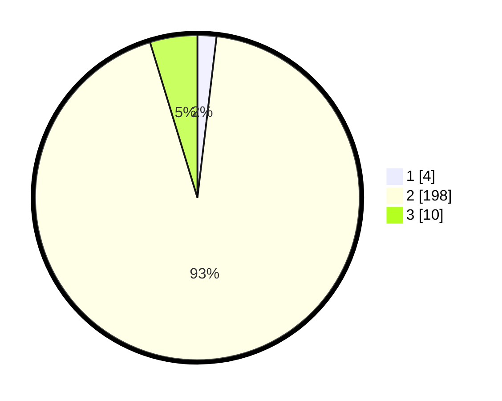

# Hasil

## Grafik

## Tabel

| No. | Nama Paslon    | Suara | Suara (raw) | Persentase |
|:--- |:-------------- | -----:| -----------:| ----------:|
| 1   | ANIES MUHAIMIN | 4     | [4][p-1]    | 1,89       |
| 2   | PRABOWO GIBRAN | 198   | [198][p-2]  | 93,40      |
| 3   | GANJAR MAHFUD  | 10    | [10][p-3]   | 4,72       |

[p-1]: https://github.com/gigit-pemilu/pemilu-2024/blob/main/pilpres/hitung-suara/sub/35-jawa-timur/sub/14-pasuruan/sub/24-tosari/sub/2007-sedaeng/sub/001-tps/sub/paslon-1.txt
[p-2]: https://github.com/gigit-pemilu/pemilu-2024/blob/main/pilpres/hitung-suara/sub/35-jawa-timur/sub/14-pasuruan/sub/24-tosari/sub/2007-sedaeng/sub/001-tps/sub/paslon-2.txt
[p-3]: https://github.com/gigit-pemilu/pemilu-2024/blob/main/pilpres/hitung-suara/sub/35-jawa-timur/sub/14-pasuruan/sub/24-tosari/sub/2007-sedaeng/sub/001-tps/sub/paslon-3.txt

## Foto C Plano

https://sirekap-obj-formc.kpu.go.id/3d53/pemilu/ppwp/35/14/24/20/07/3514242007001-20240217-125731--4ae0fab0-7f0c-4ead-9a54-6e45a5b7d2f5.jpg

https://sirekap-obj-formc.kpu.go.id/3d53/pemilu/ppwp/35/14/24/20/07/3514242007001-20240217-170758--28ed352f-877b-4029-abba-7c66ed4bedd6.jpg

https://sirekap-obj-formc.kpu.go.id/3d53/pemilu/ppwp/35/14/24/20/07/3514242007001-20240217-170757--c654d6ac-c2a2-4569-910b-b8fa5b580742.jpg

## Metadata

| Key        | Value               |
| ---------- | ------------------- |
| Time Stamp | 2024-02-19 06:16:00 |

