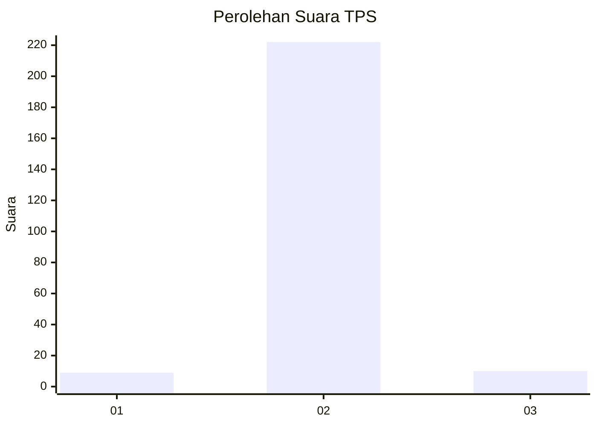
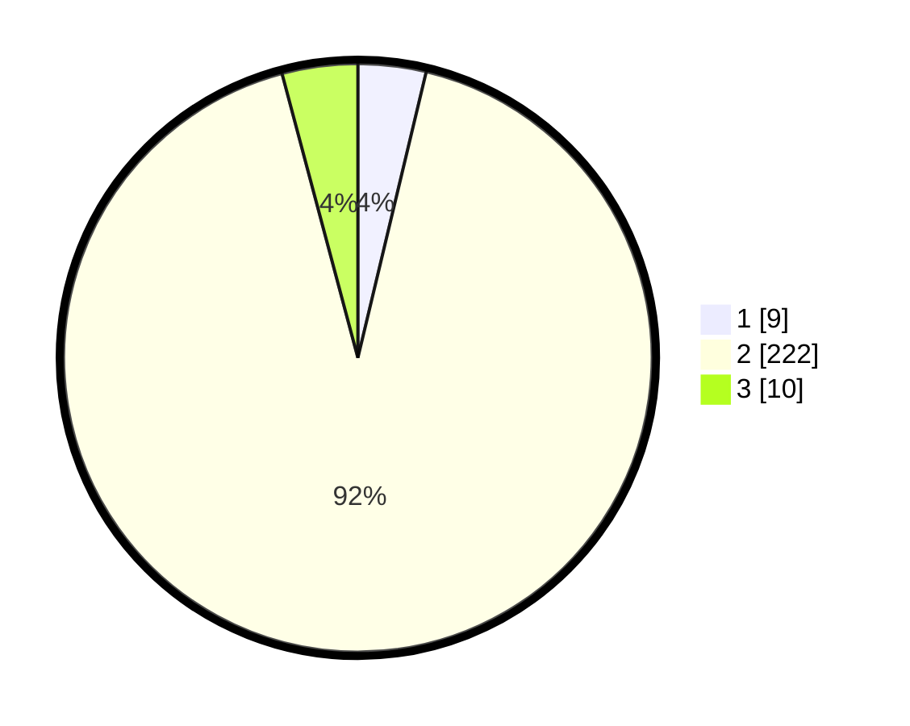

# Hasil

## Grafik

## Tabel

| No. | Nama Paslon    | Suara | Suara (raw) | Persentase |
|:--- |:-------------- | -----:| -----------:| ----------:|
| 1   | ANIES MUHAIMIN | 9     | [9][p-1]    | 3,73       |
| 2   | PRABOWO GIBRAN | 222   | [222][p-2]  | 92,12      |
| 3   | GANJAR MAHFUD  | 10    | [10][p-3]   | 4,15       |

[p-1]: https://github.com/gigit-pemilu/pemilu-2024/blob/main/pilpres/hitung-suara/sub/35-jawa-timur/sub/14-pasuruan/sub/24-tosari/sub/2008-kandangan/sub/004-tps/sub/paslon-1.txt
[p-2]: https://github.com/gigit-pemilu/pemilu-2024/blob/main/pilpres/hitung-suara/sub/35-jawa-timur/sub/14-pasuruan/sub/24-tosari/sub/2008-kandangan/sub/004-tps/sub/paslon-2.txt
[p-3]: https://github.com/gigit-pemilu/pemilu-2024/blob/main/pilpres/hitung-suara/sub/35-jawa-timur/sub/14-pasuruan/sub/24-tosari/sub/2008-kandangan/sub/004-tps/sub/paslon-3.txt

## Foto C Plano

https://sirekap-obj-formc.kpu.go.id/1f2e/pemilu/ppwp/35/14/24/20/08/3514242008004-20240217-191246--b745354d-85aa-42d6-9566-511160d559ec.jpg

https://sirekap-obj-formc.kpu.go.id/1f2e/pemilu/ppwp/35/14/24/20/08/3514242008004-20240217-191410--f3d17871-90e6-4fba-97cb-670a58a5cc28.jpg

https://sirekap-obj-formc.kpu.go.id/1f2e/pemilu/ppwp/35/14/24/20/08/3514242008004-20240217-191508--9e88e8e3-a958-4dac-91be-0e3680e5a5fa.jpg

## Metadata

| Key        | Value               |
| ---------- | ------------------- |
| Time Stamp | 2024-02-17 19:30:00 |

## DATA PEMILIH TETAP

Jumlah pemilih dalam DPT: **251**.
 * L: **130**.
 * P: **121**.

## DATA PENGGUNA HAK PILIH

Jumlah pengguna hak pilih dalam DPT: **241**.
 * L: **127**.
 * P: **114**.

Jumlah pengguna hak pilih dalam DPTb: **264**.
 * L: **127**.
 * P: **114**.

Jumlah pengguna hak pilih dalam DPK: **6**.
 * L: **0**.
 * P: **0**.

Jumlah pengguna hak pilih: **0**.
 * L: **0**.
 * P: **0**.

## JUMLAH SUARA SAH DAN TIDAK SAH

JUMLAH SELURUH SUARA SAH: **241**.

JUMLAH SUARA TIDAK SAH: **0**.

JUMLAH SELURUH SUARA SAH DAN SUARA TIDAK SAH: **241**.

