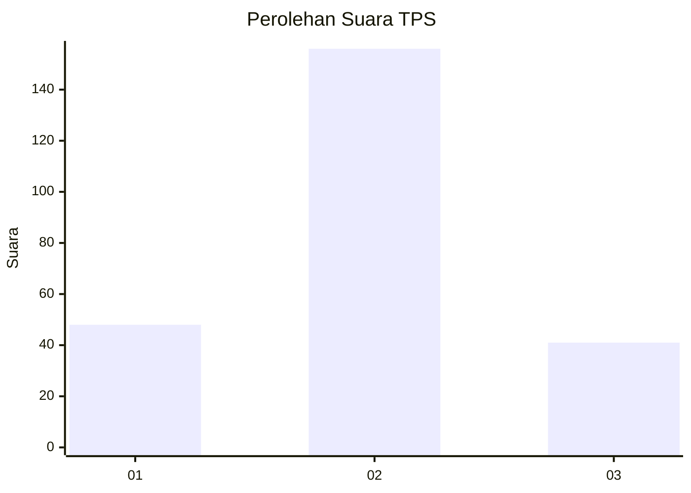

# Hasil

## Grafik

## Tabel

| No. | Nama Paslon    | Suara | Suara (raw) | Persentase |
|:--- |:-------------- | -----:| -----------:| ----------:|
| 1   | ANIES MUHAIMIN | 48    | [48][p-1]   | 19,59      |
| 2   | PRABOWO GIBRAN | 156   | [156][p-2]  | 63,67      |
| 3   | GANJAR MAHFUD  | 41    | [41][p-3]   | 16,73      |

[p-1]: https://github.com/gigit-pemilu/pemilu-2024/blob/main/pilpres/hitung-suara/sub/35-jawa-timur/sub/15-sidoarjo/sub/01-tarik/sub/2005-mergobener/sub/004-tps/sub/paslon-1.txt
[p-2]: https://github.com/gigit-pemilu/pemilu-2024/blob/main/pilpres/hitung-suara/sub/35-jawa-timur/sub/15-sidoarjo/sub/01-tarik/sub/2005-mergobener/sub/004-tps/sub/paslon-2.txt
[p-3]: https://github.com/gigit-pemilu/pemilu-2024/blob/main/pilpres/hitung-suara/sub/35-jawa-timur/sub/15-sidoarjo/sub/01-tarik/sub/2005-mergobener/sub/004-tps/sub/paslon-3.txt

## Foto C Plano

https://sirekap-obj-formc.kpu.go.id/2a1d/pemilu/ppwp/35/15/01/20/05/3515012005004-20240215-013026--d7db181c-66b6-4161-aaaf-c1c77ae86055.jpg

https://sirekap-obj-formc.kpu.go.id/2a1d/pemilu/ppwp/35/15/01/20/05/3515012005004-20240215-013500--c8a54561-54c0-41ea-90a9-dbfcc6e45c5f.jpg

https://sirekap-obj-formc.kpu.go.id/2a1d/pemilu/ppwp/35/15/01/20/05/3515012005004-20240215-013919--3c40b555-e657-4aea-9478-a9eed40ff1b7.jpg

## Metadata

| Key        | Value               |
| ---------- | ------------------- |
| Time Stamp | 2024-02-15 17:30:25 |

