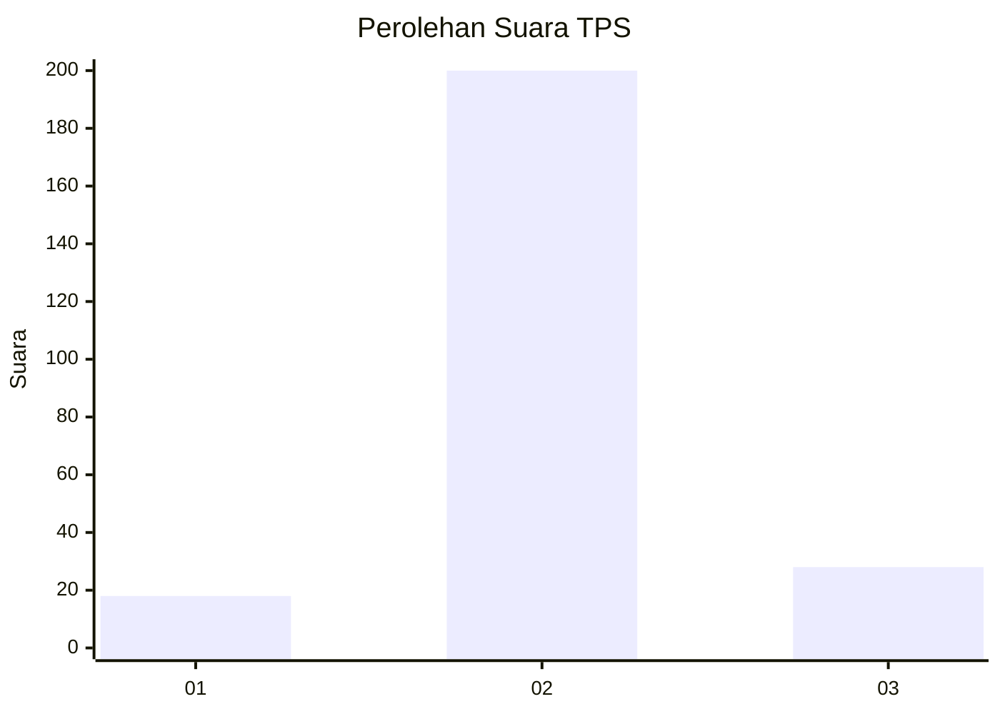
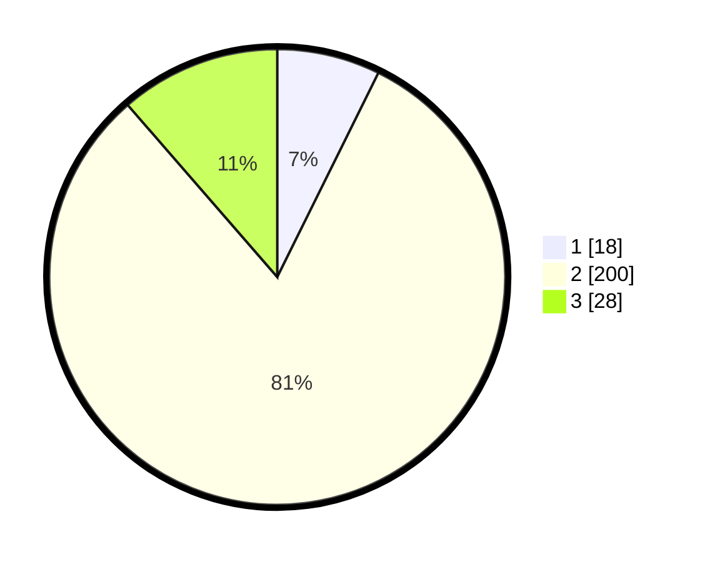

# Hasil

## Grafik

## Tabel

| No. | Nama Paslon    | Suara | Suara (raw) | Persentase |
|:--- |:-------------- | -----:| -----------:| ----------:|
| 1   | ANIES MUHAIMIN | 18    | [18][p-1]   | 7,32       |
| 2   | PRABOWO GIBRAN | 200   | [200][p-2]  | 81,30      |
| 3   | GANJAR MAHFUD  | 28    | [28][p-3]   | 11,38      |

[p-1]: https://github.com/gigit-pemilu/pemilu-2024-35-jawa-timur/blob/main/pilpres/hitung-suara/sub/35-jawa-timur/sub/15-sidoarjo/sub/01-tarik/sub/2009-kalimati/sub/005-tps/sub/paslon-1.txt
[p-2]: https://github.com/gigit-pemilu/pemilu-2024-35-jawa-timur/blob/main/pilpres/hitung-suara/sub/35-jawa-timur/sub/15-sidoarjo/sub/01-tarik/sub/2009-kalimati/sub/005-tps/sub/paslon-2.txt
[p-3]: https://github.com/gigit-pemilu/pemilu-2024-35-jawa-timur/blob/main/pilpres/hitung-suara/sub/35-jawa-timur/sub/15-sidoarjo/sub/01-tarik/sub/2009-kalimati/sub/005-tps/sub/paslon-3.txt

## Foto C Plano

https://sirekap-obj-formc.kpu.go.id/8df2/pemilu/ppwp/35/15/01/20/09/3515012009005-20240214-232657--6d7b38ba-eb3e-4ed9-9c6e-a8f3d6c62dea.jpg

https://sirekap-obj-formc.kpu.go.id/8df2/pemilu/ppwp/35/15/01/20/09/3515012009005-20240214-231723--c851d5f6-ad39-4454-8ec6-631ccbbcd291.jpg

https://sirekap-obj-formc.kpu.go.id/8df2/pemilu/ppwp/35/15/01/20/09/3515012009005-20240214-231857--79ee13ff-3e10-47d9-85af-f829b931c3db.jpg

## Metadata

| Key        | Value               |
| ---------- | ------------------- |
| Time Stamp | 2024-02-15 17:30:25 |

