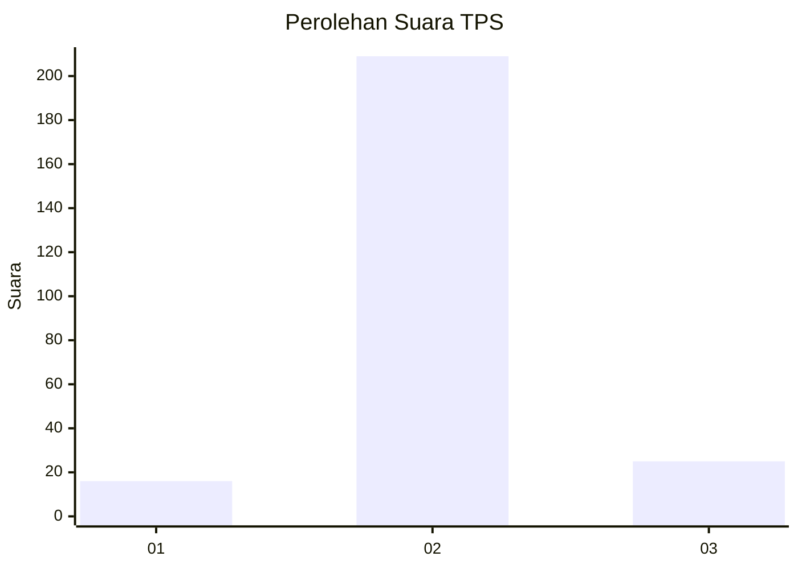
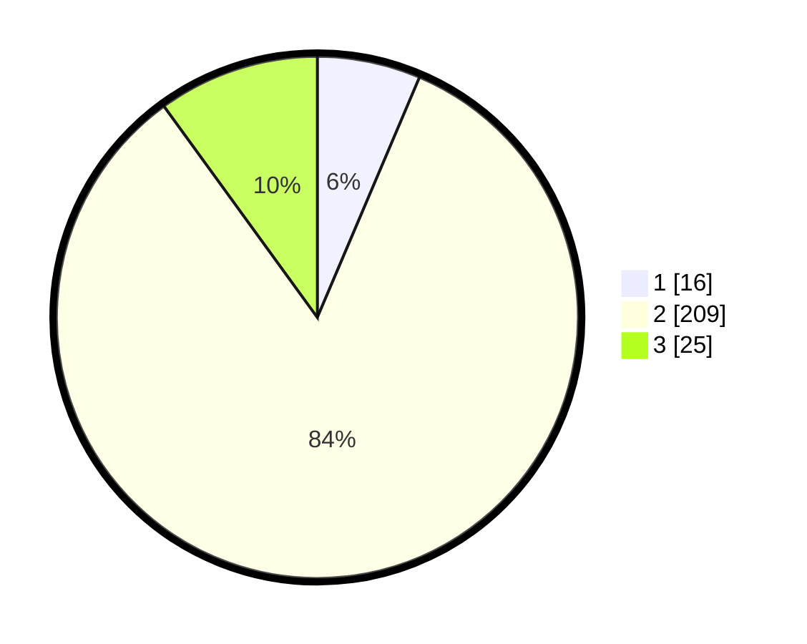

# Hasil

## Grafik

## Tabel

| No. | Nama Paslon    | Suara | Suara (raw) | Persentase |
|:--- |:-------------- | -----:| -----------:| ----------:|
| 1   | ANIES MUHAIMIN | 16    | [16][p-1]   | 6,40       |
| 2   | PRABOWO GIBRAN | 209   | [209][p-2]  | 83,60      |
| 3   | GANJAR MAHFUD  | 25    | [25][p-3]   | 10,00      |

[p-1]: https://github.com/gigit-pemilu/pemilu-2024-35-jawa-timur/blob/main/pilpres/hitung-suara/sub/35-jawa-timur/sub/15-sidoarjo/sub/01-tarik/sub/2009-kalimati/sub/007-tps/sub/paslon-1.txt
[p-2]: https://github.com/gigit-pemilu/pemilu-2024-35-jawa-timur/blob/main/pilpres/hitung-suara/sub/35-jawa-timur/sub/15-sidoarjo/sub/01-tarik/sub/2009-kalimati/sub/007-tps/sub/paslon-2.txt
[p-3]: https://github.com/gigit-pemilu/pemilu-2024-35-jawa-timur/blob/main/pilpres/hitung-suara/sub/35-jawa-timur/sub/15-sidoarjo/sub/01-tarik/sub/2009-kalimati/sub/007-tps/sub/paslon-3.txt

## Foto C Plano

https://sirekap-obj-formc.kpu.go.id/1110/pemilu/ppwp/35/15/01/20/09/3515012009007-20240216-143351--e6324672-3862-42d6-92a6-e5b17150714c.jpg

https://sirekap-obj-formc.kpu.go.id/1110/pemilu/ppwp/35/15/01/20/09/3515012009007-20240216-155542--a93e898a-3665-45b4-a940-04b0172a9bd7.jpg

https://sirekap-obj-formc.kpu.go.id/1110/pemilu/ppwp/35/15/01/20/09/3515012009007-20240215-005206--4105eb13-10d9-488b-ac30-7f1b828b5d2f.jpg

## Metadata

| Key        | Value               |
| ---------- | ------------------- |
| Time Stamp | 2024-02-16 16:25:10 |

