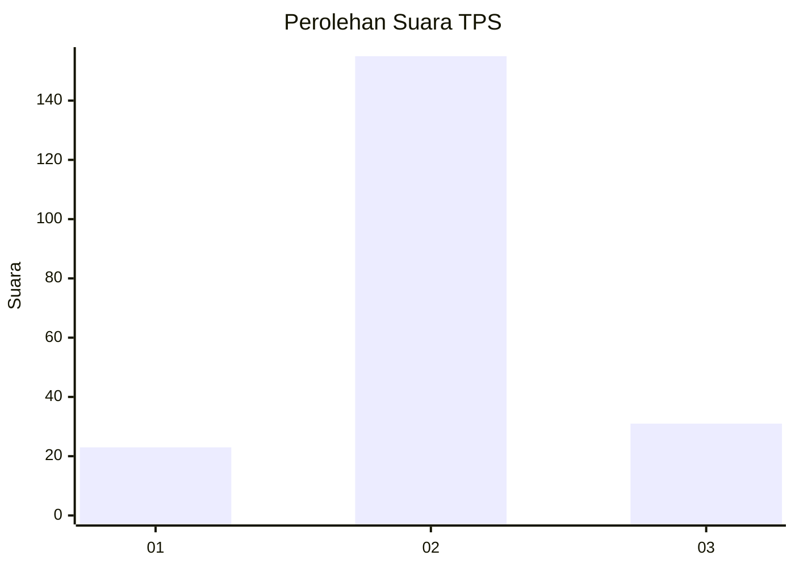
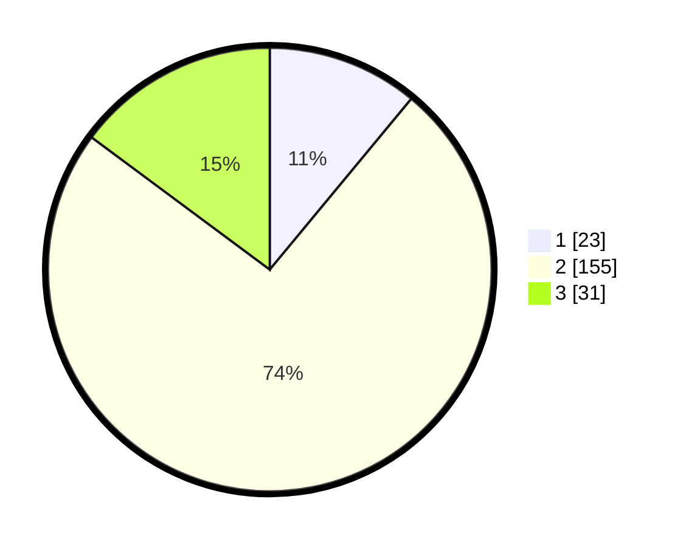

# Hasil

## Grafik

## Tabel

| No. | Nama Paslon    | Suara | Suara (raw) | Persentase |
|:--- |:-------------- | -----:| -----------:| ----------:|
| 1   | ANIES MUHAIMIN | 23    | [23][p-1]   | 11,00      |
| 2   | PRABOWO GIBRAN | 155   | [155][p-2]  | 74,16      |
| 3   | GANJAR MAHFUD  | 31    | [31][p-3]   | 14,83      |

[p-1]: https://github.com/gigit-pemilu/pemilu-2024/blob/main/pilpres/hitung-suara/sub/35-jawa-timur/sub/15-sidoarjo/sub/01-tarik/sub/2010-gempolklutuk/sub/002-tps/sub/paslon-1.txt
[p-2]: https://github.com/gigit-pemilu/pemilu-2024/blob/main/pilpres/hitung-suara/sub/35-jawa-timur/sub/15-sidoarjo/sub/01-tarik/sub/2010-gempolklutuk/sub/002-tps/sub/paslon-2.txt
[p-3]: https://github.com/gigit-pemilu/pemilu-2024/blob/main/pilpres/hitung-suara/sub/35-jawa-timur/sub/15-sidoarjo/sub/01-tarik/sub/2010-gempolklutuk/sub/002-tps/sub/paslon-3.txt

## Foto C Plano

https://sirekap-obj-formc.kpu.go.id/5493/pemilu/ppwp/35/15/01/20/10/3515012010002-20240218-113922--33a39714-5d96-483c-be7d-6faf9bd91760.jpg

https://sirekap-obj-formc.kpu.go.id/5493/pemilu/ppwp/35/15/01/20/10/3515012010002-20240218-114035--0341defc-1ee6-432e-8bf1-2945dbc53cf3.jpg

https://sirekap-obj-formc.kpu.go.id/5493/pemilu/ppwp/35/15/01/20/10/3515012010002-20240217-210315--4305b262-edb0-4acd-a05f-b0782142eca8.jpg

## Metadata

| Key        | Value               |
| ---------- | ------------------- |
| Time Stamp | 2024-02-24 22:31:28 |

