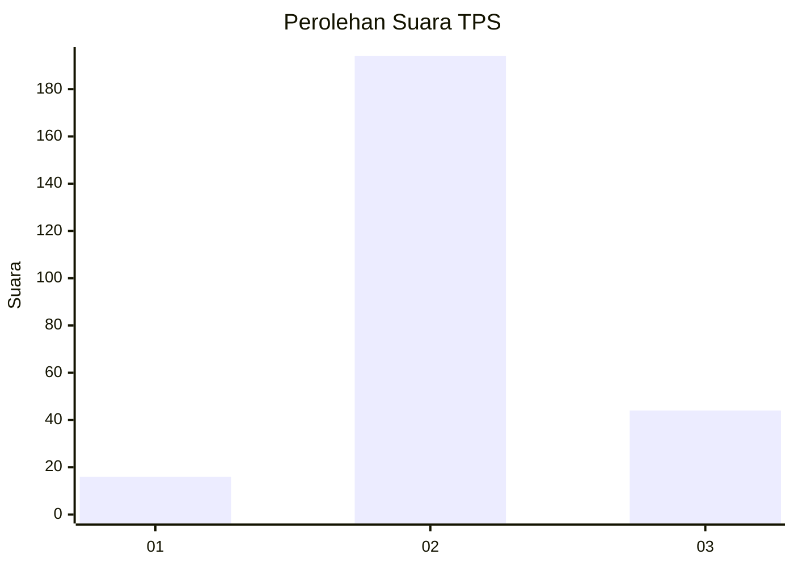

# Hasil

## Grafik

## Tabel

| No. | Nama Paslon    | Suara | Suara (raw) | Persentase |
|:--- |:-------------- | -----:| -----------:| ----------:|
| 1   | ANIES MUHAIMIN | 16    | [16][p-1]   | 6,30       |
| 2   | PRABOWO GIBRAN | 194   | [194][p-2]  | 76,38      |
| 3   | GANJAR MAHFUD  | 44    | [44][p-3]   | 17,32      |

[p-1]: https://github.com/gigit-pemilu/pemilu-2024-35-jawa-timur/blob/main/pilpres/hitung-suara/sub/35-jawa-timur/sub/15-sidoarjo/sub/01-tarik/sub/2014-sebani/sub/006-tps/sub/paslon-1.txt
[p-2]: https://github.com/gigit-pemilu/pemilu-2024-35-jawa-timur/blob/main/pilpres/hitung-suara/sub/35-jawa-timur/sub/15-sidoarjo/sub/01-tarik/sub/2014-sebani/sub/006-tps/sub/paslon-2.txt
[p-3]: https://github.com/gigit-pemilu/pemilu-2024-35-jawa-timur/blob/main/pilpres/hitung-suara/sub/35-jawa-timur/sub/15-sidoarjo/sub/01-tarik/sub/2014-sebani/sub/006-tps/sub/paslon-3.txt

## Foto C Plano

https://sirekap-obj-formc.kpu.go.id/06f6/pemilu/ppwp/35/15/01/20/14/3515012014006-20240214-210450--a39ffbd6-522c-409b-8c9c-ab4ac5ff9057.jpg

https://sirekap-obj-formc.kpu.go.id/06f6/pemilu/ppwp/35/15/01/20/14/3515012014006-20240214-210346--24fa7e4f-e23f-4041-8bd6-1b591fc172a2.jpg

https://sirekap-obj-formc.kpu.go.id/06f6/pemilu/ppwp/35/15/01/20/14/3515012014006-20240214-210239--e938c6c4-7647-4fe0-b191-2999f2cb07c7.jpg

## Metadata

| Key        | Value               |
| ---------- | ------------------- |
| Time Stamp | 2024-02-15 15:00:29 |

