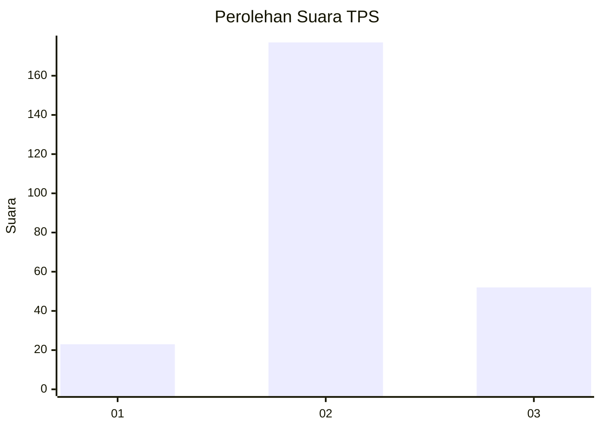
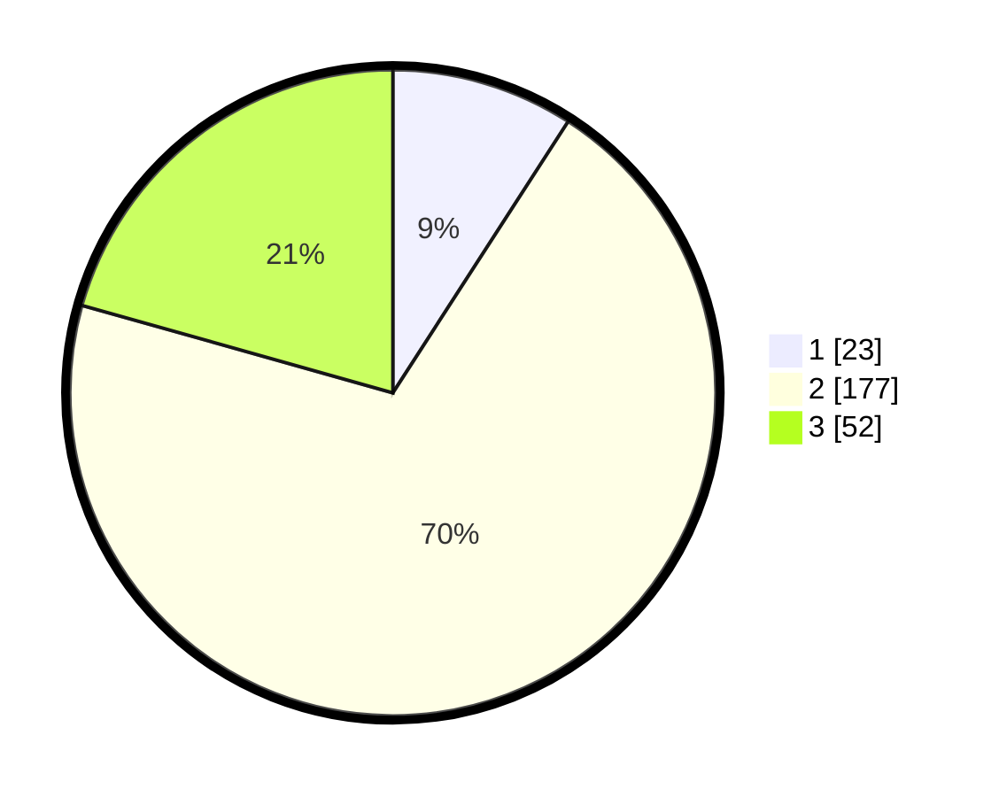

# Hasil

## Grafik

## Tabel

| No. | Nama Paslon    | Suara | Suara (raw) | Persentase |
|:--- |:-------------- | -----:| -----------:| ----------:|
| 1   | ANIES MUHAIMIN | 23    | [23][p-1]   | 9,13       |
| 2   | PRABOWO GIBRAN | 177   | [177][p-2]  | 70,24      |
| 3   | GANJAR MAHFUD  | 52    | [52][p-3]   | 20,63      |

[p-1]: https://github.com/gigit-pemilu/pemilu-2024-35-jawa-timur/blob/main/pilpres/hitung-suara/sub/35-jawa-timur/sub/15-sidoarjo/sub/01-tarik/sub/2017-kemuning/sub/003-tps/sub/paslon-1.txt
[p-2]: https://github.com/gigit-pemilu/pemilu-2024-35-jawa-timur/blob/main/pilpres/hitung-suara/sub/35-jawa-timur/sub/15-sidoarjo/sub/01-tarik/sub/2017-kemuning/sub/003-tps/sub/paslon-2.txt
[p-3]: https://github.com/gigit-pemilu/pemilu-2024-35-jawa-timur/blob/main/pilpres/hitung-suara/sub/35-jawa-timur/sub/15-sidoarjo/sub/01-tarik/sub/2017-kemuning/sub/003-tps/sub/paslon-3.txt

## Foto C Plano

https://sirekap-obj-formc.kpu.go.id/00c7/pemilu/ppwp/35/15/01/20/17/3515012017003-20240215-004209--09c89c51-e375-432a-8cd7-4e3d86884d9c.jpg

https://sirekap-obj-formc.kpu.go.id/00c7/pemilu/ppwp/35/15/01/20/17/3515012017003-20240215-033942--d6af1ecf-85e4-4e6c-a038-14fe2161c2a1.jpg

https://sirekap-obj-formc.kpu.go.id/00c7/pemilu/ppwp/35/15/01/20/17/3515012017003-20240215-004415--7564a938-f34f-49bb-8f51-1792f1d91f14.jpg

## Metadata

| Key        | Value               |
| ---------- | ------------------- |
| Time Stamp | 2024-02-15 15:00:29 |

