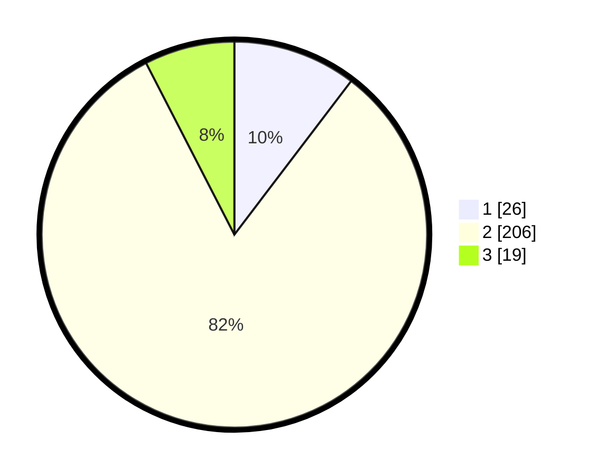

# Hasil

## Grafik

## Tabel

| No. | Nama Paslon    | Suara | Suara (raw) | Persentase |
|:--- |:-------------- | -----:| -----------:| ----------:|
| 1   | ANIES MUHAIMIN | 26    | [26][p-1]   | 10,36      |
| 2   | PRABOWO GIBRAN | 206   | [206][p-2]  | 82,07      |
| 3   | GANJAR MAHFUD  | 19    | [19][p-3]   | 7,57       |

[p-1]: https://github.com/gigit-pemilu/pemilu-2024-35-jawa-timur/blob/main/pilpres/hitung-suara/sub/35-jawa-timur/sub/15-sidoarjo/sub/01-tarik/sub/2018-janti/sub/001-tps/sub/paslon-1.txt
[p-2]: https://github.com/gigit-pemilu/pemilu-2024-35-jawa-timur/blob/main/pilpres/hitung-suara/sub/35-jawa-timur/sub/15-sidoarjo/sub/01-tarik/sub/2018-janti/sub/001-tps/sub/paslon-2.txt
[p-3]: https://github.com/gigit-pemilu/pemilu-2024-35-jawa-timur/blob/main/pilpres/hitung-suara/sub/35-jawa-timur/sub/15-sidoarjo/sub/01-tarik/sub/2018-janti/sub/001-tps/sub/paslon-3.txt

## Foto C Plano

https://sirekap-obj-formc.kpu.go.id/8be5/pemilu/ppwp/35/15/01/20/18/3515012018001-20240214-192508--95253639-356a-45f0-a712-f2f5bbeedbb7.jpg

https://sirekap-obj-formc.kpu.go.id/8be5/pemilu/ppwp/35/15/01/20/18/3515012018001-20240214-192755--7c218270-3f2e-4a66-8d3d-e6b3e8448897.jpg

https://sirekap-obj-formc.kpu.go.id/8be5/pemilu/ppwp/35/15/01/20/18/3515012018001-20240214-192829--fe61ba9b-3f11-4df3-8361-107b17367646.jpg

## Metadata

| Key        | Value               |
| ---------- | ------------------- |
| Time Stamp | 2024-02-15 15:00:29 |

