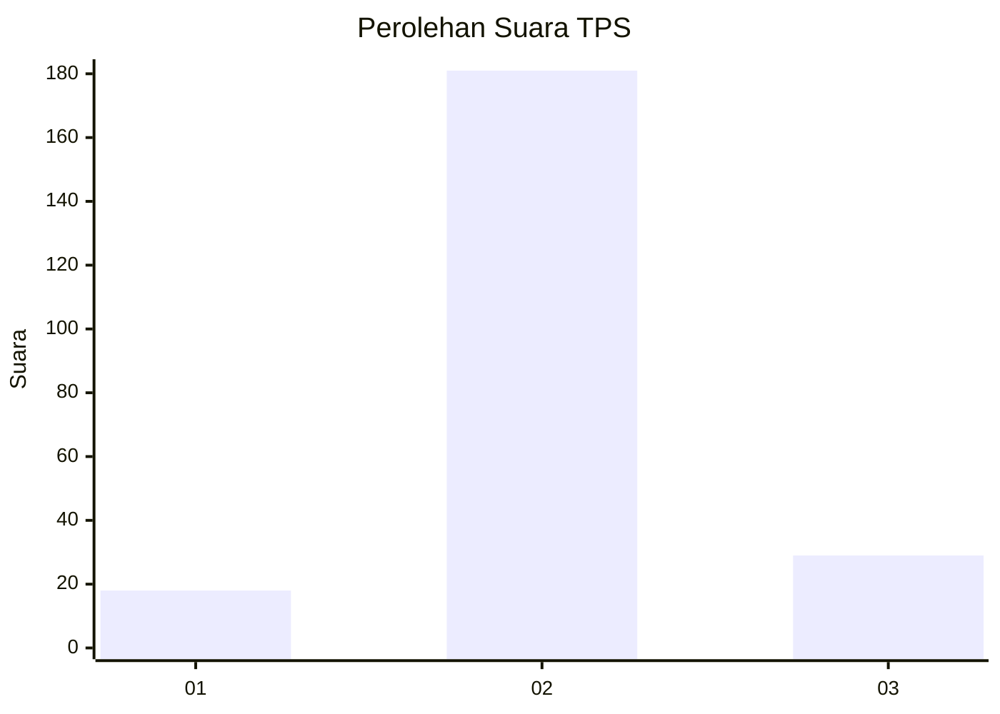
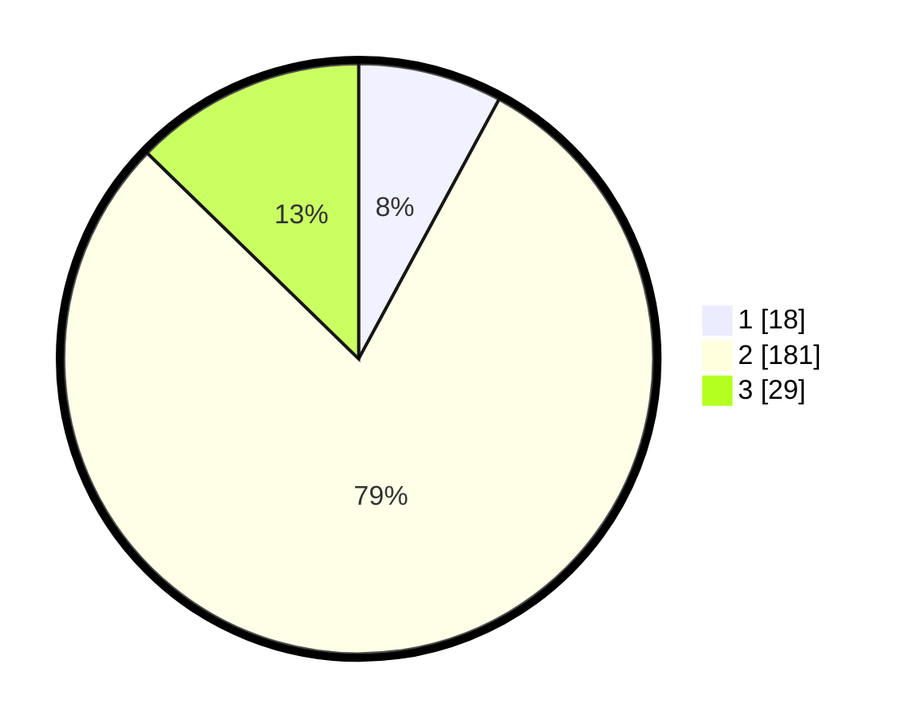

# Hasil

## Grafik

## Tabel

| No. | Nama Paslon    | Suara | Suara (raw) | Persentase |
|:--- |:-------------- | -----:| -----------:| ----------:|
| 1   | ANIES MUHAIMIN | 18    | [18][p-1]   | 7,89       |
| 2   | PRABOWO GIBRAN | 181   | [181][p-2]  | 79,39      |
| 3   | GANJAR MAHFUD  | 29    | [29][p-3]   | 12,72      |

[p-1]: https://github.com/gigit-pemilu/pemilu-2024/blob/main/pilpres/hitung-suara/sub/35-jawa-timur/sub/15-sidoarjo/sub/01-tarik/sub/2019-segodobancang/sub/003-tps/sub/paslon-1.txt
[p-2]: https://github.com/gigit-pemilu/pemilu-2024/blob/main/pilpres/hitung-suara/sub/35-jawa-timur/sub/15-sidoarjo/sub/01-tarik/sub/2019-segodobancang/sub/003-tps/sub/paslon-2.txt
[p-3]: https://github.com/gigit-pemilu/pemilu-2024/blob/main/pilpres/hitung-suara/sub/35-jawa-timur/sub/15-sidoarjo/sub/01-tarik/sub/2019-segodobancang/sub/003-tps/sub/paslon-3.txt

## Foto C Plano

https://sirekap-obj-formc.kpu.go.id/0be5/pemilu/ppwp/35/15/01/20/19/3515012019003-20240214-212338--d6c8550a-e78d-4aa5-85d4-aae5ba69b056.jpg

https://sirekap-obj-formc.kpu.go.id/0be5/pemilu/ppwp/35/15/01/20/19/3515012019003-20240214-212441--bb292e3e-5279-4933-b947-bd2f7aac330b.jpg

https://sirekap-obj-formc.kpu.go.id/0be5/pemilu/ppwp/35/15/01/20/19/3515012019003-20240214-212532--4b8ca68b-f980-4e35-8d64-649ac29e20a3.jpg

## Metadata

| Key        | Value               |
| ---------- | ------------------- |
| Time Stamp | 2024-02-15 15:00:29 |

