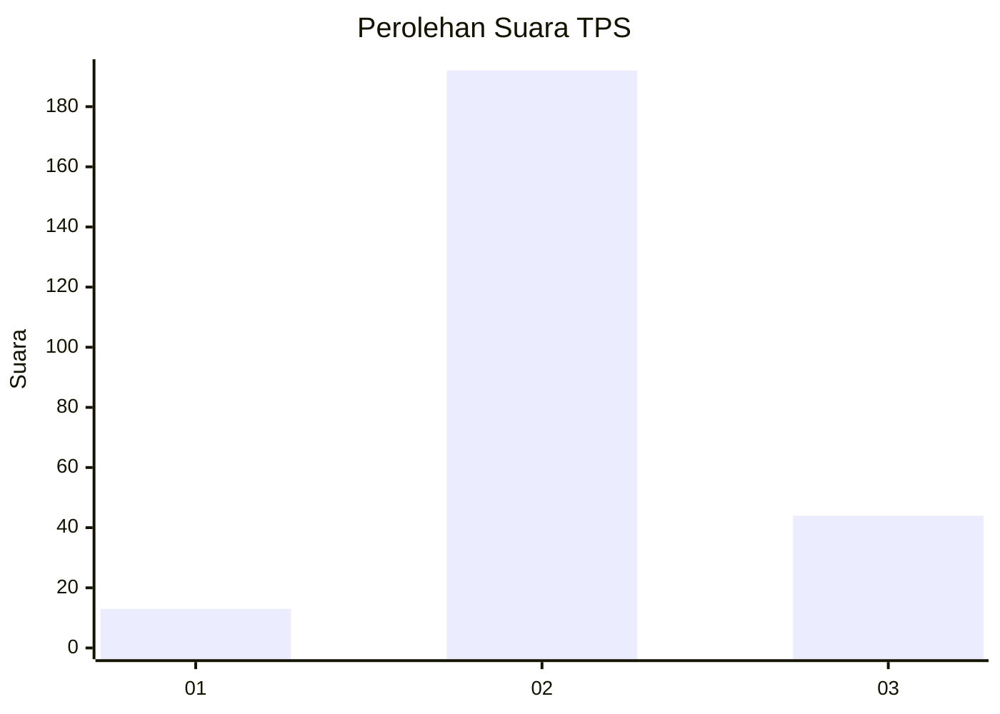

# Hasil

## Grafik

## Tabel

| No. | Nama Paslon    | Suara | Suara (raw) | Persentase |
|:--- |:-------------- | -----:| -----------:| ----------:|
| 1   | ANIES MUHAIMIN | 13    | [13][p-1]   | 5,22       |
| 2   | PRABOWO GIBRAN | 192   | [192][p-2]  | 77,11      |
| 3   | GANJAR MAHFUD  | 44    | [44][p-3]   | 17,67      |

[p-1]: https://github.com/gigit-pemilu/pemilu-2024/blob/main/pilpres/hitung-suara/sub/35-jawa-timur/sub/15-sidoarjo/sub/01-tarik/sub/2020-kedinding/sub/006-tps/sub/paslon-1.txt
[p-2]: https://github.com/gigit-pemilu/pemilu-2024/blob/main/pilpres/hitung-suara/sub/35-jawa-timur/sub/15-sidoarjo/sub/01-tarik/sub/2020-kedinding/sub/006-tps/sub/paslon-2.txt
[p-3]: https://github.com/gigit-pemilu/pemilu-2024/blob/main/pilpres/hitung-suara/sub/35-jawa-timur/sub/15-sidoarjo/sub/01-tarik/sub/2020-kedinding/sub/006-tps/sub/paslon-3.txt

## Foto C Plano

https://sirekap-obj-formc.kpu.go.id/3b4e/pemilu/ppwp/35/15/01/20/20/3515012020006-20240214-224516--d3f8cf5f-26ac-4676-9f0f-bbb8fe6b6f39.jpg

https://sirekap-obj-formc.kpu.go.id/3b4e/pemilu/ppwp/35/15/01/20/20/3515012020006-20240214-224547--f4b6338b-6fcc-4078-ac0b-4688946e88e9.jpg

https://sirekap-obj-formc.kpu.go.id/3b4e/pemilu/ppwp/35/15/01/20/20/3515012020006-20240214-224702--bb146227-8046-4297-917f-2557b1e337d2.jpg

## Metadata

| Key        | Value               |
| ---------- | ------------------- |
| Time Stamp | 2024-03-02 14:00:00 |

