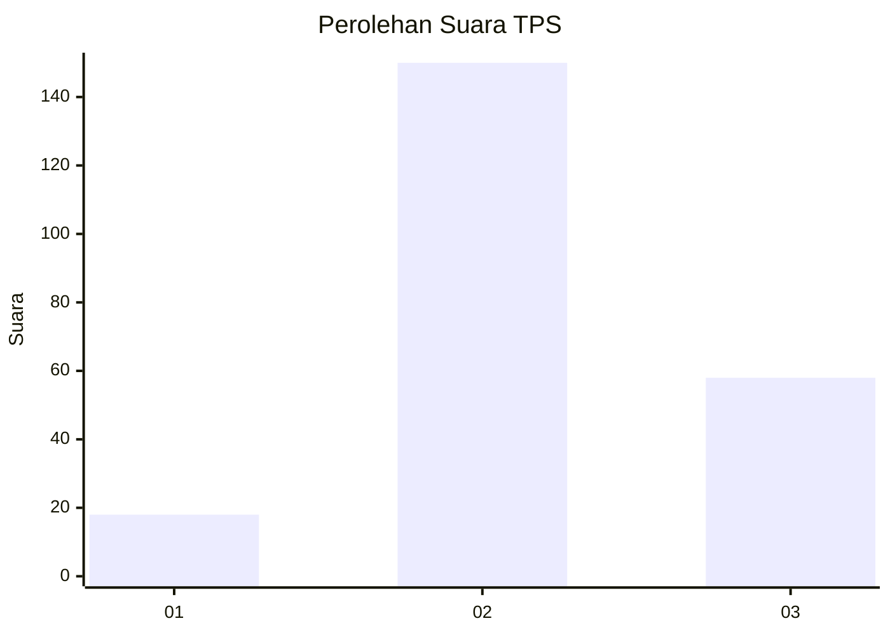
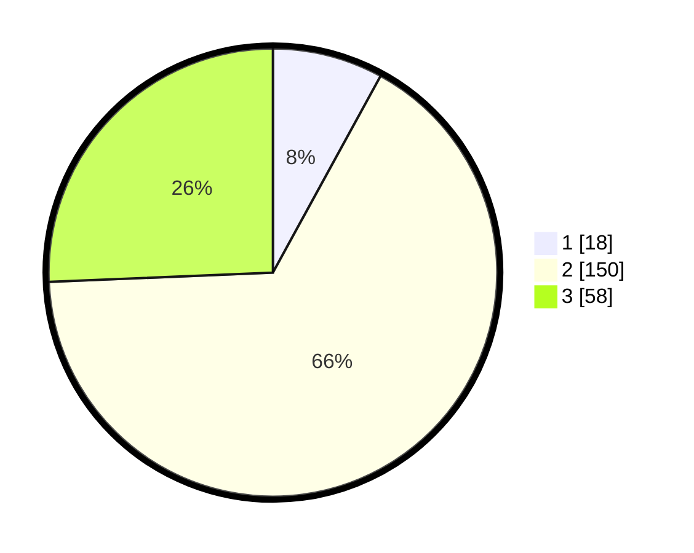

# Hasil

## Grafik

## Tabel

| No. | Nama Paslon    | Suara | Suara (raw) | Persentase |
|:--- |:-------------- | -----:| -----------:| ----------:|
| 1   | ANIES MUHAIMIN | 18    | [18][p-1]   | 7,96       |
| 2   | PRABOWO GIBRAN | 150   | [150][p-2]  | 66,37      |
| 3   | GANJAR MAHFUD  | 58    | [58][p-3]   | 25,66      |

[p-1]: https://github.com/gigit-pemilu/pemilu-2024/blob/main/pilpres/hitung-suara/sub/35-jawa-timur/sub/15-sidoarjo/sub/02-prambon/sub/2011-kedungsugo/sub/001-tps/sub/paslon-1.txt
[p-2]: https://github.com/gigit-pemilu/pemilu-2024/blob/main/pilpres/hitung-suara/sub/35-jawa-timur/sub/15-sidoarjo/sub/02-prambon/sub/2011-kedungsugo/sub/001-tps/sub/paslon-2.txt
[p-3]: https://github.com/gigit-pemilu/pemilu-2024/blob/main/pilpres/hitung-suara/sub/35-jawa-timur/sub/15-sidoarjo/sub/02-prambon/sub/2011-kedungsugo/sub/001-tps/sub/paslon-3.txt

## Foto C Plano

https://sirekap-obj-formc.kpu.go.id/b6df/pemilu/ppwp/35/15/02/20/11/3515022011001-20240220-082931--d3a39c6e-863d-4768-b6db-8e7ca553448d.jpg

https://sirekap-obj-formc.kpu.go.id/b6df/pemilu/ppwp/35/15/02/20/11/3515022011001-20240220-083809--c0686f15-4ef4-4458-beb1-838f566e76ba.jpg

https://sirekap-obj-formc.kpu.go.id/b6df/pemilu/ppwp/35/15/02/20/11/3515022011001-20240220-084023--a65a6d7e-d126-4901-b89b-c98b6e634daa.jpg

## Metadata

| Key        | Value               |
| ---------- | ------------------- |
| Time Stamp | 2024-02-25 12:00:00 |

