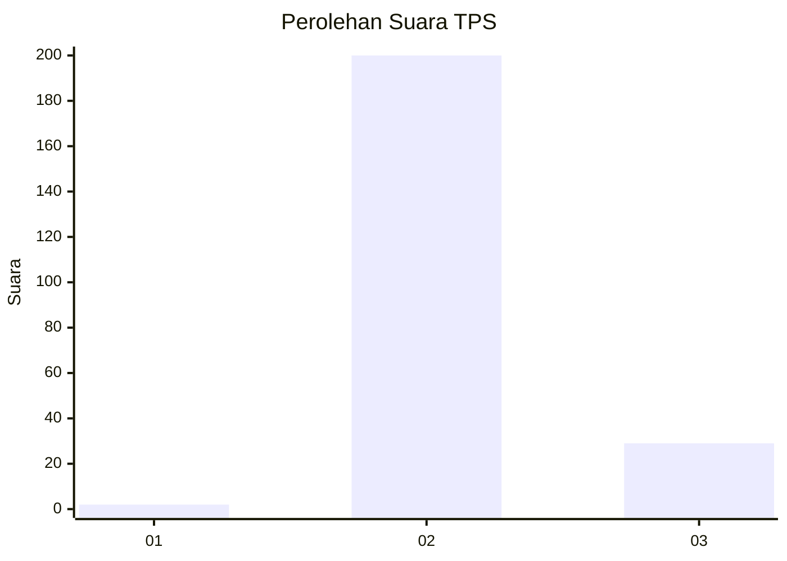
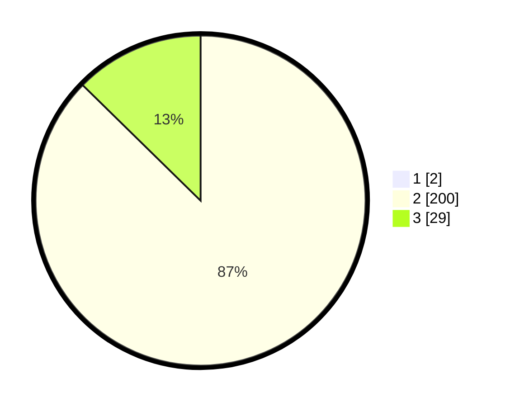

# Hasil

## Grafik

## Tabel

| No. | Nama Paslon    | Suara | Suara (raw) | Persentase |
|:--- |:-------------- | -----:| -----------:| ----------:|
| 1   | ANIES MUHAIMIN | 2     | [2][p-1]    | 0,87       |
| 2   | PRABOWO GIBRAN | 200   | [200][p-2]  | 86,58      |
| 3   | GANJAR MAHFUD  | 29    | [29][p-3]   | 12,55      |

[p-1]: https://github.com/gigit-pemilu/pemilu-2024/blob/main/pilpres/hitung-suara/sub/35-jawa-timur/sub/15-sidoarjo/sub/03-krembung/sub/2001-tambakrejo/sub/018-tps/sub/paslon-1.txt
[p-2]: https://github.com/gigit-pemilu/pemilu-2024/blob/main/pilpres/hitung-suara/sub/35-jawa-timur/sub/15-sidoarjo/sub/03-krembung/sub/2001-tambakrejo/sub/018-tps/sub/paslon-2.txt
[p-3]: https://github.com/gigit-pemilu/pemilu-2024/blob/main/pilpres/hitung-suara/sub/35-jawa-timur/sub/15-sidoarjo/sub/03-krembung/sub/2001-tambakrejo/sub/018-tps/sub/paslon-3.txt

## Foto C Plano

https://sirekap-obj-formc.kpu.go.id/e188/pemilu/ppwp/35/15/03/20/01/3515032001018-20240214-220312--b00a36d4-2f5e-4927-b703-f295480bffa9.jpg

https://sirekap-obj-formc.kpu.go.id/e188/pemilu/ppwp/35/15/03/20/01/3515032001018-20240214-220345--ba388ae9-b7bc-45cc-b1fe-8dde10c17614.jpg

https://sirekap-obj-formc.kpu.go.id/e188/pemilu/ppwp/35/15/03/20/01/3515032001018-20240214-220453--225d6297-b5f2-4872-90d1-a289ec757ac2.jpg

## Metadata

| Key        | Value               |
| ---------- | ------------------- |
| Time Stamp | 2024-02-16 21:01:00 |

## DATA PEMILIH TETAP

Jumlah pemilih dalam DPT: **255**.
 * L: **628**.
 * P: **627**.

## DATA PENGGUNA HAK PILIH

Jumlah pengguna hak pilih dalam DPT: **238**.
 * L: **167**.
 * P: **824**.

Jumlah pengguna hak pilih dalam DPTb: **0**.
 * L: **0**.
 * P: **88**.

Jumlah pengguna hak pilih dalam DPK: **0**.
 * L: **80**.
 * P: **8**.

Jumlah pengguna hak pilih: **238**.
 * L: **647**.
 * P: **626**.

## JUMLAH SUARA SAH DAN TIDAK SAH

JUMLAH SELURUH SUARA SAH: **231**.

JUMLAH SUARA TIDAK SAH: **7**.

JUMLAH SELURUH SUARA SAH DAN SUARA TIDAK SAH: **238**.

