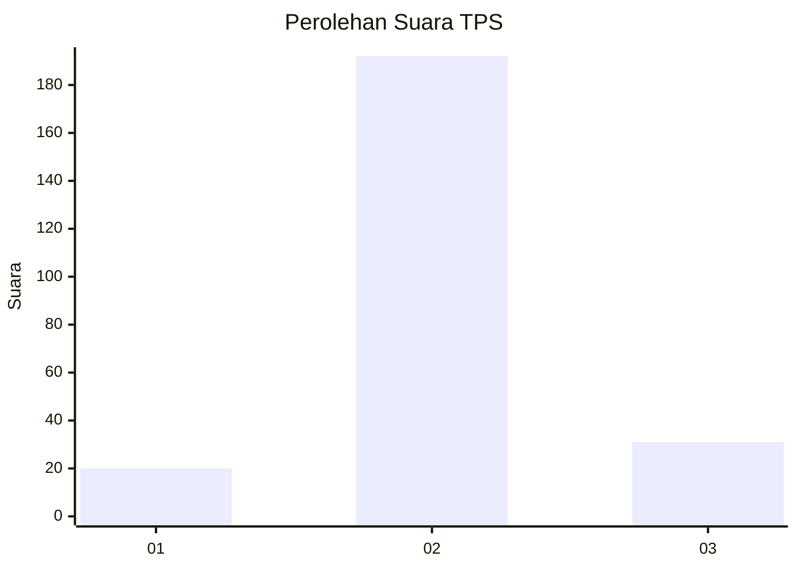
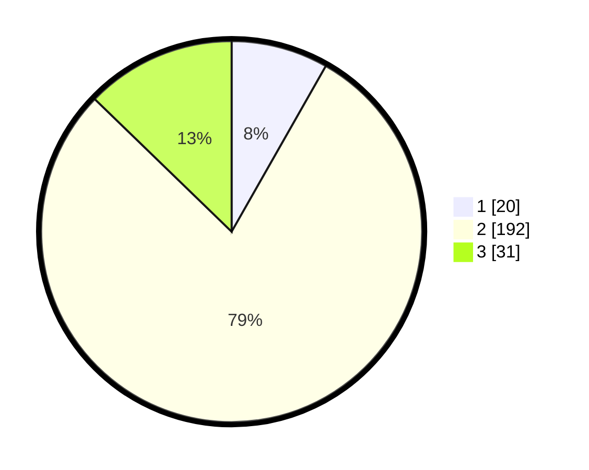

# Hasil

## Grafik

## Tabel

| No. | Nama Paslon    | Suara | Suara (raw) | Persentase |
|:--- |:-------------- | -----:| -----------:| ----------:|
| 1   | ANIES MUHAIMIN | 20    | [20][p-1]   | 8,23       |
| 2   | PRABOWO GIBRAN | 192   | [192][p-2]  | 79,01      |
| 3   | GANJAR MAHFUD  | 31    | [31][p-3]   | 12,76      |

[p-1]: https://github.com/gigit-pemilu/pemilu-2024/blob/main/pilpres/hitung-suara/sub/35-jawa-timur/sub/15-sidoarjo/sub/03-krembung/sub/2004-kedungrawan/sub/009-tps/sub/paslon-1.txt
[p-2]: https://github.com/gigit-pemilu/pemilu-2024/blob/main/pilpres/hitung-suara/sub/35-jawa-timur/sub/15-sidoarjo/sub/03-krembung/sub/2004-kedungrawan/sub/009-tps/sub/paslon-2.txt
[p-3]: https://github.com/gigit-pemilu/pemilu-2024/blob/main/pilpres/hitung-suara/sub/35-jawa-timur/sub/15-sidoarjo/sub/03-krembung/sub/2004-kedungrawan/sub/009-tps/sub/paslon-3.txt

## Foto C Plano

https://sirekap-obj-formc.kpu.go.id/9d2e/pemilu/ppwp/35/15/03/20/04/3515032004009-20240215-030237--31d1a3db-6a65-430b-9d98-5ac22f330386.jpg

https://sirekap-obj-formc.kpu.go.id/9d2e/pemilu/ppwp/35/15/03/20/04/3515032004009-20240214-195745--daeb18e7-852f-4801-9a06-272123f35ae8.jpg

https://sirekap-obj-formc.kpu.go.id/9d2e/pemilu/ppwp/35/15/03/20/04/3515032004009-20240215-030505--64409986-a328-4d9b-9055-1ca67ae8af9d.jpg

## Metadata

| Key        | Value               |
| ---------- | ------------------- |
| Time Stamp | 2024-02-15 15:00:29 |

