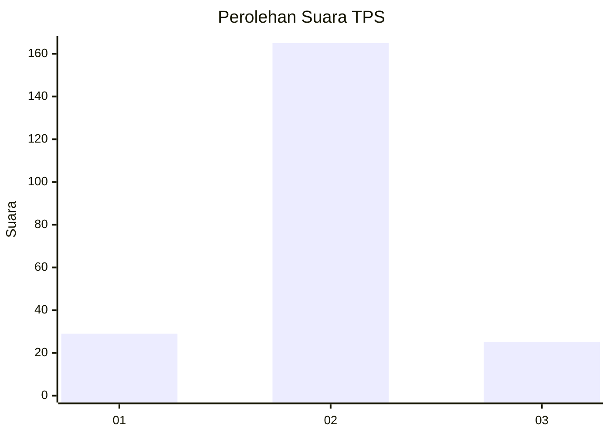
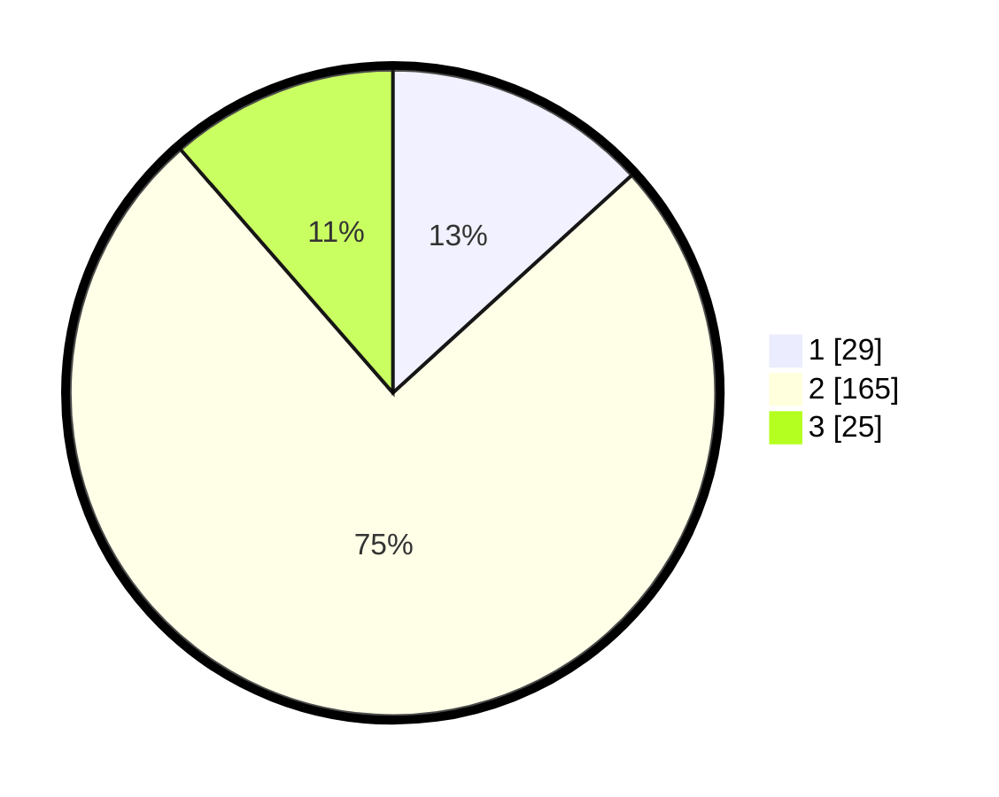

# Hasil

## Grafik

## Tabel

| No. | Nama Paslon    | Suara | Suara (raw) | Persentase |
|:--- |:-------------- | -----:| -----------:| ----------:|
| 1   | ANIES MUHAIMIN | 29    | [29][p-1]   | 13,24      |
| 2   | PRABOWO GIBRAN | 165   | [165][p-2]  | 75,34      |
| 3   | GANJAR MAHFUD  | 25    | [25][p-3]   | 11,42      |

[p-1]: https://github.com/gigit-pemilu/pemilu-2024/blob/main/pilpres/hitung-suara/sub/35-jawa-timur/sub/15-sidoarjo/sub/03-krembung/sub/2019-balonggarut/sub/001-tps/sub/paslon-1.txt
[p-2]: https://github.com/gigit-pemilu/pemilu-2024/blob/main/pilpres/hitung-suara/sub/35-jawa-timur/sub/15-sidoarjo/sub/03-krembung/sub/2019-balonggarut/sub/001-tps/sub/paslon-2.txt
[p-3]: https://github.com/gigit-pemilu/pemilu-2024/blob/main/pilpres/hitung-suara/sub/35-jawa-timur/sub/15-sidoarjo/sub/03-krembung/sub/2019-balonggarut/sub/001-tps/sub/paslon-3.txt

## Foto C Plano

https://sirekap-obj-formc.kpu.go.id/b884/pemilu/ppwp/35/15/03/20/19/3515032019001-20240214-230833--5b019b84-9a6a-4540-a5ca-ba65f625fb31.jpg

https://sirekap-obj-formc.kpu.go.id/b884/pemilu/ppwp/35/15/03/20/19/3515032019001-20240218-081139--d841e81d-16dd-4e08-b2d5-e97a5baa3394.jpg

https://sirekap-obj-formc.kpu.go.id/b884/pemilu/ppwp/35/15/03/20/19/3515032019001-20240218-081531--dbf9f4d5-513c-49c8-abbc-e6f05c97a59a.jpg

## Metadata

| Key        | Value               |
| ---------- | ------------------- |
| Time Stamp | 2024-02-25 12:00:00 |

