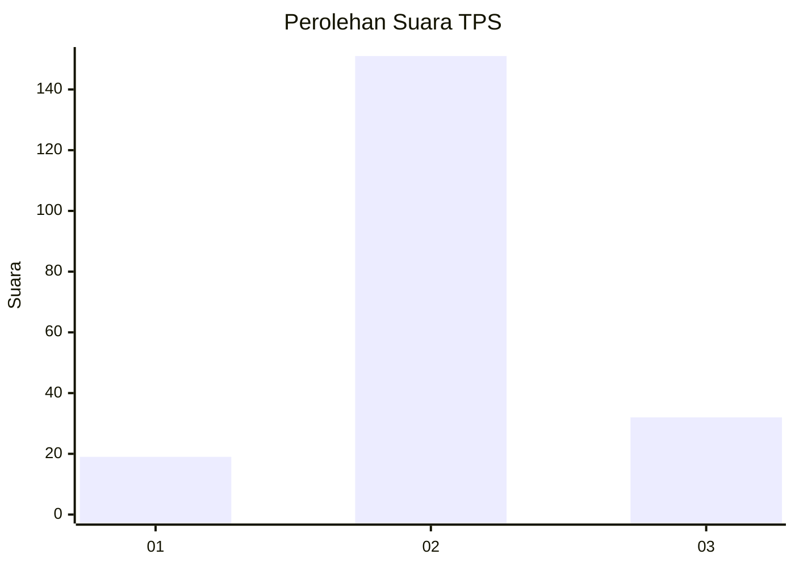
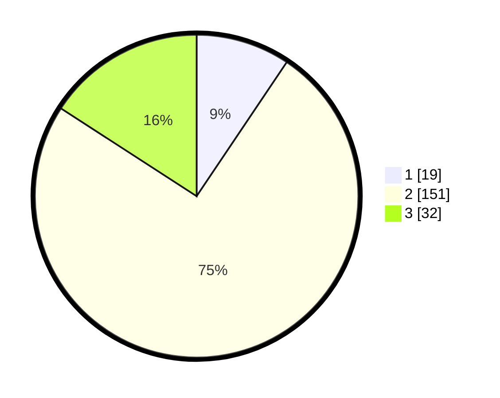

# Hasil

## Grafik

## Tabel

| No. | Nama Paslon    | Suara | Suara (raw) | Persentase |
|:--- |:-------------- | -----:| -----------:| ----------:|
| 1   | ANIES MUHAIMIN | 19    | [19][p-1]   | 9,41       |
| 2   | PRABOWO GIBRAN | 151   | [151][p-2]  | 74,75      |
| 3   | GANJAR MAHFUD  | 32    | [32][p-3]   | 15,84      |

[p-1]: https://github.com/gigit-pemilu/pemilu-2024/blob/main/pilpres/hitung-suara/sub/35-jawa-timur/sub/15-sidoarjo/sub/03-krembung/sub/2019-balonggarut/sub/003-tps/sub/paslon-1.txt
[p-2]: https://github.com/gigit-pemilu/pemilu-2024/blob/main/pilpres/hitung-suara/sub/35-jawa-timur/sub/15-sidoarjo/sub/03-krembung/sub/2019-balonggarut/sub/003-tps/sub/paslon-2.txt
[p-3]: https://github.com/gigit-pemilu/pemilu-2024/blob/main/pilpres/hitung-suara/sub/35-jawa-timur/sub/15-sidoarjo/sub/03-krembung/sub/2019-balonggarut/sub/003-tps/sub/paslon-3.txt

## Foto C Plano

https://sirekap-obj-formc.kpu.go.id/ca1c/pemilu/ppwp/35/15/03/20/19/3515032019003-20240216-200753--d9f8cc08-c6bf-4dc2-a1e4-03dc926e45e9.jpg

https://sirekap-obj-formc.kpu.go.id/ca1c/pemilu/ppwp/35/15/03/20/19/3515032019003-20240216-200055--32ab9da9-5a25-4385-bcac-36a97ba29709.jpg

https://sirekap-obj-formc.kpu.go.id/ca1c/pemilu/ppwp/35/15/03/20/19/3515032019003-20240216-200433--db7b02e7-f121-4955-912e-79f64913937c.jpg

## Metadata

| Key        | Value               |
| ---------- | ------------------- |
| Time Stamp | 2024-02-21 21:00:04 |

