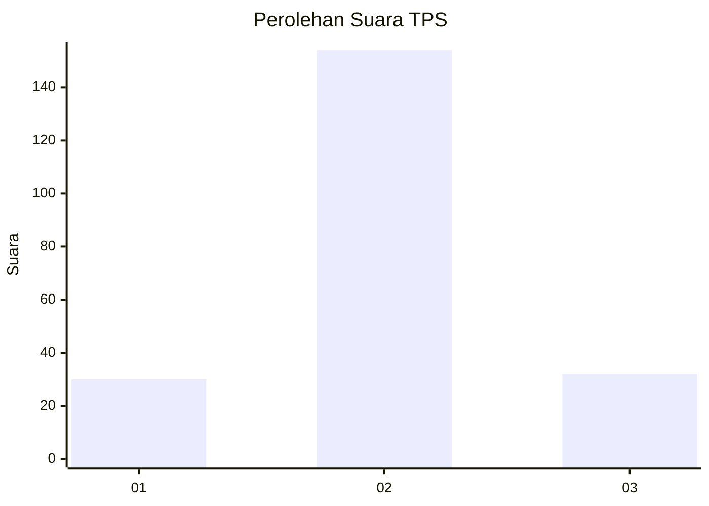

# Hasil

## Grafik

## Tabel

| No. | Nama Paslon    | Suara | Suara (raw) | Persentase |
|:--- |:-------------- | -----:| -----------:| ----------:|
| 1   | ANIES MUHAIMIN | 30    | [30][p-1]   | 13,89      |
| 2   | PRABOWO GIBRAN | 154   | [154][p-2]  | 71,30      |
| 3   | GANJAR MAHFUD  | 32    | [32][p-3]   | 14,81      |

[p-1]: https://github.com/gigit-pemilu/pemilu-2024/blob/main/pilpres/hitung-suara/sub/35-jawa-timur/sub/15-sidoarjo/sub/04-porong/sub/1004-juwetkenongo/sub/003-tps/sub/paslon-1.txt
[p-2]: https://github.com/gigit-pemilu/pemilu-2024/blob/main/pilpres/hitung-suara/sub/35-jawa-timur/sub/15-sidoarjo/sub/04-porong/sub/1004-juwetkenongo/sub/003-tps/sub/paslon-2.txt
[p-3]: https://github.com/gigit-pemilu/pemilu-2024/blob/main/pilpres/hitung-suara/sub/35-jawa-timur/sub/15-sidoarjo/sub/04-porong/sub/1004-juwetkenongo/sub/003-tps/sub/paslon-3.txt

## Foto C Plano

https://sirekap-obj-formc.kpu.go.id/6725/pemilu/ppwp/35/15/04/10/04/3515041004003-20240218-225342--a2cadefa-ee6f-4a57-bcd6-5126ed039c2a.jpg

https://sirekap-obj-formc.kpu.go.id/6725/pemilu/ppwp/35/15/04/10/04/3515041004003-20240218-145528--0c8790db-486d-4d12-b6ad-84dd21bad205.jpg

https://sirekap-obj-formc.kpu.go.id/6725/pemilu/ppwp/35/15/04/10/04/3515041004003-20240218-150434--6060be0c-a097-4fc1-8e9f-99ee547b0c6d.jpg

## Metadata

| Key        | Value               |
| ---------- | ------------------- |
| Time Stamp | 2024-02-24 22:31:28 |

