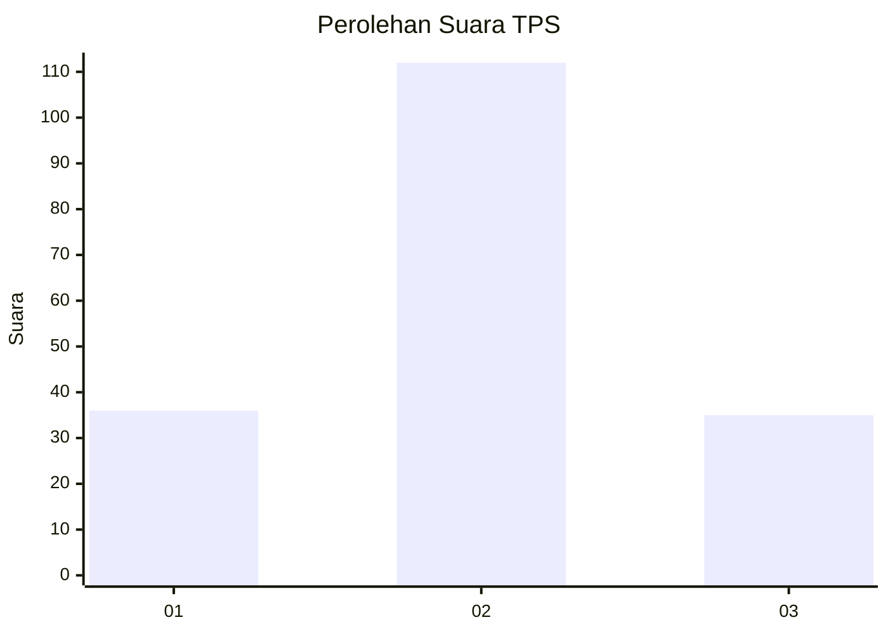
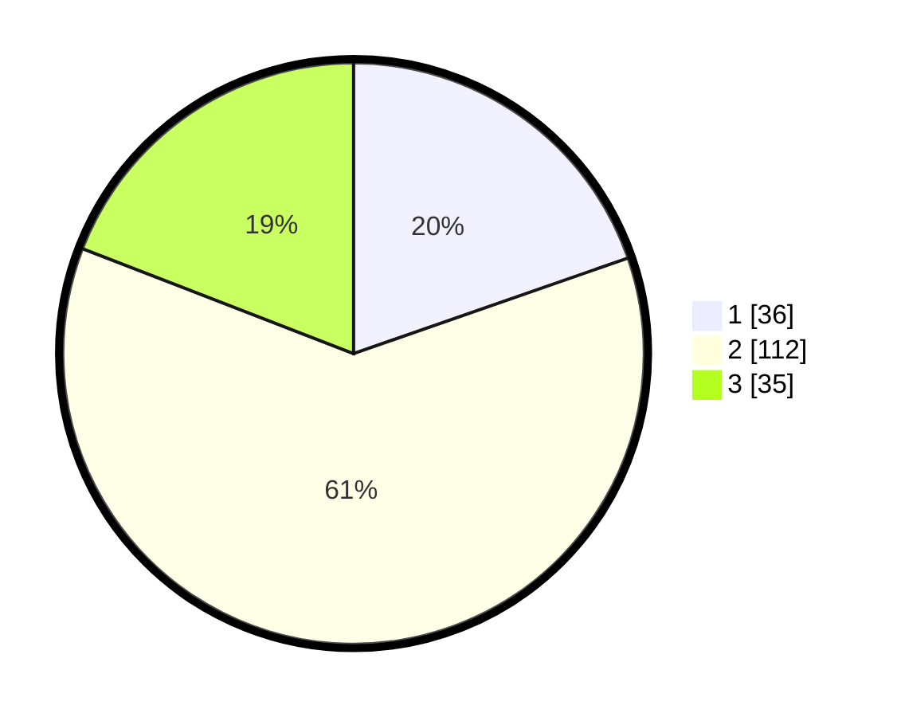

# Hasil

## Grafik

## Tabel

| No. | Nama Paslon    | Suara | Suara (raw) | Persentase |
|:--- |:-------------- | -----:| -----------:| ----------:|
| 1   | ANIES MUHAIMIN | 36    | [36][p-1]   | 19,67      |
| 2   | PRABOWO GIBRAN | 112   | [112][p-2]  | 61,20      |
| 3   | GANJAR MAHFUD  | 35    | [35][p-3]   | 19,13      |

[p-1]: https://github.com/gigit-pemilu/pemilu-2024/blob/main/pilpres/hitung-suara/sub/35-jawa-timur/sub/15-sidoarjo/sub/04-porong/sub/1013-gedang/sub/001-tps/sub/paslon-1.txt
[p-2]: https://github.com/gigit-pemilu/pemilu-2024/blob/main/pilpres/hitung-suara/sub/35-jawa-timur/sub/15-sidoarjo/sub/04-porong/sub/1013-gedang/sub/001-tps/sub/paslon-2.txt
[p-3]: https://github.com/gigit-pemilu/pemilu-2024/blob/main/pilpres/hitung-suara/sub/35-jawa-timur/sub/15-sidoarjo/sub/04-porong/sub/1013-gedang/sub/001-tps/sub/paslon-3.txt

## Foto C Plano

https://sirekap-obj-formc.kpu.go.id/7606/pemilu/ppwp/35/15/04/10/13/3515041013001-20240215-003817--132ef8f2-26e5-49a8-ad1b-c5e8bb14f56d.jpg

https://sirekap-obj-formc.kpu.go.id/7606/pemilu/ppwp/35/15/04/10/13/3515041013001-20240215-003904--6cc0c176-142e-40be-b130-2ac045206566.jpg

https://sirekap-obj-formc.kpu.go.id/7606/pemilu/ppwp/35/15/04/10/13/3515041013001-20240215-004027--b1553a52-18a9-4f28-b501-b518b30b0c7f.jpg

## Metadata

| Key        | Value               |
| ---------- | ------------------- |
| Time Stamp | 2024-02-24 22:31:28 |

