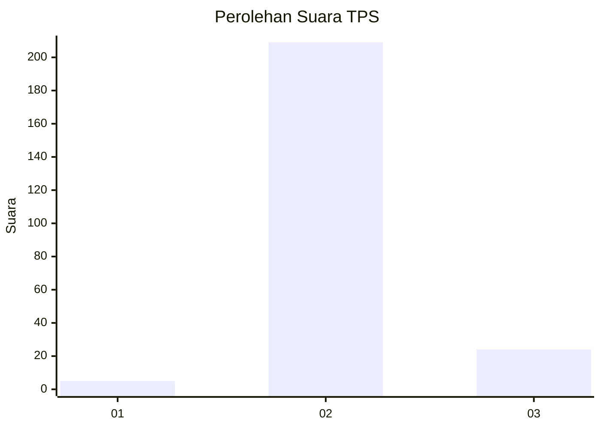
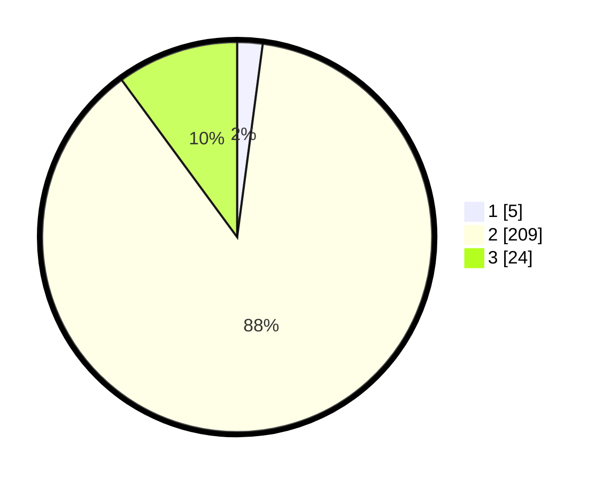

# Hasil

## Grafik

## Tabel

| No. | Nama Paslon    | Suara | Suara (raw) | Persentase |
|:--- |:-------------- | -----:| -----------:| ----------:|
| 1   | ANIES MUHAIMIN | 5     | [5][p-1]    | 2,10       |
| 2   | PRABOWO GIBRAN | 209   | [209][p-2]  | 87,82      |
| 3   | GANJAR MAHFUD  | 24    | [24][p-3]   | 10,08      |

[p-1]: https://github.com/gigit-pemilu/pemilu-2024/blob/main/pilpres/hitung-suara/sub/35-jawa-timur/sub/15-sidoarjo/sub/04-porong/sub/2001-kebonagung/sub/017-tps/sub/paslon-1.txt
[p-2]: https://github.com/gigit-pemilu/pemilu-2024/blob/main/pilpres/hitung-suara/sub/35-jawa-timur/sub/15-sidoarjo/sub/04-porong/sub/2001-kebonagung/sub/017-tps/sub/paslon-2.txt
[p-3]: https://github.com/gigit-pemilu/pemilu-2024/blob/main/pilpres/hitung-suara/sub/35-jawa-timur/sub/15-sidoarjo/sub/04-porong/sub/2001-kebonagung/sub/017-tps/sub/paslon-3.txt

## Foto C Plano

https://sirekap-obj-formc.kpu.go.id/aff8/pemilu/ppwp/35/15/04/20/01/3515042001017-20240218-141542--1f9e5e1c-6bd1-4c74-85da-347ba94b1a36.jpg

https://sirekap-obj-formc.kpu.go.id/aff8/pemilu/ppwp/35/15/04/20/01/3515042001017-20240218-141611--5c14e1d2-7247-4ccc-b941-ebef4009de4f.jpg

https://sirekap-obj-formc.kpu.go.id/aff8/pemilu/ppwp/35/15/04/20/01/3515042001017-20240218-141639--77ed5af3-927d-4c57-8e41-5298f95c32f1.jpg

## Metadata

| Key        | Value               |
| ---------- | ------------------- |
| Time Stamp | 2024-02-24 22:31:28 |

