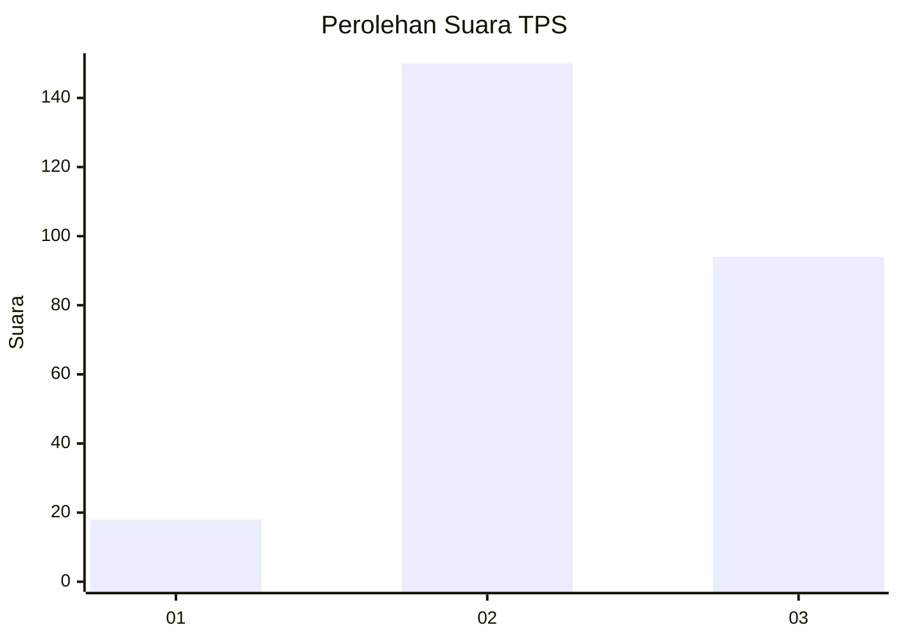
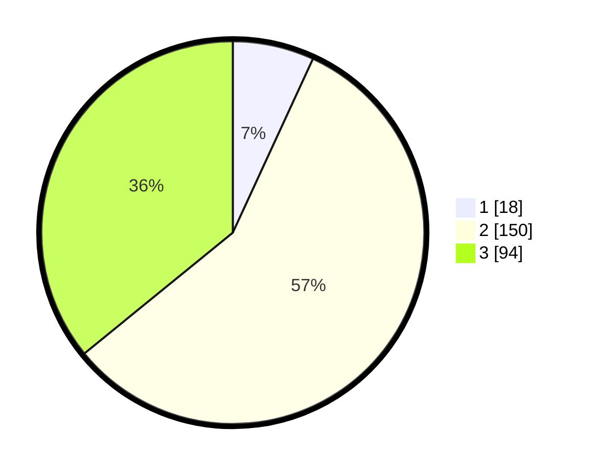

# Hasil

## Grafik

## Tabel

| No. | Nama Paslon    | Suara | Suara (raw) | Persentase |
|:--- |:-------------- | -----:| -----------:| ----------:|
| 1   | ANIES MUHAIMIN | 18    | [18][p-1]   | 6,87       |
| 2   | PRABOWO GIBRAN | 150   | [150][p-2]  | 57,25      |
| 3   | GANJAR MAHFUD  | 94    | [94][p-3]   | 35,88      |

[p-1]: https://github.com/gigit-pemilu/pemilu-2024/blob/main/pilpres/hitung-suara/sub/35-jawa-timur/sub/15-sidoarjo/sub/04-porong/sub/2001-kebonagung/sub/904-tps/sub/paslon-1.txt
[p-2]: https://github.com/gigit-pemilu/pemilu-2024/blob/main/pilpres/hitung-suara/sub/35-jawa-timur/sub/15-sidoarjo/sub/04-porong/sub/2001-kebonagung/sub/904-tps/sub/paslon-2.txt
[p-3]: https://github.com/gigit-pemilu/pemilu-2024/blob/main/pilpres/hitung-suara/sub/35-jawa-timur/sub/15-sidoarjo/sub/04-porong/sub/2001-kebonagung/sub/904-tps/sub/paslon-3.txt

## Foto C Plano

https://sirekap-obj-formc.kpu.go.id/1b6d/pemilu/ppwp/35/15/04/20/01/3515042001904-20240216-145612--c9c8b790-b50f-4294-9d0d-6f56b9fae0eb.jpg

https://sirekap-obj-formc.kpu.go.id/1b6d/pemilu/ppwp/35/15/04/20/01/3515042001904-20240214-184507--8d16af39-a1c1-4781-9a9c-dc640cb35aee.jpg

https://sirekap-obj-formc.kpu.go.id/1b6d/pemilu/ppwp/35/15/04/20/01/3515042001904-20240214-185305--ee5d4a2d-fd36-4f3a-b0bd-6f9b27e98be6.jpg

## Metadata

| Key        | Value               |
| ---------- | ------------------- |
| Time Stamp | 2024-02-16 16:25:10 |

## DATA PEMILIH TETAP

Jumlah pemilih dalam DPT: **289**.
 * L: **289**.
 * P: **0**.

## DATA PENGGUNA HAK PILIH

Jumlah pengguna hak pilih dalam DPT: **207**.
 * L: **207**.
 * P: **0**.

Jumlah pengguna hak pilih dalam DPTb: **72**.
 * L: **72**.
 * P: **0**.

Jumlah pengguna hak pilih dalam DPK: **0**.
 * L: **0**.
 * P: **0**.

Jumlah pengguna hak pilih: **279**.
 * L: **279**.
 * P: **0**.

## JUMLAH SUARA SAH DAN TIDAK SAH

JUMLAH SELURUH SUARA SAH: **262**.

JUMLAH SUARA TIDAK SAH: **17**.

JUMLAH SELURUH SUARA SAH DAN SUARA TIDAK SAH: **279**.

