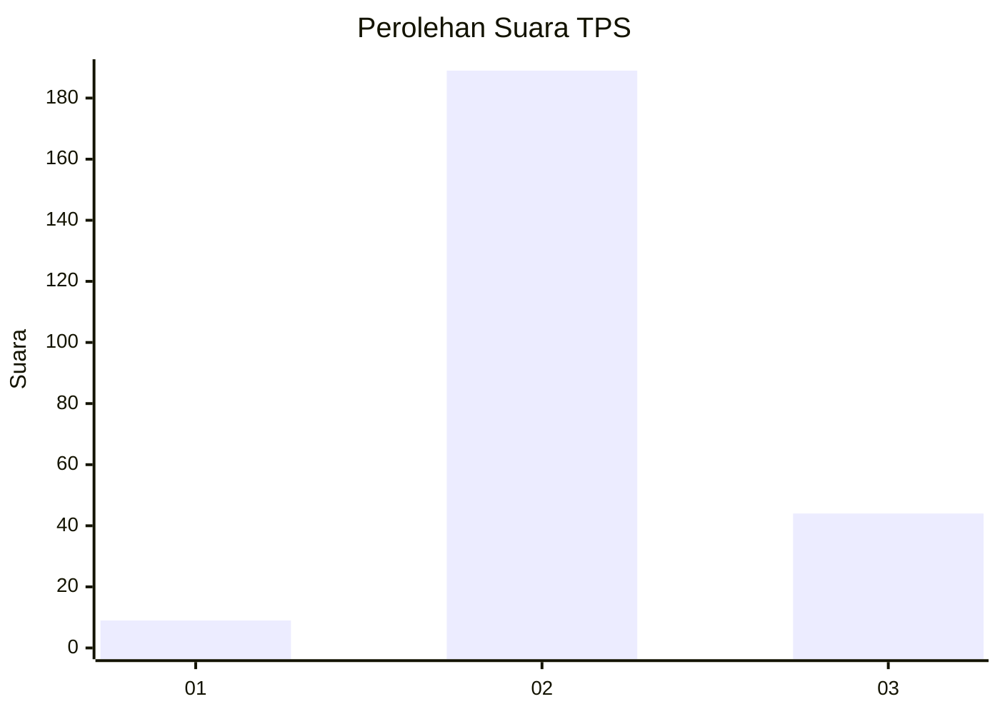

# Hasil

## Grafik

## Tabel

| No. | Nama Paslon    | Suara | Suara (raw) | Persentase |
|:--- |:-------------- | -----:| -----------:| ----------:|
| 1   | ANIES MUHAIMIN | 9     | [9][p-1]    | 3,72       |
| 2   | PRABOWO GIBRAN | 189   | [189][p-2]  | 78,10      |
| 3   | GANJAR MAHFUD  | 44    | [44][p-3]   | 18,18      |

[p-1]: https://github.com/gigit-pemilu/pemilu-2024/blob/main/pilpres/hitung-suara/sub/35-jawa-timur/sub/15-sidoarjo/sub/04-porong/sub/2009-lajuk/sub/002-tps/sub/paslon-1.txt
[p-2]: https://github.com/gigit-pemilu/pemilu-2024/blob/main/pilpres/hitung-suara/sub/35-jawa-timur/sub/15-sidoarjo/sub/04-porong/sub/2009-lajuk/sub/002-tps/sub/paslon-2.txt
[p-3]: https://github.com/gigit-pemilu/pemilu-2024/blob/main/pilpres/hitung-suara/sub/35-jawa-timur/sub/15-sidoarjo/sub/04-porong/sub/2009-lajuk/sub/002-tps/sub/paslon-3.txt

## Foto C Plano

https://sirekap-obj-formc.kpu.go.id/979c/pemilu/ppwp/35/15/04/20/09/3515042009002-20240215-011538--4ba293c1-4337-4fd5-8975-41668f7ba15a.jpg

https://sirekap-obj-formc.kpu.go.id/979c/pemilu/ppwp/35/15/04/20/09/3515042009002-20240215-011616--13ddd8fa-f1ff-4f01-bc86-160f1f93cd3b.jpg

https://sirekap-obj-formc.kpu.go.id/979c/pemilu/ppwp/35/15/04/20/09/3515042009002-20240215-011651--60025df5-df51-4fad-91ca-c5e9c97da9a5.jpg

## Metadata

| Key        | Value               |
| ---------- | ------------------- |
| Time Stamp | 2024-02-24 22:31:28 |

