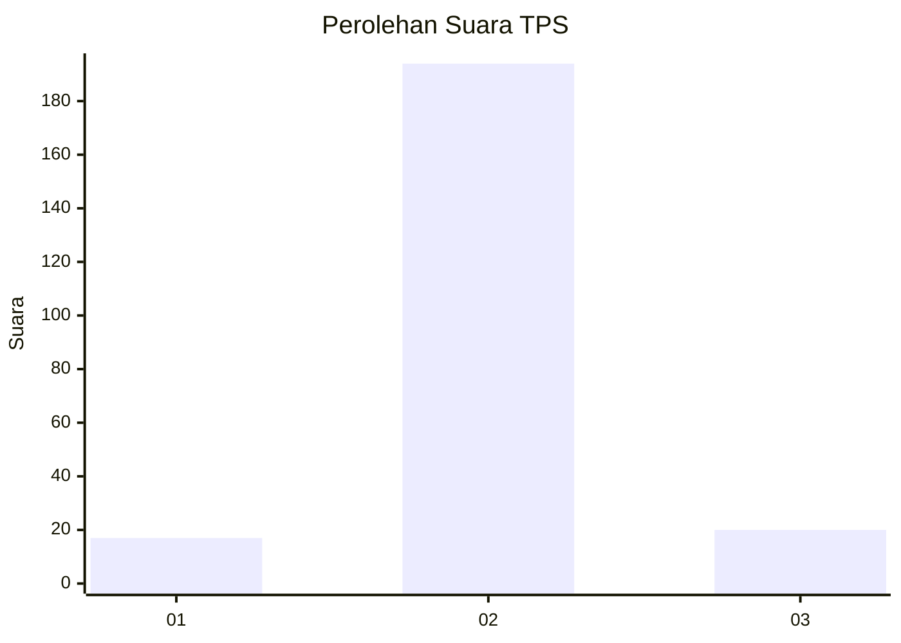
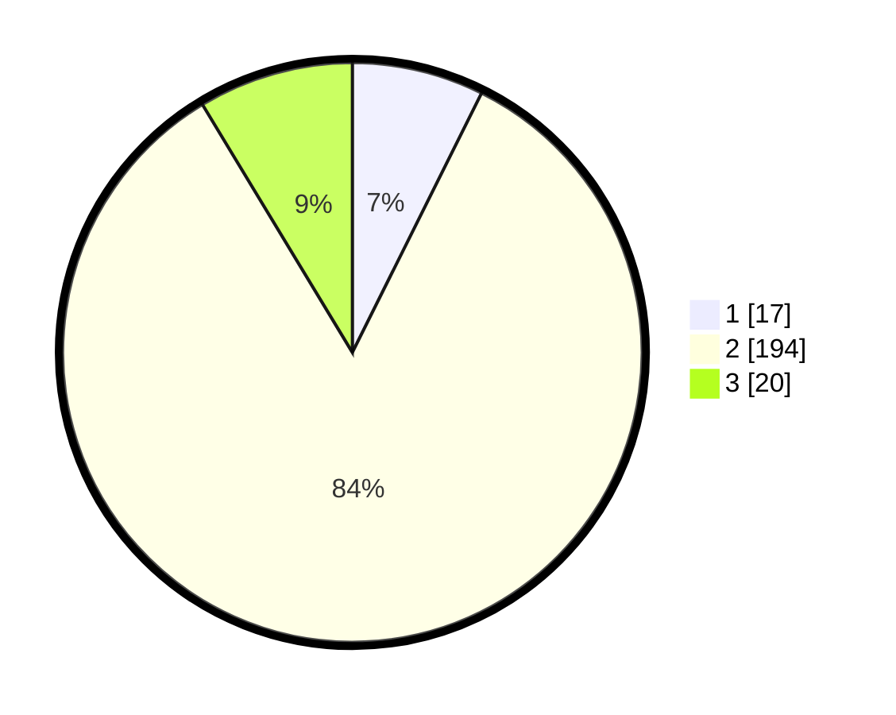

# Hasil

## Grafik

## Tabel

| No. | Nama Paslon    | Suara | Suara (raw) | Persentase |
|:--- |:-------------- | -----:| -----------:| ----------:|
| 1   | ANIES MUHAIMIN | 17    | [17][p-1]   | 7,36       |
| 2   | PRABOWO GIBRAN | 194   | [194][p-2]  | 83,98      |
| 3   | GANJAR MAHFUD  | 20    | [20][p-3]   | 8,66       |

[p-1]: https://github.com/gigit-pemilu/pemilu-2024-35-jawa-timur/blob/main/pilpres/hitung-suara/sub/35-jawa-timur/sub/15-sidoarjo/sub/04-porong/sub/2009-lajuk/sub/007-tps/sub/paslon-1.txt
[p-2]: https://github.com/gigit-pemilu/pemilu-2024-35-jawa-timur/blob/main/pilpres/hitung-suara/sub/35-jawa-timur/sub/15-sidoarjo/sub/04-porong/sub/2009-lajuk/sub/007-tps/sub/paslon-2.txt
[p-3]: https://github.com/gigit-pemilu/pemilu-2024-35-jawa-timur/blob/main/pilpres/hitung-suara/sub/35-jawa-timur/sub/15-sidoarjo/sub/04-porong/sub/2009-lajuk/sub/007-tps/sub/paslon-3.txt

## Foto C Plano

https://sirekap-obj-formc.kpu.go.id/d505/pemilu/ppwp/35/15/04/20/09/3515042009007-20240218-092442--8babecfa-d992-4b39-b940-6549d2cbbc82.jpg

https://sirekap-obj-formc.kpu.go.id/d505/pemilu/ppwp/35/15/04/20/09/3515042009007-20240218-092631--63f788ee-7765-4cbb-b60f-acd7676bb8dc.jpg

https://sirekap-obj-formc.kpu.go.id/d505/pemilu/ppwp/35/15/04/20/09/3515042009007-20240218-093334--fa749227-2112-491c-b2a9-63a2c10833e2.jpg

## Metadata

| Key        | Value               |
| ---------- | ------------------- |
| Time Stamp | 2024-02-22 16:00:00 |

## DATA PEMILIH TETAP

Jumlah pemilih dalam DPT: **162**.
 * L: **52**.
 * P: **222**.

## DATA PENGGUNA HAK PILIH

Jumlah pengguna hak pilih dalam DPT: **700**.
 * L: **582**.
 * P: **677**.

Jumlah pengguna hak pilih dalam DPTb: **405**.
 * L: **877**.
 * P: **173**.

Jumlah pengguna hak pilih dalam DPK: **222**.
 * L: **577**.
 * P: **332**.

Jumlah pengguna hak pilih: **202**.
 * L: **200**.
 * P: **200**.

## JUMLAH SUARA SAH DAN TIDAK SAH

JUMLAH SELURUH SUARA SAH: **231**.

JUMLAH SUARA TIDAK SAH: **13**.

JUMLAH SELURUH SUARA SAH DAN SUARA TIDAK SAH: **244**.

