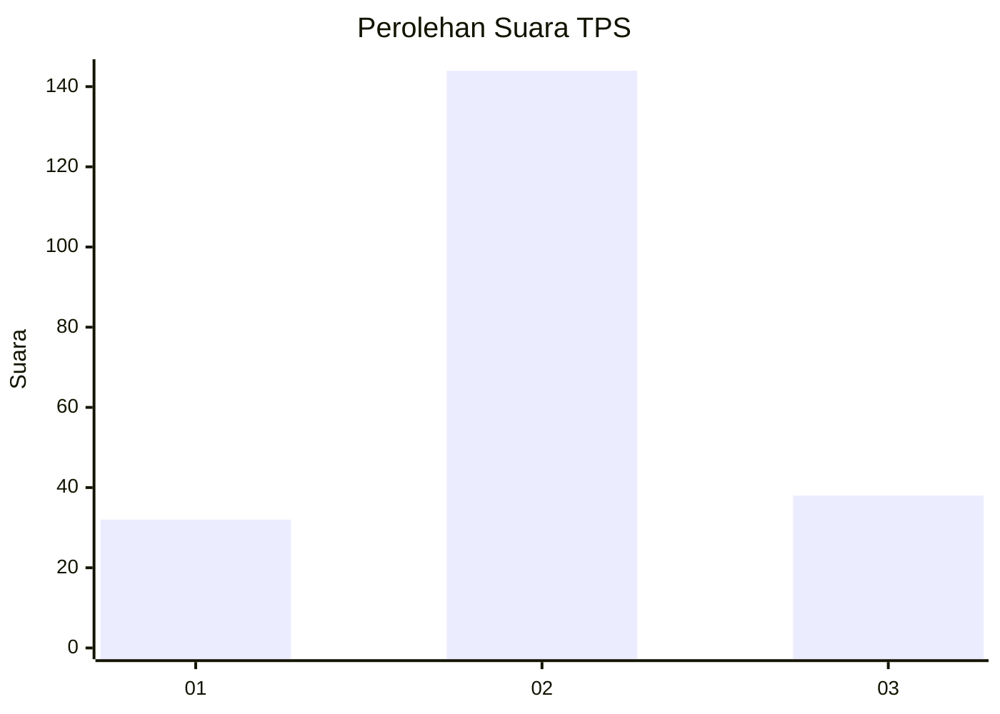
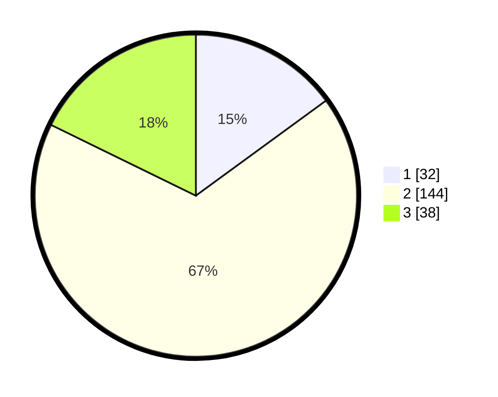

# Hasil

## Grafik

## Tabel

| No. | Nama Paslon    | Suara | Suara (raw) | Persentase |
|:--- |:-------------- | -----:| -----------:| ----------:|
| 1   | ANIES MUHAIMIN | 32    | [32][p-1]   | 14,95      |
| 2   | PRABOWO GIBRAN | 144   | [144][p-2]  | 67,29      |
| 3   | GANJAR MAHFUD  | 38    | [38][p-3]   | 17,76      |

[p-1]: https://github.com/gigit-pemilu/pemilu-2024/blob/main/pilpres/hitung-suara/sub/35-jawa-timur/sub/15-sidoarjo/sub/04-porong/sub/2010-kedungboto/sub/004-tps/sub/paslon-1.txt
[p-2]: https://github.com/gigit-pemilu/pemilu-2024/blob/main/pilpres/hitung-suara/sub/35-jawa-timur/sub/15-sidoarjo/sub/04-porong/sub/2010-kedungboto/sub/004-tps/sub/paslon-2.txt
[p-3]: https://github.com/gigit-pemilu/pemilu-2024/blob/main/pilpres/hitung-suara/sub/35-jawa-timur/sub/15-sidoarjo/sub/04-porong/sub/2010-kedungboto/sub/004-tps/sub/paslon-3.txt

## Foto C Plano

https://sirekap-obj-formc.kpu.go.id/a2ac/pemilu/ppwp/35/15/04/20/10/3515042010004-20240215-022620--133d1e0d-0f2b-4f25-99b7-59faff712600.jpg

https://sirekap-obj-formc.kpu.go.id/a2ac/pemilu/ppwp/35/15/04/20/10/3515042010004-20240218-164331--fd5f17d1-78e8-4f18-bf7e-df22c5bd53f1.jpg

https://sirekap-obj-formc.kpu.go.id/a2ac/pemilu/ppwp/35/15/04/20/10/3515042010004-20240215-042922--13a4af2e-5f7b-4374-84a8-6d0d252b314e.jpg

## Metadata

| Key        | Value               |
| ---------- | ------------------- |
| Time Stamp | 2024-02-25 16:00:00 |

