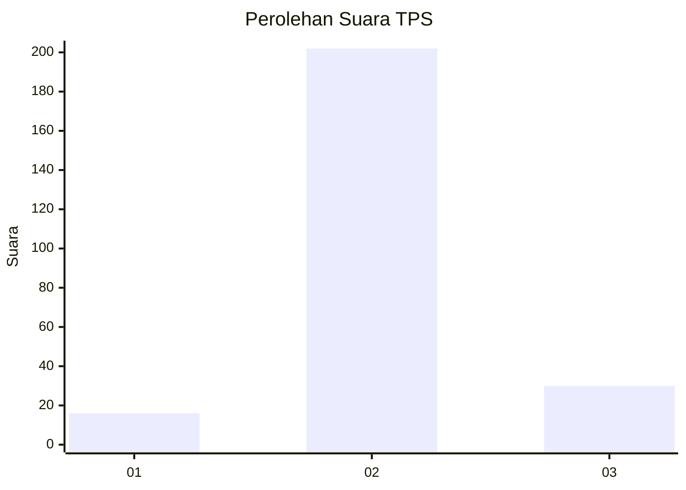
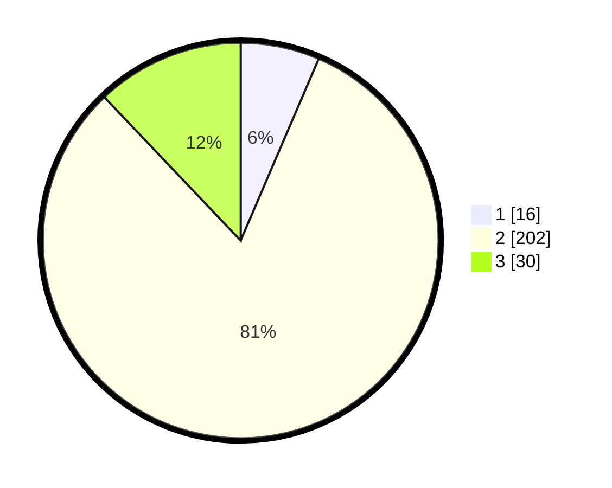

# Hasil

## Grafik

## Tabel

| No. | Nama Paslon    | Suara | Suara (raw) | Persentase |
|:--- |:-------------- | -----:| -----------:| ----------:|
| 1   | ANIES MUHAIMIN | 16    | [16][p-1]   | 6,45       |
| 2   | PRABOWO GIBRAN | 202   | [202][p-2]  | 81,45      |
| 3   | GANJAR MAHFUD  | 30    | [30][p-3]   | 12,10      |

[p-1]: https://github.com/gigit-pemilu/pemilu-2024-35-jawa-timur/blob/main/pilpres/hitung-suara/sub/35-jawa-timur/sub/15-sidoarjo/sub/04-porong/sub/2011-candipari/sub/003-tps/sub/paslon-1.txt
[p-2]: https://github.com/gigit-pemilu/pemilu-2024-35-jawa-timur/blob/main/pilpres/hitung-suara/sub/35-jawa-timur/sub/15-sidoarjo/sub/04-porong/sub/2011-candipari/sub/003-tps/sub/paslon-2.txt
[p-3]: https://github.com/gigit-pemilu/pemilu-2024-35-jawa-timur/blob/main/pilpres/hitung-suara/sub/35-jawa-timur/sub/15-sidoarjo/sub/04-porong/sub/2011-candipari/sub/003-tps/sub/paslon-3.txt

## Foto C Plano

https://sirekap-obj-formc.kpu.go.id/1410/pemilu/ppwp/35/15/04/20/11/3515042011003-20240216-115859--db283878-4448-44f1-af07-3aceee362090.jpg

https://sirekap-obj-formc.kpu.go.id/1410/pemilu/ppwp/35/15/04/20/11/3515042011003-20240215-005000--a4c02c86-22b6-434a-b2b0-65bc15f00414.jpg

https://sirekap-obj-formc.kpu.go.id/1410/pemilu/ppwp/35/15/04/20/11/3515042011003-20240215-005057--1fd064fa-235e-4f8d-a488-0162d6f3f5ee.jpg

## Metadata

| Key        | Value               |
| ---------- | ------------------- |
| Time Stamp | 2024-02-17 13:37:34 |

