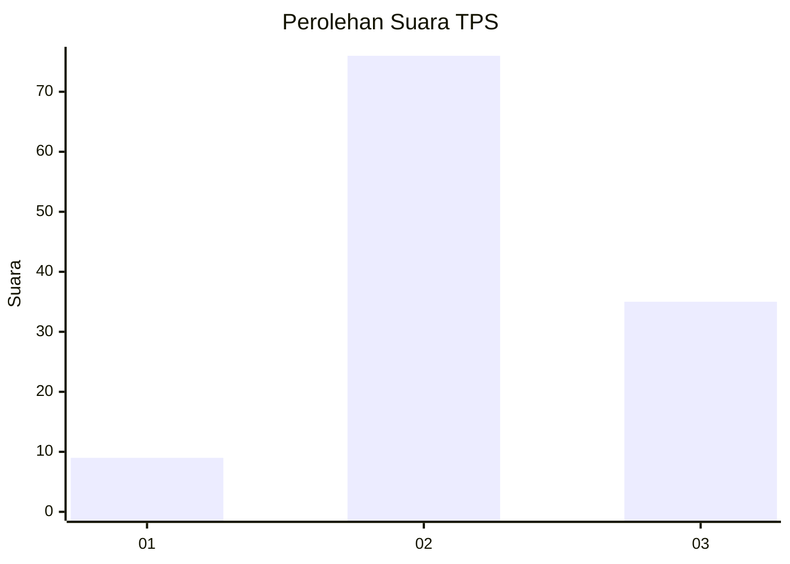
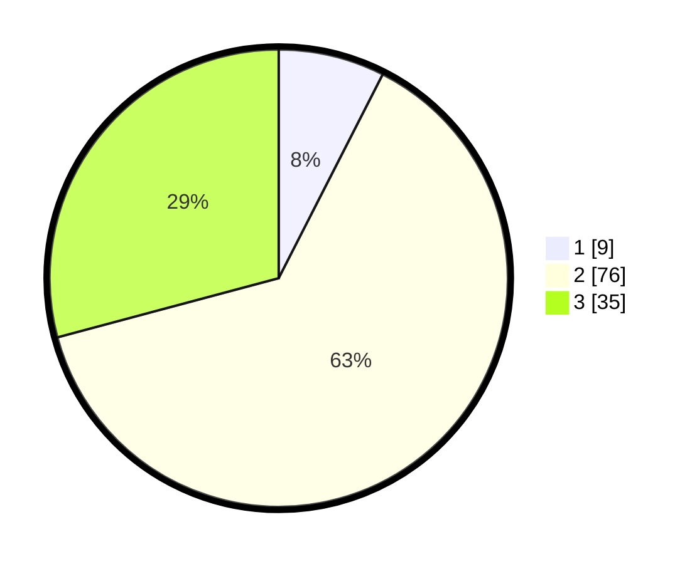

# Hasil

## Grafik

## Tabel

| No. | Nama Paslon    | Suara | Suara (raw) | Persentase |
|:--- |:-------------- | -----:| -----------:| ----------:|
| 1   | ANIES MUHAIMIN | 9     | [9][p-1]    | 7,50       |
| 2   | PRABOWO GIBRAN | 76    | [76][p-2]   | 63,33      |
| 3   | GANJAR MAHFUD  | 35    | [35][p-3]   | 29,17      |

[p-1]: https://github.com/gigit-pemilu/pemilu-2024/blob/main/pilpres/hitung-suara/sub/35-jawa-timur/sub/15-sidoarjo/sub/04-porong/sub/2015-glagaharum/sub/015-tps/sub/paslon-1.txt
[p-2]: https://github.com/gigit-pemilu/pemilu-2024/blob/main/pilpres/hitung-suara/sub/35-jawa-timur/sub/15-sidoarjo/sub/04-porong/sub/2015-glagaharum/sub/015-tps/sub/paslon-2.txt
[p-3]: https://github.com/gigit-pemilu/pemilu-2024/blob/main/pilpres/hitung-suara/sub/35-jawa-timur/sub/15-sidoarjo/sub/04-porong/sub/2015-glagaharum/sub/015-tps/sub/paslon-3.txt

## Foto C Plano

https://sirekap-obj-formc.kpu.go.id/6c0e/pemilu/ppwp/35/15/04/20/15/3515042015015-20240215-033023--677e474b-c146-44b8-9707-e29ace1a123e.jpg

https://sirekap-obj-formc.kpu.go.id/6c0e/pemilu/ppwp/35/15/04/20/15/3515042015015-20240215-033102--19559a63-b6f1-4073-9aac-0da714d098e9.jpg

https://sirekap-obj-formc.kpu.go.id/6c0e/pemilu/ppwp/35/15/04/20/15/3515042015015-20240215-025619--744c6a6f-013f-48df-84ed-7c83f4c82b19.jpg

## Metadata

| Key        | Value               |
| ---------- | ------------------- |
| Time Stamp | 2024-02-21 17:00:00 |

