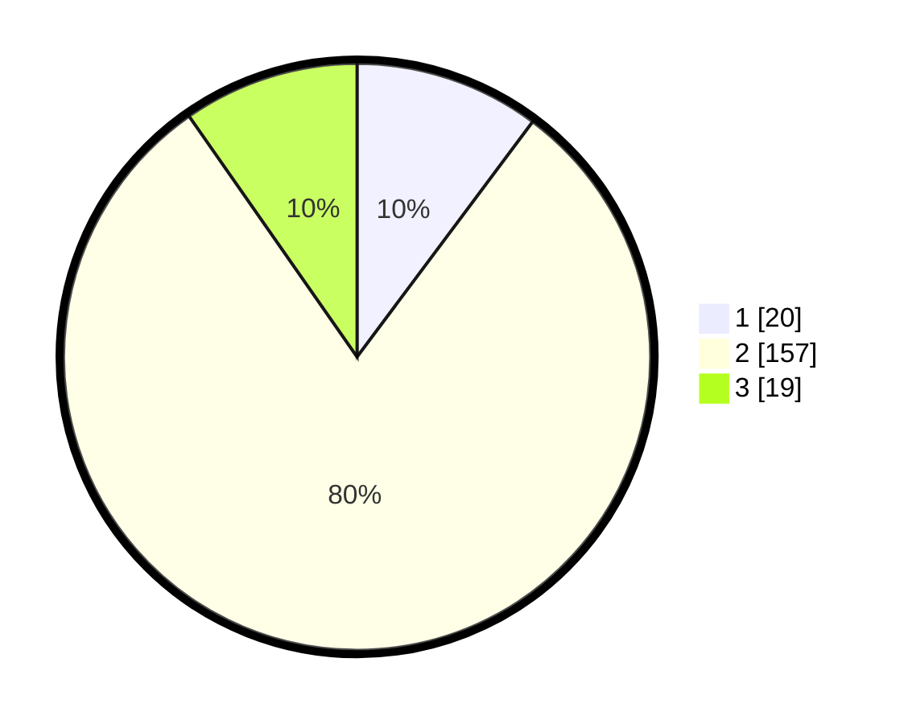

# Hasil

## Grafik

## Tabel

| No. | Nama Paslon    | Suara | Suara (raw) | Persentase |
|:--- |:-------------- | -----:| -----------:| ----------:|
| 1   | ANIES MUHAIMIN | 20    | [20][p-1]   | 10,20      |
| 2   | PRABOWO GIBRAN | 157   | [157][p-2]  | 80,10      |
| 3   | GANJAR MAHFUD  | 19    | [19][p-3]   | 9,69       |

[p-1]: https://github.com/gigit-pemilu/pemilu-2024/blob/main/pilpres/hitung-suara/sub/35-jawa-timur/sub/15-sidoarjo/sub/05-jabon/sub/2002-trompoasri/sub/006-tps/sub/paslon-1.txt
[p-2]: https://github.com/gigit-pemilu/pemilu-2024/blob/main/pilpres/hitung-suara/sub/35-jawa-timur/sub/15-sidoarjo/sub/05-jabon/sub/2002-trompoasri/sub/006-tps/sub/paslon-2.txt
[p-3]: https://github.com/gigit-pemilu/pemilu-2024/blob/main/pilpres/hitung-suara/sub/35-jawa-timur/sub/15-sidoarjo/sub/05-jabon/sub/2002-trompoasri/sub/006-tps/sub/paslon-3.txt

## Foto C Plano

https://sirekap-obj-formc.kpu.go.id/eb08/pemilu/ppwp/35/15/05/20/02/3515052002006-20240223-114603--0e725b40-c852-4019-97af-b91f8f7615f6.jpg

https://sirekap-obj-formc.kpu.go.id/eb08/pemilu/ppwp/35/15/05/20/02/3515052002006-20240223-105811--e8a86493-6ba8-44f0-875c-3097b56d7076.jpg

https://sirekap-obj-formc.kpu.go.id/eb08/pemilu/ppwp/35/15/05/20/02/3515052002006-20240223-105656--cf9a5e9c-8f32-49e8-b281-c9a2b89c4f59.jpg

## Metadata

| Key        | Value               |
| ---------- | ------------------- |
| Time Stamp | 2024-02-24 22:31:28 |

