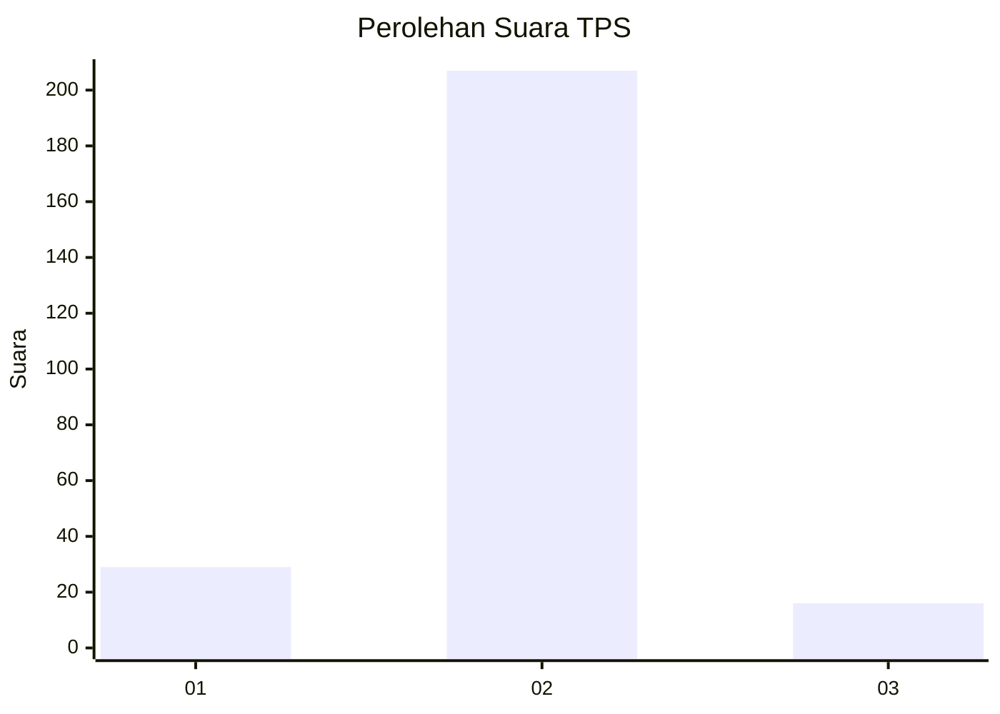
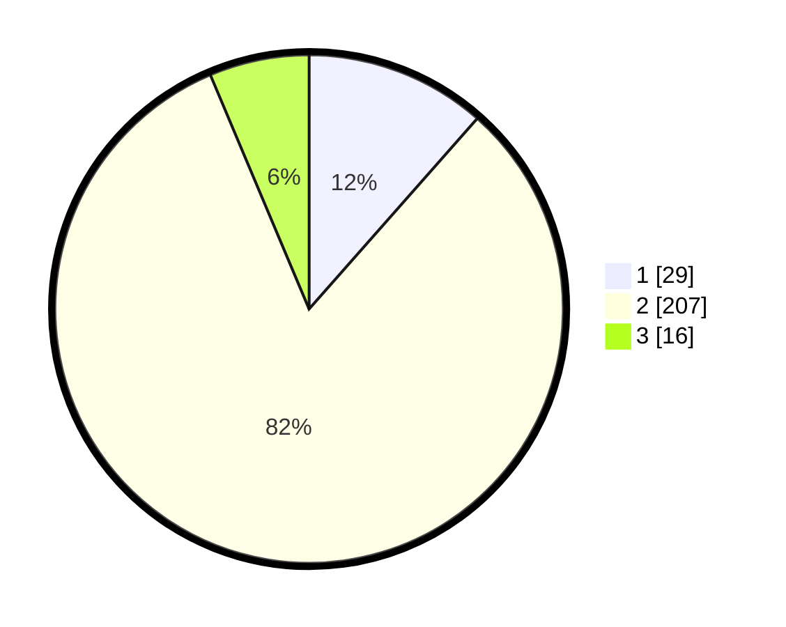

# Hasil

## Grafik

## Tabel

| No. | Nama Paslon    | Suara | Suara (raw) | Persentase |
|:--- |:-------------- | -----:| -----------:| ----------:|
| 1   | ANIES MUHAIMIN | 29    | [29][p-1]   | 11,51      |
| 2   | PRABOWO GIBRAN | 207   | [207][p-2]  | 82,14      |
| 3   | GANJAR MAHFUD  | 16    | [16][p-3]   | 6,35       |

[p-1]: https://github.com/gigit-pemilu/pemilu-2024/blob/main/pilpres/hitung-suara/sub/35-jawa-timur/sub/15-sidoarjo/sub/05-jabon/sub/2002-trompoasri/sub/016-tps/sub/paslon-1.txt
[p-2]: https://github.com/gigit-pemilu/pemilu-2024/blob/main/pilpres/hitung-suara/sub/35-jawa-timur/sub/15-sidoarjo/sub/05-jabon/sub/2002-trompoasri/sub/016-tps/sub/paslon-2.txt
[p-3]: https://github.com/gigit-pemilu/pemilu-2024/blob/main/pilpres/hitung-suara/sub/35-jawa-timur/sub/15-sidoarjo/sub/05-jabon/sub/2002-trompoasri/sub/016-tps/sub/paslon-3.txt

## Foto C Plano

https://sirekap-obj-formc.kpu.go.id/9deb/pemilu/ppwp/35/15/05/20/02/3515052002016-20240214-205731--b9bebdea-f3f7-4688-87c1-b446e1370862.jpg

https://sirekap-obj-formc.kpu.go.id/9deb/pemilu/ppwp/35/15/05/20/02/3515052002016-20240215-013406--1468e2e1-5174-492f-ba04-97f6b4dece68.jpg

https://sirekap-obj-formc.kpu.go.id/9deb/pemilu/ppwp/35/15/05/20/02/3515052002016-20240214-210147--4bdf504f-7e05-4575-9bae-c621086c3916.jpg

## Metadata

| Key        | Value               |
| ---------- | ------------------- |
| Time Stamp | 2024-02-15 16:00:26 |

