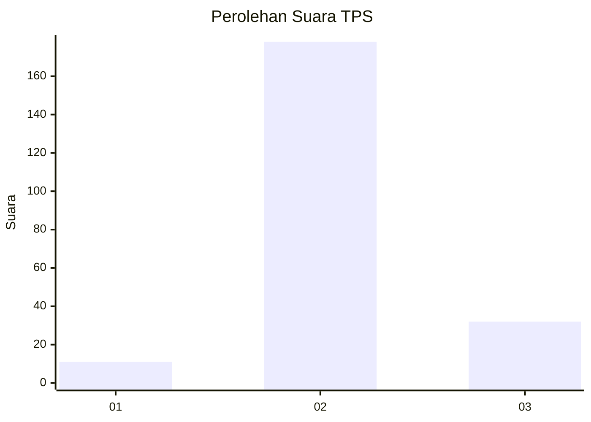

# Hasil

## Grafik

## Tabel

| No. | Nama Paslon    | Suara | Suara (raw) | Persentase |
|:--- |:-------------- | -----:| -----------:| ----------:|
| 1   | ANIES MUHAIMIN | 11    | [11][p-1]   | 4,98       |
| 2   | PRABOWO GIBRAN | 178   | [178][p-2]  | 80,54      |
| 3   | GANJAR MAHFUD  | 32    | [32][p-3]   | 14,48      |

[p-1]: https://github.com/gigit-pemilu/pemilu-2024-35-jawa-timur/blob/main/pilpres/hitung-suara/sub/35-jawa-timur/sub/15-sidoarjo/sub/05-jabon/sub/2007-tambakkalisogo/sub/002-tps/sub/paslon-1.txt
[p-2]: https://github.com/gigit-pemilu/pemilu-2024-35-jawa-timur/blob/main/pilpres/hitung-suara/sub/35-jawa-timur/sub/15-sidoarjo/sub/05-jabon/sub/2007-tambakkalisogo/sub/002-tps/sub/paslon-2.txt
[p-3]: https://github.com/gigit-pemilu/pemilu-2024-35-jawa-timur/blob/main/pilpres/hitung-suara/sub/35-jawa-timur/sub/15-sidoarjo/sub/05-jabon/sub/2007-tambakkalisogo/sub/002-tps/sub/paslon-3.txt

## Foto C Plano

https://sirekap-obj-formc.kpu.go.id/1abb/pemilu/ppwp/35/15/05/20/07/3515052007002-20240214-202350--623bb465-a856-46d1-a7e3-8f26ca39624e.jpg

https://sirekap-obj-formc.kpu.go.id/1abb/pemilu/ppwp/35/15/05/20/07/3515052007002-20240214-202643--918a1a95-e9d6-43ad-b4f4-321429ca874f.jpg

https://sirekap-obj-formc.kpu.go.id/1abb/pemilu/ppwp/35/15/05/20/07/3515052007002-20240214-202842--5014d5ef-dd4e-4b5f-b9b0-1c66bef5050b.jpg

## Metadata

| Key        | Value               |
| ---------- | ------------------- |
| Time Stamp | 2024-02-15 16:30:25 |

