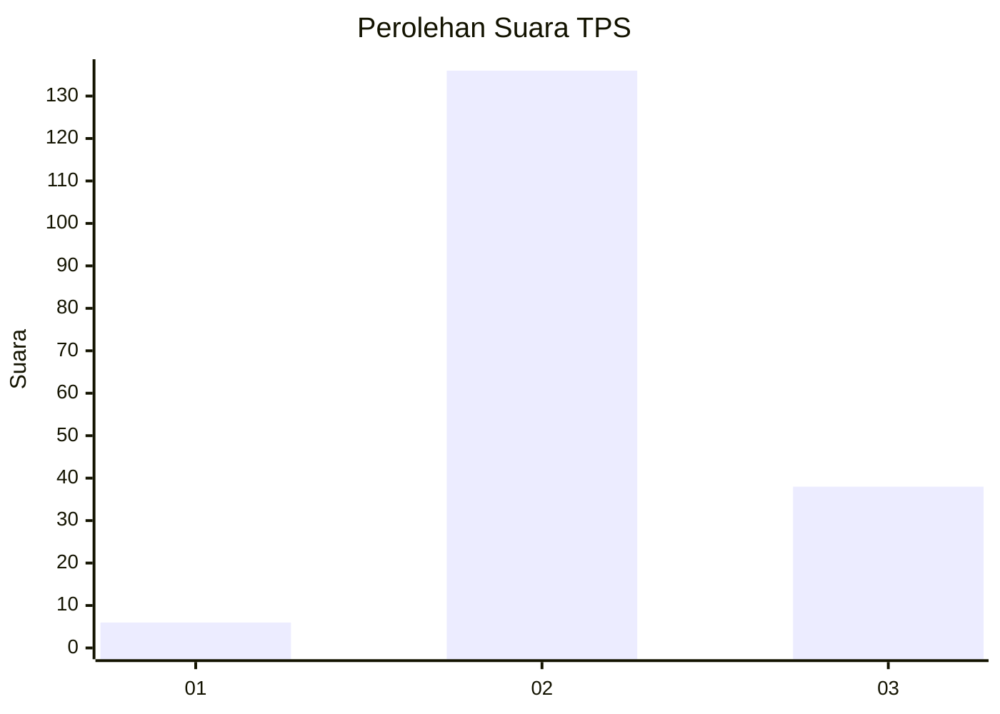

# Hasil

## Grafik

## Tabel

| No. | Nama Paslon    | Suara | Suara (raw) | Persentase |
|:--- |:-------------- | -----:| -----------:| ----------:|
| 1   | ANIES MUHAIMIN | 6     | [6][p-1]    | 3,33       |
| 2   | PRABOWO GIBRAN | 136   | [136][p-2]  | 75,56      |
| 3   | GANJAR MAHFUD  | 38    | [38][p-3]   | 21,11      |

[p-1]: https://github.com/gigit-pemilu/pemilu-2024-35-jawa-timur/blob/main/pilpres/hitung-suara/sub/35-jawa-timur/sub/15-sidoarjo/sub/05-jabon/sub/2007-tambakkalisogo/sub/006-tps/sub/paslon-1.txt
[p-2]: https://github.com/gigit-pemilu/pemilu-2024-35-jawa-timur/blob/main/pilpres/hitung-suara/sub/35-jawa-timur/sub/15-sidoarjo/sub/05-jabon/sub/2007-tambakkalisogo/sub/006-tps/sub/paslon-2.txt
[p-3]: https://github.com/gigit-pemilu/pemilu-2024-35-jawa-timur/blob/main/pilpres/hitung-suara/sub/35-jawa-timur/sub/15-sidoarjo/sub/05-jabon/sub/2007-tambakkalisogo/sub/006-tps/sub/paslon-3.txt

## Foto C Plano

https://sirekap-obj-formc.kpu.go.id/4e0a/pemilu/ppwp/35/15/05/20/07/3515052007006-20240217-192739--e1e6bda6-435f-41fb-a576-79af393be5ba.jpg

https://sirekap-obj-formc.kpu.go.id/4e0a/pemilu/ppwp/35/15/05/20/07/3515052007006-20240217-192747--26cab7b9-2d7d-4818-be78-a7580a172dff.jpg

https://sirekap-obj-formc.kpu.go.id/4e0a/pemilu/ppwp/35/15/05/20/07/3515052007006-20240217-201839--0e1181ea-44c1-4866-9ca6-9b72a3fae20e.jpg

## Metadata

| Key        | Value               |
| ---------- | ------------------- |
| Time Stamp | 2024-02-25 12:00:00 |

